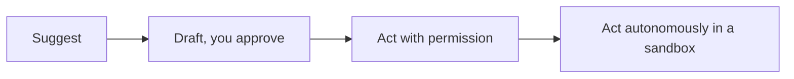

<LevelBadge level="all" />

Das Beste aus KI herauszuholen schließt ein, sie *verantwortungsvoll* zu nutzen. Diese Seite ist kurz, praktisch und gilt für alle — vom Anfänger bis zum Entwickler.

## Die Verifikations-Haltung

Die wichtigste Gewohnheit überhaupt: **Passe deine Verifikation an das Risiko an.**

| Risiko | Beispiel | Wie viel verifizieren |
|---|---|---|
| Niedrig | Brainstorming, grobe Entwürfe | Frei vertrauen, überfliegen |
| Mittel | Eine geschäftliche E-Mail, eine Zusammenfassung | Lesen, Fakten plausibilisieren |
| Hoch | Veröffentlichte Statistiken, Code, den du ausführst, Rechtliches/Medizinisches/Finanzielles | Jede Behauptung gegen eine vertrauenswürdige Quelle prüfen |

KI ist ein schneller erster Entwurf, niemals eine endgültige Autorität — siehe [Halluzinationen](/docs/foundations/hallucinations).

## Die Autonomie-Leiter

Gib der KI nur dann mehr Unabhängigkeit, wenn sich Vertrauen verdient hat:

Beginne mit „vorschlagen, ich genehmige" ([Plan-Modus](/docs/claude-code/plan-mode)); behalte volle Autonomie für risikoarme, sandboxed, umkehrbare Arbeit vor ([Autonome Läufe härten](/docs/security/hardening-autonomous-runs)).

## Privatsphäre & Daten

- Füge keine Geheimnisse, Credentials oder personenbezogenen Daten anderer in ein Werkzeug ein, das du nicht geprüft hast.
- Kenne die Datenverarbeitungs- und Trainingsrichtlinie deines Anbieters, bevor du sensibles Material teilst — siehe [Privatsphäre & Datenverarbeitung](/docs/foundations/privacy).
- Verwende für regulierte oder vertrauliche Daten die passenden Enterprise-/kontrollierten Einstellungen.

## Bias, Fairness und Grenzen

Modelle spiegeln Muster aus ihren Trainingsdaten wider, die **Bias** (Verzerrungen) tragen können. Sei besonders vorsichtig, wenn KI-Ausgaben Entscheidungen über Menschen beeinflussen (Einstellung, Kreditvergabe, Moderation). Halte einen Menschen für folgenreiche Entscheidungen verantwortlich und behandle KI als Hilfe für das Urteilsvermögen, nicht als dessen Ersatz.

## Lagere dein Denken nicht aus

:::tip Nutze KI, um besser zu denken, nicht weniger
Die besten Nutzer bleiben engagiert — sie hinterfragen Ausgaben, lernen daraus und stehen zum Ergebnis. Beim Lernen bedeutet das die [Teach-back-Schleife](/docs/playbooks/learning), nicht Copy-Paste. Du bist verantwortlich für das, was du mit der Hilfe von KI auslieferst.
:::

## Sicherheit, kurz gefasst

Wenn KI jemals nicht vertrauenswürdige Inhalte liest (Webseiten, E-Mails, Dokumente) oder Aktionen ausführt, erbst du ein Sicherheitsmodell. Lies [Prompt Injection](/docs/security/prompt-injection) und [Agenten absichern](/docs/security/securing-agents).

## Weiter

- [Prompt Injection erklärt](/docs/security/prompt-injection)
- [Halluzinationen & wie man sie reduziert](/docs/foundations/hallucinations)
- [Privatsphäre & Datenverarbeitung](/docs/foundations/privacy)
