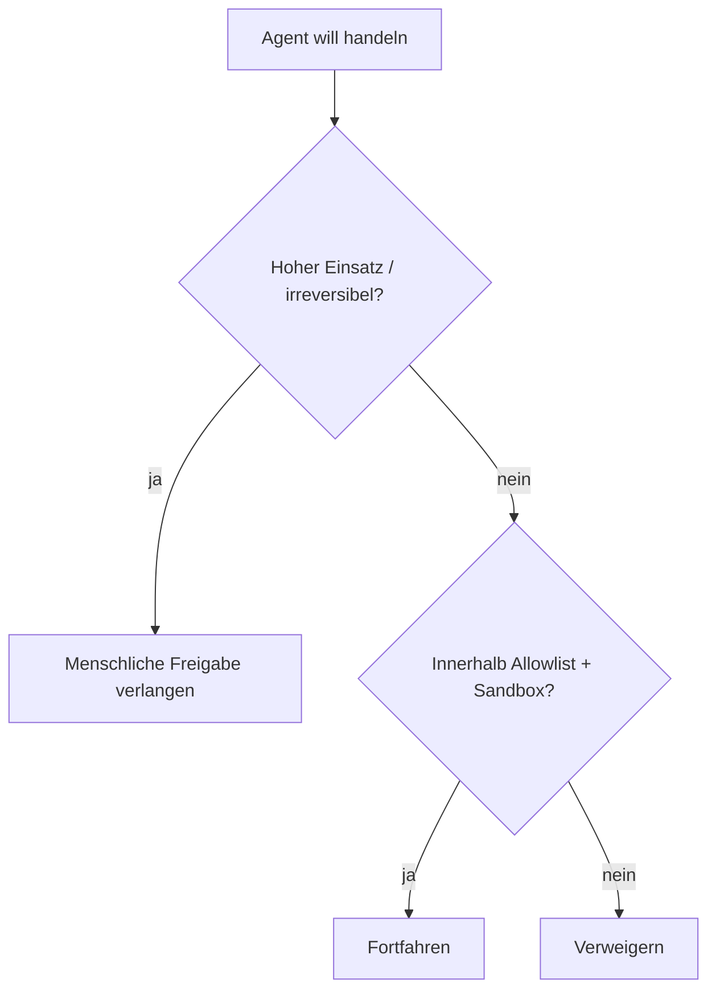

<LevelBadge level="advanced" />

<Callout type="objectives" items={["Least Privilege anwenden — einem Agenten nur den Zugriff geben, den seine Aufgabe braucht", "Das Confused-Deputy-Problem erkennen: Ein Agent borgt sich deine Autorität", "Die fünf Verteidigungsschichten kombinieren, die den Wirkungsradius verkleinern, wenn ein Agent ausgetrickst wird", "Entscheiden, welche Aktionen einen Menschen im Ablauf erfordern", "Werkzeug-Eingaben validieren, damit ein fehlerhaftes oder manipuliertes Argument nicht ausgeführt werden kann"]} />

In dem Moment, in dem eine KI **Aktionen ausführen** kann (Werkzeuge aufrufen, Code ausführen, APIs ansprechen), erbt sie ein Sicherheitsmodell. Das Ziel ist nicht, das Modell unaustricksbar zu machen — sondern sicherzustellen, dass es **selbst wenn es ausgetrickst wird, nicht viel Schaden anrichten kann**.

## Das Kernprinzip: Least Privilege

Gib einem Agenten den **minimalen** Zugriff, den seine Aufgabe erfordert, nicht mehr.

- Ein Dokument-Zusammenfasser braucht **Lesezugriff**, nicht Schreib- oder Netzwerkzugriff.
- Ein Reviewer muss Code lesen und einen Kommentar posten können — nicht pushen oder deployen.
- Begrenze Werkzeuge, API-Schlüssel und Dateizugriff pro Aufgabe. Ein eng begrenzter Agent, in den eine [Injection](/docs/security/prompt-injection) gelingt, kann nur begrenzten Schaden anrichten.

## Das Confused-Deputy-Problem

Ein Agent handelt oft **mit deiner Autorität** (deinen Tokens, deinen Sitzungen). Wenn von Angreifern kontrollierte Eingaben ihn steuern, borgt sich der Angreifer deine Rechte — ein „Confused Deputy" (verwirrter Stellvertreter). Verteidigung: Gib dem Agenten keine Umgebungsautorität, die er nicht braucht, und verlange für sensible Werkzeuge explizite, eng begrenzte Credentials.

## Verteidigungsschichten

Kombiniere diese — keine einzelne ist ausreichend. Jede Schicht geht davon aus, dass die darüberliegenden versagen könnten.

<Steps items={[
  {title: "Ausführung und Dateizugriff sandboxen", body: "Führe Code und Dateioperationen in Containern oder flüchtigen Verzeichnissen aus, ohne Zugriff auf das weitere System oder Geheimnisse. Wenn der Agent ausgetrickst wird, spielt er in einer Box."},
  {title: "Die gefährliche Angriffsfläche per Allowlist freigeben", body: "Entscheide, welche Befehle, welche Domains und welche Pfade erlaubt sind — verweigere den Rest. In Claude Code sind das die Berechtigungen (/docs/claude-code/permissions)."},
  {title: "Human-in-the-Loop bei hohem Einsatz", body: "Verlange eine explizite Freigabe für irreversible oder sensible Aktionen: Geld senden, E-Mails senden, löschen, deployen oder Produktionskonfiguration ändern."},
  {title: "Vertrauenszonen trennen", body: "Lass nicht einen einzigen Agenten gleichzeitig Geheimnisse halten, nicht vertrauenswürdige Inhalte lesen und beliebige ausgehende Aufrufe tätigen — diese Kombination ist der Exfiltrationspfad."},
  {title: "Werkzeug-Aufrufe protokollieren und überprüfen", body: "Halte fest, welche Werkzeuge der Agent tatsächlich mit welchen Argumenten aufgerufen hat, damit du das Verhalten prüfen und Abweichungen erkennen kannst."}
]} />

## Eine Allowlist schriftlich festhalten

„Die gefährliche Angriffsfläche per Allowlist freigeben" nickt man leicht ab und überspringt es ebenso leicht. In Claude Code ist es konkret: eine `settings.json`, die genau den engen Satz an Befehlen und Domains erlaubt, den die Aufgabe braucht, und den Rest verweigert. Beginne restriktiv und weite nur aus, wenn eine echte Aufgabe blockiert wird.

<PromptCard title="Ein Least-Privilege-Berechtigungsblock für Claude Code">{`{
  "permissions": {
    "allow": [
      "Read",
      "Edit",
      "Bash(npm test:*)",
      "Bash(npm run build:*)",
      "Bash(git status)",
      "Bash(git diff:*)"
    ],
    "deny": [
      "Bash(git push:*)",
      "Bash(rm:*)",
      "Bash(curl:*)",
      "Read(./.env)",
      "Read(./secrets/**)"
    ]
  }
}`}</PromptCard>

Die `deny`-Liste gewinnt gegenüber `allow`, sodass das Blockieren von `.env` und `secrets/**` selbst dann greift, wenn ein weit gefasstes `Read` gewährt wurde. Siehe [permissions](/docs/claude-code/permissions) für die vollständige Regelsyntax und Priorität.

## Werkzeuge haben Schemata — validiere sie

Werkzeug-Eingaben, die das Modell erzeugt, können falsch oder manipuliert sein. **Validiere** Argumente vor der Ausführung und **gib Fehler als Ergebnisse zurück**, damit sich der Agent erholt, anstatt blind erneut zu versuchen.

<Flashcards title="Die Kernbegriffe einüben" cards={[{front: "Least Privilege", back: "Gib einem Agenten nur den Zugriff, den seine konkrete Aufgabe braucht — nicht mehr. Ein eng begrenzter Agent, der ausgetrickst wird, kann nur begrenzten Schaden anrichten."}, {front: "Confused Deputy", back: "Ein Agent handelt mit deiner Autorität (deinen Tokens, deinen Sitzungen). Wenn von Angreifern kontrollierte Eingaben ihn steuern, borgt sich der Angreifer deine Rechte."}, {front: "Sandbox", back: "Führe Code und Dateizugriff in einem isolierten Container oder flüchtigen Verzeichnis aus, ohne Pfad zum weiteren System oder zu Geheimnissen, sodass ein ausgetrickster Agent eingesperrt bleibt."}, {front: "Vertrauenszonen", back: "Halte Geheimnisse, nicht vertrauenswürdige Inhalte und ausgehendes Netzwerk in getrennten Agenten. Ein Agent, der alle drei hält, ist ein Exfiltrationspfad."}, {front: "Human-in-the-Loop", back: "Ein erforderliches menschliches Freigabe-Tor vor irreversiblen oder sensiblen Aktionen — Geld senden, löschen, deployen, Produktionskonfiguration ändern."}]} />

<Quiz title="Überprüfe dich selbst" questions={[
  {
    q: "Was verlangt das Prinzip des Least Privilege bei der Konfiguration eines Agenten von dir?",
    options: ["Gib ihm breiten Zugriff, damit er mitten in der Aufgabe nie blockiert wird", "Gib ihm nur den Zugriff, den seine konkrete Aufgabe erfordert", "Gib ihm dieselben Berechtigungen wie der Mensch, der ihn ausführt"],
    answer: 1,
    explain: "Least Privilege bedeutet den minimalen Zugriff, den die Aufgabe braucht. Ein eng begrenzter Agent, in den eine Injection gelingt, kann nur begrenzten Schaden anrichten."
  },
  {
    q: "Warum ist ein Agent, der mit deinen Tokens handelt, ein 'Confused-Deputy'-Risiko?",
    options: ["Er verwechselt, welches Modell aufgerufen werden soll", "Von Angreifern kontrollierte Eingaben können ihn dazu bringen, deine Rechte zu nutzen", "Er ernennt andere Agenten ohne zu fragen zu Stellvertretern"],
    answer: 1,
    explain: "Der Agent hält deine Autorität. Wenn von Angreifern kontrollierte Eingaben ihn steuern, borgt sich der Angreifer effektiv deine Rechte — das Confused-Deputy-Problem."
  },
  {
    q: "Welcher Eintrag in einem Claude-Code-Berechtigungsblock hält den Agenten zuverlässig davon ab, eine Geheimnis-Datei zu lesen?",
    options: ["Ein allow-Eintrag für Read", "Ein deny-Eintrag für den Geheimnis-Pfad, da deny gegenüber allow gewinnt", "Das Bash-Werkzeug entfernen"],
    answer: 1,
    explain: "Deny hat Vorrang vor allow, sodass ein deny auf secrets/** selbst dann greift, wenn ein weit gefasstes Read gewährt wurde."
  }
]} />

<Callout type="takeaways" items={["Least Privilege zuerst: Begrenze Werkzeuge, Schlüssel und Dateizugriff pro Aufgabe, sodass ein ausgetrickster Agent nur begrenzten Schaden anrichten kann", "Ein Agent handelt mit deiner Autorität — gib ihm keine Umgebungsrechte, die er nicht braucht (das Confused-Deputy-Problem)", "Kombiniere die fünf Schichten: Sandbox, Allowlist, Human-in-the-Loop, getrennte Vertrauenszonen, protokollieren und überprüfen", "In Claude Code schlagen deny-Regeln die allow-Regeln — blockiere .env- und secrets-Pfade explizit", "Validiere Werkzeug-Argumente vor der Ausführung und gib Fehler als Ergebnisse zurück, damit sich der Agent erholt, anstatt blind erneut zu versuchen"]} />

## Weiter

- [Prompt Injection erklärt](/docs/security/prompt-injection)
- [Autonome Läufe härten](/docs/security/hardening-autonomous-runs)
- [Code von Drittanbietern prüfen](/docs/security/reviewing-third-party-code)
