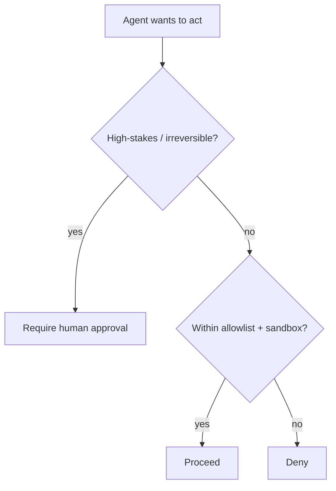

<LevelBadge level="advanced" />

In dem Moment, in dem eine KI **Aktionen ausführen** kann (Werkzeuge aufrufen, Code ausführen, APIs ansprechen), erbt sie ein Sicherheitsmodell. Das Ziel ist nicht, das Modell unaustricksbar zu machen — sondern sicherzustellen, dass es **selbst wenn es ausgetrickst wird, nicht viel Schaden anrichten kann**.

## Das Kernprinzip: Least Privilege

Gib einem Agenten den **minimalen** Zugriff, den seine Aufgabe erfordert, nicht mehr.

- Ein Dokument-Zusammenfasser braucht **Lesezugriff**, nicht Schreib- oder Netzwerkzugriff.
- Ein Reviewer muss Code lesen und einen Kommentar posten können — nicht pushen oder deployen.
- Begrenze Werkzeuge, API-Schlüssel und Dateizugriff pro Aufgabe. Ein eng begrenzter Agent, in den eine [Injection](/docs/security/prompt-injection) gelingt, kann nur begrenzten Schaden anrichten.

## Das Confused-Deputy-Problem

Ein Agent handelt oft **mit deiner Autorität** (deinen Tokens, deinen Sitzungen). Wenn von Angreifern kontrollierte Eingaben ihn steuern, borgt sich der Angreifer deine Rechte — ein „Confused Deputy" (verwirrter Stellvertreter). Verteidigung: Gib dem Agenten keine Umgebungsautorität, die er nicht braucht, und verlange für sensible Werkzeuge explizite, eng begrenzte Credentials.

## Verteidigungsschichten

1. **Sandboxe** Code-Ausführung und Dateizugriff — Container, flüchtige Verzeichnisse, kein Zugriff auf das weitere System oder Geheimnisse.
2. **Setze eine Allowlist** für die gefährliche Angriffsfläche: welche Befehle, welche Domains, welche Pfade. Verweigere den Rest. (In Claude Code sind das die [Berechtigungen](/docs/claude-code/permissions).)
3. **Human-in-the-Loop** für irreversible oder besonders folgenreiche Aktionen: Geld senden, E-Mails, Löschen, Deployen, Produktionskonfiguration ändern.
4. **Trenne Vertrauenszonen.** Lass nicht einen einzigen Agenten gleichzeitig Geheimnisse halten, nicht vertrauenswürdige Inhalte lesen und beliebige ausgehende Aufrufe tätigen.
5. **Protokolliere und überprüfe**, welche Werkzeuge der Agent tatsächlich aufgerufen hat.

## Werkzeuge haben Schemata — validiere sie

Werkzeug-Eingaben, die das Modell erzeugt, können falsch oder manipuliert sein. **Validiere** Argumente vor der Ausführung und **gib Fehler als Ergebnisse zurück**, damit sich der Agent erholt, anstatt blind erneut zu versuchen.

## Weiter

- [Prompt Injection erklärt](/docs/security/prompt-injection)
- [Autonome Läufe härten](/docs/security/hardening-autonomous-runs)
- [Code von Drittanbietern prüfen](/docs/security/reviewing-third-party-code)
