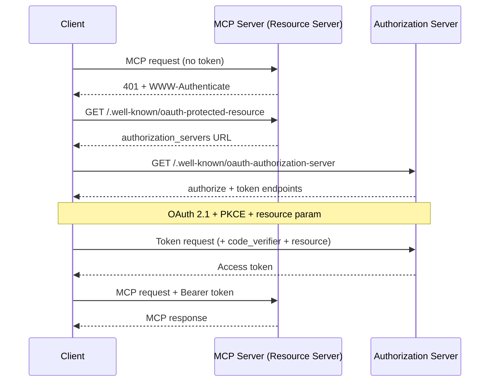
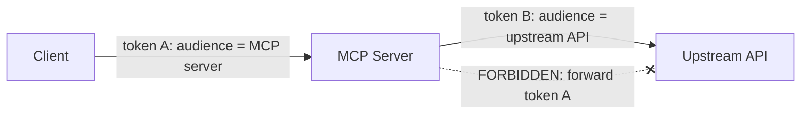

<LevelBadge level="advanced" />

<Callout type="objectives" items={["Verstehen, warum ein entfernter (HTTP-)MCP-Server ein OAuth-2.1-Resource-Server ist und nicht nur ein API-Key-Endpunkt", "Den Discovery-Handshake nachvollziehen: 401 → Protected Resource Metadata → Authorization Server Metadata → Token", "Die Audience-Bindung von Tokens (RFC 8707) erklären und warum sie verhindert, dass das Token eines Dienstes bei einem anderen funktioniert", "Die Falle des verwirrten Stellvertreters benennen und die eine Regel, die sie schließt: niemals das Token eines Clients an eine vorgelagerte API durchreichen", "Eine kurze Härtungs-Checkliste anwenden, bevor du einen MCP-Server im Internet freigibst"]} />

[MCP](/docs/claude-code/mcp) hat sich von einer Neuheit zur Standardart entwickelt, mit der Agenten Werkzeuge erreichen — was bedeutet, dass MCP-Server nun vor echten Daten und echten Aktionen sitzen. Ein lokaler Server, den du über **STDIO** startest, vertraut seiner Umgebung: Er liest Zugangsdaten aus Umgebungsvariablen, und es gibt keine Netzwerkgrenze zu verteidigen. Sobald du denselben Server **entfernt** (HTTP) betreibst, kann jeder, der die URL erreicht, versuchen, ihn aufzurufen. Das verwandelt ihn in ein Autorisierungsproblem, und die MCP-Spezifikation beantwortet das mit **OAuth 2.1** — nicht mit einem selbstgebauten API-Key-Schema.

Diese Seite behandelt den entfernten Fall. Wenn dein Server nur STDIO nutzt, sagt die Spezifikation ausdrücklich: Folge dem OAuth-Ablauf *nicht* — hole die Zugangsdaten aus der Umgebung und mach weiter.

<VerifyNote lastVerified="2026-07-07" source="https://modelcontextprotocol.io/specification/2025-06-18/basic/authorization" />

## Die drei Rollen

OAuth teilt das Problem auf drei Parteien auf. MCP bildet sich sauber darauf ab:

<Flashcards title="Wer ist wer in einem MCP-OAuth-Ablauf" cards={[{front: "MCP-Server = Resource Server", back: "Das geschützte Ding. Es akzeptiert Anfragen, die ein Access-Token tragen, validiert das Token und gibt Daten zurück — oder ein 401, wenn das Token fehlt oder falsch ist. Es meldet den Benutzer NICHT an."}, {front: "MCP-Client = OAuth-Client", back: "Dein Agenten-Host (Claude Code, die Desktop-App, dein eigener Code). Er beschafft ein Token im Namen des Benutzers und hängt es jeder Anfrage als Bearer-Header an."}, {front: "Authorization Server (AS)", back: "Die Partei, die tatsächlich mit dem Benutzer spricht, die Zustimmung einholt und Tokens ausstellt. Kann mit dem Server gehostet werden oder ein separater Identitätsanbieter sein. Ihre Interna liegen außerhalb des Geltungsbereichs von MCP."}]} />

Der entscheidende gedankliche Wechsel: **Der MCP-Server kümmert sich niemals selbst um den Login.** Er validiert nur Tokens, die jemand anderes ausgestellt hat. Diese Trennung ist es, die es dir erlaubt, einen fertigen Identitätsanbieter vor einen selbst geschriebenen Server zu stellen.

## Der Discovery-Handshake

Ein Client sollte nicht vorkonfiguriert wissen müssen, wo er sich authentifizieren soll. MCP macht die Discovery automatisch, ausgelöst durch ein `401`:

<Steps items={[
  {title: "Der Client ruft den Server ohne Token auf", body: "Die allererste Anfrage geht nackt hinaus. Der Server weist sie mit HTTP 401 Unauthorized und einem WWW-Authenticate-Header ab, der auf seine Resource-Metadata-URL verweist."},
  {title: "Der Client holt die Protected Resource Metadata (RFC 9728)", body: "Er ruft per GET /.well-known/oauth-protected-resource auf dem Server ab. Das Feld authorization_servers des Dokuments benennt mindestens einen Authorization Server, den der Client verwenden kann."},
  {title: "Der Client holt die Authorization Server Metadata (RFC 8414)", body: "Er ruft per GET /.well-known/oauth-authorization-server des AS ab, um die Authorize- und Token-Endpunkte sowie die unterstützten Fähigkeiten zu erfahren."},
  {title: "Optional: Dynamic Client Registration (RFC 7591)", body: "Wenn der Client keine Client-ID für diesen AS hat, kann er per POST /register eine ohne menschliches Zutun beschaffen — entscheidend, weil ein Client nicht jeden MCP-Server im Voraus kennen kann."},
  {title: "OAuth-2.1-Autorisierung mit PKCE + resource", body: "Der Client erzeugt einen PKCE-Verifier/-Challenge, öffnet den Browser zur Authorize-URL inklusive des resource-Parameters, der Benutzer stimmt zu, und der Client tauscht den zurückgegebenen Code (mit dem Verifier) gegen ein Access-Token ein."},
  {title: "Der Client wiederholt die Anfrage mit dem Token", body: "Nun trägt jede Anfrage Authorization: Bearer <token>. Der Server validiert es und antwortet."}
]} />

Beachte, dass es auf der Client-Seite **keine fest verdrahtete Auth-Konfiguration** gibt — das `401` bootet alles hoch. Genau das ist der Sinn: Ein Agent kann sich mit einem Server verbinden, den er noch nie gesehen hat, und herausfinden, wie er sich authentifiziert.

## Audience-Bindung: die tragende Regel

Hier ist der Fehlermodus, den die Audience-Bindung verhindern soll. Angenommen, ein Benutzer hat ein Token, das für `calendar.example.com` ausgestellt wurde. Ein bösartiger (oder einfach nachlässiger) MCP-Server unter `evil.example.com` bringt den Client dazu, *dieses* Token an ihn zu senden. Wenn `evil` es akzeptiert, kann er sich nun umdrehen und die Kalender-API im Namen des Benutzers aufrufen. Das Token eines Dienstes hat bei einem anderen funktioniert. Die Sicherheitsgrenze von OAuth ist gerade zusammengebrochen.

Die Lösung sind **Resource Indicators (RFC 8707)**:

<Steps items={[
  {title: "Der Client deklariert das Ziel", body: "Sowohl bei der Autorisierungsanfrage als auch bei der Token-Anfrage MUSS der Client einen resource-Parameter einschließen, der auf die kanonische URI des MCP-Servers gesetzt ist, den er aufrufen will — z. B. resource=https://mcp.example.com. Er sendet ihn auch dann, wenn er unsicher ist, ob der AS ihn unterstützt."},
  {title: "Der AS bindet das Token an diese Audience", body: "Wo unterstützt, stempelt der AS das Token so, dass es nur für diesen spezifischen Resource Server gültig ist."},
  {title: "Der Server validiert die Audience", body: "Bevor er irgendeine Arbeit verrichtet, MUSS der MCP-Server prüfen, dass das Token für IHN ausgestellt wurde — indem er den Audience-Claim (RFC 9068) prüft. Ein Token, das für irgendjemand anderen erzeugt wurde, bekommt ein 401, Punkt."}
]} />

<PromptCard title="Resource-Parameter bei der Autorisierungsanfrage (URL-kodiert)">{`&resource=https%3A%2F%2Fmcp.example.com`}</PromptCard>

Kanonische URIs sind strikt: `https://mcp.example.com` und `https://mcp.example.com:8443/mcp` sind gültig; `mcp.example.com` (kein Schema) und `https://mcp.example.com#frag` (Fragment) sind es nicht. Bevorzuge für die Interoperabilität die Form ohne abschließenden Schrägstrich.

## Der verwirrte Stellvertreter: das Token niemals durchreichen

Das ist der Fehler, der einen wohlmeinenden MCP-Server in den Proxy eines Angreifers verwandelt. Es ist dasselbe [Problem des verwirrten Stellvertreters](/docs/security/securing-agents) aus der Agenten-Sicherheit, zugespitzt auf eine konkrete Regel.

Ein MCP-Server muss oft eine **vorgelagerte API** aufrufen (GitHub, einen Datenbankdienst, ein anderes SaaS). Die Versuchung besteht darin, das Token zu nehmen, das der Client dir gereicht hat, und es weiterzuleiten. **Tu das nicht.** Die Spezifikation ist unmissverständlich: Der MCP-Server **DARF NICHT** das Token durchreichen, das er vom Client erhalten hat.

Warum das gefährlich ist: Das Token des Clients wurde für *deinen* Server als seine Audience ausgestellt. Wenn du es weiterleitest, vertraut die vorgelagerte API ihm womöglich, als käme es von dir, oder nimmt an, du hättest es bereits validiert — und nun verrichtet ein Token, das für einen Hop bestimmt war, Arbeit zwei Hops entfernt, außerhalb des Zustimmungsmodells von irgendjemandem.

<Callout type="warning" items={["Wenn dein MCP-Server eine vorgelagerte API aufruft, agiert er als SEPARATER OAuth-Client gegenüber dieser API und beschafft sein EIGENES Token vom vorgelagerten Authorization Server. Zwei unabhängige Tokens, zwei unabhängige Audiences. Das Token des Clients endet an deiner Tür."]} />

## Eine Pre-Flight-Härtungs-Checkliste

Bevor ein entfernter MCP-Server das öffentliche Internet berührt:

<Steps items={[
  {title: "Alles über HTTPS ausliefern", body: "Alle AS-Endpunkte MÜSSEN HTTPS sein. Redirect-URIs MÜSSEN HTTPS oder localhost sein — sonst nichts."},
  {title: "Bei jeder Anfrage die Audience validieren", body: "Weise jedes Token zurück, das nicht ausdrücklich für diesen Server ausgestellt wurde. Das ist die eine Prüfung, die die dienstübergreifende Token-Wiederverwendung stoppt."},
  {title: "PKCE verlangen", body: "Clients MÜSSEN PKCE verwenden, damit ein abgefangener Autorisierungscode ohne den passenden Verifier nutzlos ist."},
  {title: "Exakte Redirect-URIs festnageln", body: "Der AS MUSS Redirect-URIs exakt gegen vorregistrierte Werte abgleichen, und Clients SOLLTEN den state-Parameter verwenden und verifizieren — beides schützt vor Open-Redirect-Phishing."},
  {title: "Kurzlebige Tokens + Refresh-Rotation", body: "Stelle kurzlebige Access-Tokens aus, um den Schaden eines Lecks zu begrenzen; bei öffentlichen Clients rotiere die Refresh-Tokens. Speichere Tokens sicher und logge sie niemals."},
  {title: "Tokens niemals in die URL packen", body: "Tokens gehören in den Authorization-Header, niemals in den Query-String, wo sie in Logs und Referrern landen würden."},
  {title: "Die Grundlagen der Agenten-Sicherheit obendrauf legen", body: "Die Audience-Bindung ist das Transport-Tor; wende trotzdem Least Privilege, Sandboxing und Human-in-the-Loop aus /docs/security/securing-agents an. Auth sagt WER — sie sagt nicht, dass die Anfrage sicher ist."}
]} />

## Prüfe dich selbst

<Quiz title="Prüfe dich selbst" questions={[
  {
    q: "Ein entfernter MCP-Server erhält eine Anfrage ohne Access-Token. Was verlangt die Spezifikation, dass er zuerst tut?",
    options: [
      "Den Benutzer nach Benutzername und Passwort fragen",
      "HTTP 401 mit einem WWW-Authenticate-Header zurückgeben, der auf seine Resource-Metadata-URL verweist",
      "Die Anfrage stillschweigend an seine vorgelagerte API weiterleiten",
      "Dem Client selbst ein Token ausstellen"
    ],
    answer: 1,
    explain: "Der Server ist ein Resource Server, keine Login-Seite. Er beantwortet eine tokenlose Anfrage mit 401 + WWW-Authenticate, was die Discovery des Authorization Servers durch den Client hochbootet."
  },
  {
    q: "Wovor schützt die Audience-Bindung von Tokens (RFC 8707)?",
    options: [
      "Vor langsamer Token-Validierung",
      "Davor, dass ein für einen Dienst ausgestelltes Token bei einem anderen Dienst akzeptiert und wiederverwendet wird",
      "Davor, dass Benutzer ihre Passwörter vergessen",
      "Vor großen Kontextfenstern"
    ],
    answer: 1,
    explain: "Der resource-Parameter bindet ein Token an den spezifischen Server, für den es erzeugt wurde. Der Server validiert dann den Audience-Claim und weist jedes Token zurück, das für jemand anderen ausgestellt wurde — was das Loch der dienstübergreifenden Wiederverwendung schließt."
  },
  {
    q: "Dein MCP-Server muss eine vorgelagerte GitHub-API aufrufen. Was sollte er mit dem Access-Token tun, das der Client ihm gesendet hat?",
    options: [
      "Dasselbe Token an GitHub weiterleiten, um einen Roundtrip zu sparen",
      "Nichts mit GitHub — sein eigenes separates Token als OAuth-Client gegenüber GitHub beschaffen und das Token des Clients niemals durchreichen",
      "Das Token loggen, damit es später wiederabgespielt werden kann",
      "Das Token in die GitHub-Anfrage-URL packen"
    ],
    answer: 1,
    explain: "Das Weiterreichen des Client-Tokens nach oben ist die Falle des verwirrten Stellvertreters und ist ausdrücklich verboten. Der Server agiert als sein eigener OAuth-Client gegenüber der vorgelagerten API mit einem separaten Token, das an die Audience dieser API gebunden ist."
  },
  {
    q: "Wie sollen laut Spezifikation bei einem STDIO-(lokalen-)MCP-Server die Zugangsdaten gehandhabt werden?",
    options: [
      "Bei jedem Start den vollständigen OAuth-2.1-Browser-Ablauf durchführen",
      "Sie aus der Umgebung holen — der OAuth-Autorisierungsablauf ist für HTTP-Transporte, nicht für STDIO",
      "Sie im Client fest verdrahten",
      "Für alle Transporte die Authentifizierung ganz überspringen"
    ],
    answer: 1,
    explain: "Die Spezifikation sagt, dass STDIO-Transporte dem HTTP-Autorisierungsablauf NICHT folgen SOLLTEN und stattdessen die Zugangsdaten aus der Umgebung lesen. OAuth ist hier speziell für entfernte, HTTP-basierte Server."
  }
]} />

## Quellen & weiterführende Literatur

- [MCP-Autorisierungsspezifikation (2025-06-18)](https://modelcontextprotocol.io/specification/2025-06-18/basic/authorization) — der normative Ablauf, die Rollen und die MUST/SHOULD-Anforderungen, die diese Seite zusammenfasst.
- [MCP Security Best Practices](https://modelcontextprotocol.io/specification/2025-06-18/basic/security_best_practices) — Token-Durchreichung, verwirrter Stellvertreter und warum sie verboten sind.
- [RFC 8707 — Resource Indicators for OAuth 2.0](https://www.rfc-editor.org/rfc/rfc8707.html) — der `resource`-Parameter und die Audience-Bindung.
- [RFC 9728 — OAuth 2.0 Protected Resource Metadata](https://datatracker.ietf.org/doc/html/rfc9728) — wie ein Resource Server seine Authorization Server bekanntgibt.
- [RFC 8414 — OAuth 2.0 Authorization Server Metadata](https://datatracker.ietf.org/doc/html/rfc8414) und [RFC 7591 — Dynamic Client Registration](https://datatracker.ietf.org/doc/html/rfc7591).
- [OAuth 2.1 draft](https://datatracker.ietf.org/doc/html/draft-ietf-oauth-v2-1-13) — PKCE, Kommunikationssicherheit und Anforderungen an die Token-Handhabung.
- Verwandtes auf AILmanac: [Agenten & Werkzeuge absichern](/docs/security/securing-agents) · [Prompt Injection](/docs/security/prompt-injection) · [MCP in Claude Code](/docs/claude-code/mcp).
