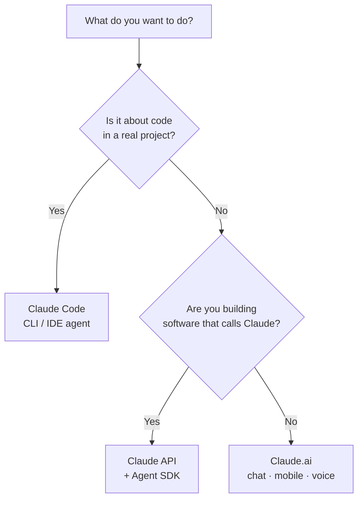

<LevelBadge level="beginner" />

„Claude" gibt es in mehreren Varianten. Wähle danach, **was du erreichen möchtest**, nicht danach, wovon du gehört hast.

## Die 30-Sekunden-Entscheidung

## Claude.ai — die Chat-Apps

**Für:** Schreiben, Recherche, Analyse, Lernen, Planen, Alltagsfragen. **Wer:** alle, ohne Einrichtung.

Du bekommst es auch auf dem **Mobilgerät** ([iOS/Android](/docs/claude-app/mobile)) und per **[Sprache](/docs/claude-app/voice-mode)** — ideal, um Ideen unterwegs festzuhalten. Hol mehr heraus mit [Projects](/docs/claude-app/projects), [benutzerdefinierten Anweisungen](/docs/claude-app/custom-instructions) und [Artifacts](/docs/claude-app/artifacts). → Beginne bei [Erste Schritte mit Claude.ai](/docs/claude-app/getting-started).

## Claude Code — das agentische Coding-Tool

**Für:** Arbeiten *in einer Codebasis* — Lesen, Bearbeiten, Befehle ausführen, Tests reparieren. **Wer:** Entwickler (und technisch Neugierige). Es agiert mit deiner Erlaubnis auf deinen Dateien. → [Was Claude Code ist](/docs/claude-code/what-is-claude-code).

## Die API & das Agent SDK — Claude in deine eigene Software einbauen

**Für:** Apps, Automatisierungen und Agenten, die Claude programmatisch aufrufen. **Wer:** Entwickler, die ein Produkt oder eine Pipeline ausliefern. → [Dein erster API-Aufruf](/docs/api/first-call).

## Sie arbeiten zusammen

Das sind keine konkurrierenden Produkte — die meisten Menschen wechseln nach und nach zwischen ihnen:

| Du möchtest… | Verwende |
|---|---|
| Eine E-Mail entwerfen, ein PDF zusammenfassen, brainstormen | Claude.ai (oder Sprache/Mobil) |
| Ein Modul refaktorieren, Tests hinzufügen, einen Bug beheben | Claude Code |
| Eine KI-Funktion zu *deiner* App hinzufügen | Die API / das Agent SDK |

:::tip Nicht sicher? Beginne mit dem Chat
[Claude.ai](/docs/claude-app/getting-started) braucht keinerlei Einrichtung und zeigt dir, wie Claude „denkt". Die Fähigkeiten lassen sich überall sonst übertragen.
:::

## Weiter

- [Deine ersten 5 Minuten](/docs/start-here/your-first-5-minutes)
- [Lernpfade](/docs/start-here/learning-paths)
- [Ein Claude-Modell wählen](/docs/api/choosing-a-model) (sobald du entwickelst)
