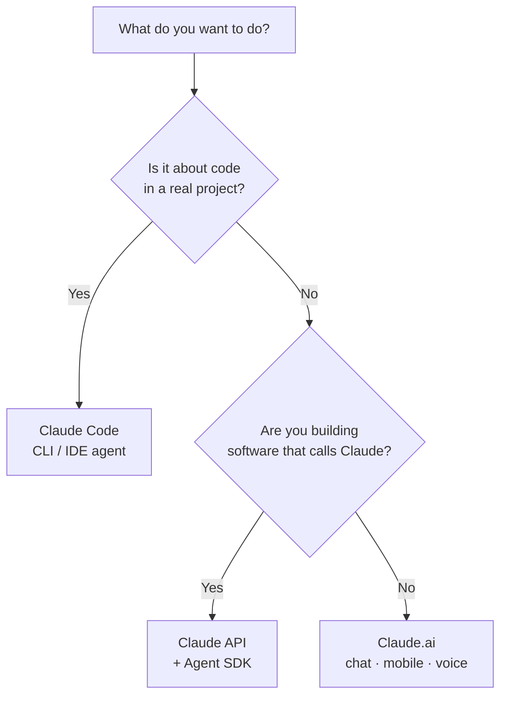

<LevelBadge level="beginner" />

„Claude“ gibt es in ein paar Varianten. Wähle nach dem, **was du erreichen willst**, nicht danach, von welcher du gehört hast.

<Callout type="objectives" items={[
  "Dein Ziel der richtigen Claude-Oberfläche zuordnen: Chat, Claude Code oder die API",
  "Wissen, wann Mobil und Sprache ins Bild passen",
  "Verstehen, wie die drei Oberflächen zusammenwirken, während du dich steigerst",
  "Eine schnelle Einschätzung bekommen, zu welchem Modell man greift, sobald man baut"
]} />

## Die 30-Sekunden-Entscheidung

## Die drei Oberflächen auf einen Blick

| Oberfläche | Am besten für | Wer | Hier starten |
|---|---|---|---|
| **Claude.ai** | Schreiben, Recherche, Analyse, Lernen, Planen, alltägliche Fragen | Alle, kein Setup | [Loslegen mit Claude.ai](/docs/claude-app/getting-started) |
| **Claude Code** | Arbeiten *in einer Codebasis* — Lesen, Bearbeiten, Befehle ausführen, Tests reparieren | Entwickler (und technisch Neugierige) | [Was Claude Code ist](/docs/claude-code/what-is-claude-code) |
| **API & Agent SDK** | Apps, Automatisierungen und Agenten, die Claude programmatisch aufrufen | Entwickler, die ein Produkt oder eine Pipeline ausliefern | [Dein erster API-Aufruf](/docs/api/first-call) |

### Claude.ai — die Chat-Apps

Claude.ai ist der Startpunkt ohne Setup für alle. Du bekommst es auch auf **Mobil** ([iOS/Android](/docs/claude-app/mobile)) und per **[Sprache](/docs/claude-app/voice-mode)** — toll, um Ideen unterwegs festzuhalten. Verstärke es mit [Projekten](/docs/claude-app/projects), [benutzerdefinierten Anweisungen](/docs/claude-app/custom-instructions) und [Artifacts](/docs/claude-app/artifacts).

### Claude Code — das agentische Coding-Tool

Claude Code arbeitet *innerhalb* deines Projekts. Es liest, bearbeitet, führt Befehle aus und repariert Tests — es handelt mit deiner Erlaubnis an deinen Dateien.

### Die API & das Agent SDK — Claude in deine eigene Software einbauen

Die API und das Agent SDK lassen deine eigene Software Claude programmatisch aufrufen, sodass du KI-Funktionen, Automatisierungen und Agenten ausliefern kannst.

## Sie wirken zusammen

Das sind keine rivalisierenden Produkte — die meisten Menschen steigern sich quer durch sie:

| Du willst… | Nutze |
|---|---|
| Eine E-Mail entwerfen, ein PDF zusammenfassen, brainstormen | Claude.ai (oder Sprache/Mobil) |
| Ein Modul refaktorieren, Tests hinzufügen, einen Bug beheben | Claude Code |
| Eine KI-Funktion zu *deiner* App hinzufügen | Die API / das Agent SDK |

:::tip Nicht sicher? Beginne mit Chat
[Claude.ai](/docs/claude-app/getting-started) braucht null Setup und bringt dir bei, wie Claude „denkt“. Die Fähigkeiten übertragen sich überallhin.
:::

## Welches Modell, sobald du baust?

Eine *Oberfläche* zu wählen ist Schritt eins. Wenn du zu Claude Code oder der API übergehst, wählst du auch ein *Modell* — Haiku, Sonnet oder Opus. Beantworte drei kurze Fragen, und dieser Auswähler schlägt einen Startpunkt vor:

<ModelPicker />

:::note Verdrahte die Namen nicht fest
Modell-Lineups und Preise ändern sich. Bestätige immer die aktuellen Modell-IDs auf der Seite [Ein Claude-Modell wählen](/docs/api/choosing-a-model), bevor du auslieferst.
:::

## Prüf dich selbst

<Quiz title="Prüf dich selbst" questions={[
  {
    q: "Du willst eine E-Mail entwerfen und ein PDF zusammenfassen — kein Setup. Welche Oberfläche?",
    options: ["Claude Code", "Claude.ai (Chat / Mobil / Sprache)", "Die API & das Agent SDK"],
    answer: 1,
    explain: "Claude.ai ist die Chat-Oberfläche ohne Setup für Schreiben, Recherche und alltägliche Fragen — verfügbar im Web, auf Mobil und per Sprache."
  },
  {
    q: "Du musst ein Modul refaktorieren und fehlschlagende Tests innerhalb eines echten Projekts reparieren. Welche Oberfläche?",
    options: ["Claude.ai", "Claude Code", "Die API & das Agent SDK"],
    answer: 1,
    explain: "Claude Code arbeitet innerhalb deiner Codebasis — Lesen, Bearbeiten, Befehle ausführen und Tests reparieren mit deiner Erlaubnis."
  },
  {
    q: "Wo solltest du die aktuellen Modellnamen und Preise bestätigen?",
    options: ["Auf dieser Seite", "Auf der Seite „Ein Claude-Modell wählen“", "Im Mermaid-Diagramm oben"],
    answer: 1,
    explain: "Modell-Lineups ändern sich, daher verdrahtet diese Seite sie nicht fest — prüfe die Seite „Ein Claude-Modell wählen“ für aktuelle IDs und Preise."
  }
]} />

<Callout type="takeaways" items={[
  "Claude.ai: Chat ohne Setup für Schreiben, Recherche und Alltagsarbeit — auch auf Mobil und per Sprache",
  "Claude Code: ein Agent, der innerhalb deiner Codebasis handelt",
  "API & Agent SDK: baue Claude in deine eigene Software ein",
  "Sie ergänzen sich — die meisten beginnen mit Chat und steigern sich zu Code und der API",
  "Wähle ein Modell (Haiku / Sonnet / Opus) erst, sobald du baust, und verifiziere die aktuellen IDs vor dem Ausliefern"
]} />

## Weiter

- [Deine ersten 5 Minuten](/docs/start-here/your-first-5-minutes)
- [Lernpfade](/docs/start-here/learning-paths)
- [Ein Claude-Modell wählen](/docs/api/choosing-a-model) (sobald du baust)
