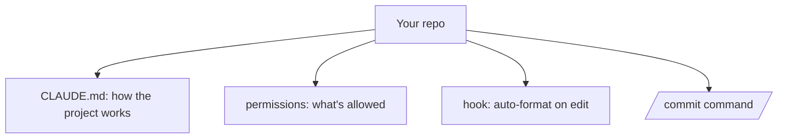

<LevelBadge level="intermediate" />

Lass uns einen frischen Checkout in ein Claude-Code-Setup verwandeln, das *dein Projekt kennt und deine Regeln respektiert* — in etwa 20 Minuten. Wir verknüpfen die Kernfunktionen samt Begründung für jede einzelne.

## Der Endzustand



## Schritt 1 — CLAUDE.md generieren und ausdünnen

Führe `/init` aus, um eine [CLAUDE.md](/docs/claude-code/claude-md) zu entwerfen, und **kürze sie dann** auf das, was zutrifft: Stack, wie man ausführt/testet/lintet, echte Konventionen und Leitplanken ("vor dem Abschluss Tests ausführen", "`/generated` nicht anfassen"). *Warum:* Es ist die wirkungsvollste Anpassung — Claude liest sie in jeder Sitzung.

Schnapp dir eine Vorlage aus den [CLAUDE.md-Vorlagen](/docs/templates/claude-md).

## Schritt 2 — Berechtigungen setzen

Füge eine `.claude/settings.json` ([Referenz](/docs/claude-code/settings)) hinzu, die sichere, sich wiederholende Befehle vorab erlaubt und gefährliche verweigert:

```json
{
  "permissions": {
    "allow": ["Read", "Bash(npm run test:*)", "Bash(npm run lint)", "Bash(git diff:*)"],
    "ask": ["Write", "Bash(npm install:*)"],
    "deny": ["Read(./.env)", "Bash(git push --force:*)"]
  }
}
```

*Warum:* weniger Unterbrechungen bei sicheren Aktionen, harte Stopps bei riskanten. Siehe [Berechtigungen](/docs/claude-code/permissions).

## Schritt 3 — Einen Formatierungs-Hook hinzufügen

Nach jeder Bearbeitung automatisch formatieren ([Hooks](/docs/claude-code/hooks)):

```json
{ "hooks": { "PostToolUse": [ { "matcher": "Edit|Write",
  "hooks": [ { "type": "command", "command": "npx prettier --write \"$CLAUDE_FILE_PATH\" 2>/dev/null || true" } ] } ] } }
```

*Warum:* konsistente Formatierung, garantiert — kein "bitte daran denken".

## Schritt 4 — Einen `/commit`-Command hinzufügen

Lege das `/commit`-Rezept aus der [Slash-Command-Bibliothek](/docs/templates/slash-commands) in `.claude/commands/` ab. *Warum:* ein Wort für einen wiederholbaren Workflow.

## Schritt 5 — Plan-Modus für die erste echte Aufgabe verwenden

Gib im [Plan-Modus](/docs/claude-code/plan-mode) ein echtes Ziel vor, prüfe den Plan und lass ihn dann ausführen. *Warum:* Vertrauen aufbauen, indem man Denken und Tun trennt.

## Überprüfen, ob es funktioniert hat

- Neue Sitzung → Claude bezieht sich ungefragt auf deine Konventionen (CLAUDE.md funktioniert).
- Eine Datei bearbeiten → sie wird formatiert (Hook funktioniert).
- Ein riskanter Befehl → es fragt nach oder verweigert (Berechtigungen funktionieren).
- `/commit` → eine saubere Conventional-Commit-Nachricht (Command funktioniert).

## Weiter

- [Schreibe deinen ersten Skill](/docs/walkthroughs/first-skill)
- [Hooks- und settings.json-Rezepte](/docs/templates/hooks-settings)
- [Coding und Softwareentwicklung](/docs/playbooks/coding)
