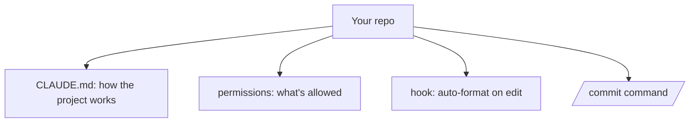

<LevelBadge level="intermediate" />

<Callout type="objectives" items={["Einen frischen Checkout in etwa 20 Minuten in ein abgestimmtes Claude-Code-Setup verwandeln", "Verstehen, WARUM jede der vier Anpassungen ihren Platz verdient — CLAUDE.md, Berechtigungen, ein Hook, ein Command", "Berechtigungsregeln schreiben, die Unterbrechungen bei sicheren Aktionen reduzieren und riskante hart stoppen", "Jedes Teil überprüfen, statt anzunehmen, dass es funktioniert hat"]} />

Lass uns einen frischen Checkout in ein Claude-Code-Setup verwandeln, das *dein Projekt kennt und deine Regeln respektiert* — in etwa 20 Minuten. Wir verknüpfen die Kernfunktionen samt Begründung für jede einzelne.

## Der Endzustand



## Schritt 1 — CLAUDE.md erzeugen und eindampfen

Führe `/init` aus, um einen Entwurf für [CLAUDE.md](/docs/claude-code/claude-md) zu erstellen, und **kürze ihn dann** auf das, was wirklich stimmt: Stack, wie man baut/testet/lintet, echte Konventionen und Leitplanken („vor dem Abschluss Tests ausführen", „`/generated` nicht anfassen"). *Warum:* Es ist die wirkungsvollste Anpassung — Claude liest sie in jeder Sitzung.

Hol dir eine Startvorlage aus den [CLAUDE.md-Vorlagen](/docs/templates/claude-md).

## Schritt 2 — Berechtigungen setzen

Lege eine `.claude/settings.json` an ([Referenz](/docs/claude-code/settings)), die sichere, sich wiederholende Befehle vorab erlaubt und gefährliche verweigert:

```json
{
  "permissions": {
    "allow": ["Read", "Bash(npm run test:*)", "Bash(npm run lint)", "Bash(git diff:*)"],
    "ask": ["Write", "Bash(npm install:*)"],
    "deny": ["Read(./.env)", "Bash(git push --force:*)"]
  }
}
```

*Warum:* weniger Unterbrechungen bei sicheren Aktionen, harte Stopps bei riskanten. Siehe [Berechtigungen](/docs/claude-code/permissions).

## Schritt 3 — Einen Formatierungs-Hook hinzufügen

Nach jeder Bearbeitung automatisch formatieren ([Hooks](/docs/claude-code/hooks)):

```json
{ "hooks": { "PostToolUse": [ { "matcher": "Edit|Write",
  "hooks": [ { "type": "command", "command": "npx prettier --write \"$CLAUDE_FILE_PATH\" 2>/dev/null || true" } ] } ] } }
```

*Warum:* konsistente Formatierung, garantiert — kein „bitte dran denken".

## Schritt 4 — Einen `/commit`-Command hinzufügen

Kopiere das `/commit`-Rezept aus der [Slash-Command-Bibliothek](/docs/templates/slash-commands) nach `.claude/commands/`. *Warum:* ein Wort für einen wiederholbaren Workflow.

## Schritt 5 — Den Plan-Modus für die erste echte Aufgabe nutzen

Gib ein echtes Ziel im [Plan-Modus](/docs/claude-code/plan-mode) vor, prüfe den Plan und lass ihn dann ausführen. *Warum:* Vertrauen aufbauen, indem man Denken vom Handeln trennt.

## Überprüfen, ob es funktioniert hat

Nimm nichts an — prüfe jedes Teil einzeln. Jeder Test isoliert eine Anpassung, sodass ein Fehlschlag dir genau sagt, welche Datei zu reparieren ist.

<Steps items={[{title: "CLAUDE.md funktioniert", body: "Starte eine NEUE Sitzung und gib eine normale Aufgabe. Claude sollte deine Konventionen unaufgefordert berücksichtigen, ohne dass du sie einfügst."}, {title: "Der Hook funktioniert", body: "Bearbeite eine Datei und lass Claude sie schreiben. Sie sollte formatiert zurückkommen — ohne Erinnerung von dir."}, {title: "Berechtigungen funktionieren", body: "Probiere einen riskanten Befehl. Claude sollte nachfragen oder ihn direkt verweigern, statt ihn einfach auszuführen."}, {title: "Der Command funktioniert", body: "Führe /commit aus. Aus einem Wort sollte eine saubere Conventional-Commit-Nachricht entstehen."}]} />

<PromptCard title="Die erste echte Aufgabe im Plan-Modus starten">{`Add pagination to the users list endpoint. Plan it first — I want to review before you touch anything.`}</PromptCard>

<Callout type="takeaways" items={["CLAUDE.md ist die wirkungsvollste Anpassung, weil Claude sie in jeder Sitzung liest — erzeuge sie mit /init und kürze sie dann auf das, was tatsächlich stimmt", "Berechtigungen sind ein zweiseitiges Werkzeug: sichere, sich wiederholende Befehle vorab erlauben, um Unterbrechungen zu reduzieren, und gefährliche verweigern, um harte Stopps zu bekommen", "Ein Hook macht Formatierung garantiert statt \"bitte dran denken\" — vom Harness erzwungenes Verhalten schlägt im Prompt erbetenes Verhalten", "Ein Slash-Command macht aus einem wiederholbaren Workflow ein einziges Wort", "Der Plan-Modus trennt Denken vom Handeln — so baut man Vertrauen auf, bevor man mehr Autonomie abgibt", "Überprüfe jede Anpassung mit einem eigenen Test, damit ein Fehlschlag auf genau eine Datei zeigt"]} />

<Quiz title="Teste dich selbst" questions={[{q: "Warum gilt CLAUDE.md als die wirkungsvollste Anpassung?", options: ["Es ist die einzige Datei, in die Claude Code schreiben kann", "Claude liest sie in jeder Sitzung, sie prägt also jede Aufgabe, ohne dass du dich wiederholst", "Sie überschreibt die Berechtigungsregeln"], answer: 1, explain: "Claude liest CLAUDE.md in jeder Sitzung. Das ist die Hebelwirkung — Stack, Befehle, Konventionen und Leitplanken landen automatisch im Kontext, statt immer wieder eingefügt zu werden. Genau deshalb kürzt du sie auch auf das, was wirklich stimmt."}, {q: "Du willst, dass Auto-Formatierung garantiert ist und nicht bloß erbeten. Welcher Mechanismus ist der richtige?", options: ["Eine Zeile in CLAUDE.md mit \"immer nach dem Bearbeiten formatieren\"", "Ein PostToolUse-Hook mit dem Matcher Edit|Write, der deinen Formatter ausführt", "Eine Allow-Berechtigungsregel für den Formatter-Befehl"], answer: 1, explain: "Ein Hook wird vom Harness erzwungen — er läuft, egal ob das Modell daran denkt oder nicht. Eine Anweisung in CLAUDE.md ist eine Bitte, die das Modell übersehen kann; eine Berechtigungsregel bestimmt nur, ob ein Befehl ERLAUBT ist, nicht ob er läuft."}, {q: "Warum stehen in der Beispiel-settings.json manche Befehle unter \"allow\" und andere unter \"ask\"?", options: ["\"ask\"-Befehle sind gefährlich und sollten stattdessen unter \"deny\" stehen", "Sichere, sich wiederholende Befehle vorab zu erlauben reduziert Unterbrechungen, während \"ask\" bei Aktionen mit Seiteneffekten einen Menschen in der Schleife hält", "\"allow\" ist nur für Leseoperationen"], answer: 1, explain: "Die Aufteilung dreht sich um Unterbrechungskosten gegen Risiko. Sichere, wiederholte Dinge wie Read und Testläufe werden vorab erlaubt, damit sie dich nie unterbrechen; Dinge mit echten Seiteneffekten wie Write oder npm install kommen zu \"ask\"; und wirklich gefährliche wie Force-Push zu \"deny\" als harter Stopp."}]} />

## Weiter

- [Schreibe deine erste Skill](/docs/walkthroughs/first-skill)
- [Hooks- & settings.json-Rezepte](/docs/templates/hooks-settings)
- [Coding & Softwareentwicklung](/docs/playbooks/coding)
