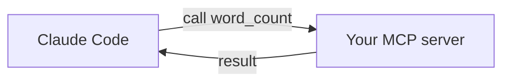

<LevelBadge level="advanced" />

<VerifyNote lastVerified="2026-06-20" source="https://modelcontextprotocol.io">
Die MCP-SDK-APIs und die Konfiguration entwickeln sich weiter — gleiche sie mit der offiziellen MCP-Dokumentation und der Claude-Code-MCP-Dokumentation ab.
</VerifyNote>

Lass uns Claude ein benutzerdefiniertes Tool zur Verfügung stellen, indem wir einen winzigen [MCP](/docs/claude-code/mcp)-Server bauen und ihn verbinden. Wir halten ihn minimal, damit die *Verdrahtung* klar ist — danach tauschst du deine echte Logik ein.

## Was wir bauen

Ein stdio-Server mit einem Tool, `word_count`, das Claude aufrufen kann. Dasselbe Muster skaliert auf "frage meine DB ab", "öffne ein Ticket" usw.



## Schritt 1 — Der Server

`server.py` (Python; eine TypeScript-Version findest du in den [MCP-Scaffolds](/docs/templates/mcp-config)):

```python
from mcp.server.fastmcp import FastMCP

mcp = FastMCP("text-tools")

@mcp.tool()
def word_count(text: str) -> int:
    """Count the words in a piece of text."""
    return len(text.split())

if __name__ == "__main__":
    mcp.run()  # stdio transport
```

## Schritt 2 — Ihn deklarieren

Füge im Root deines Repositorys zu `.mcp.json` hinzu:

```json
{ "mcpServers": {
  "text-tools": { "command": "python", "args": ["server.py"] }
} }
```

## Schritt 3 — Verbinden und testen

Starte Claude Code im Repository. Frage: *"Verwende den text-tools-Server, um die Wörter zu zählen in: 'the quick brown fox'."* Claude sollte `word_count` aufrufen und `4` melden. Wenn es das Tool nicht sieht, prüfe, ob der Server eigenständig sauber startet und ob der Pfad in `.mcp.json` korrekt ist.

## Schritt 4 — Mach es echt

Ersetze `word_count` durch deine tatsächliche Fähigkeit — eine DB-Abfrage, einen internen API-Aufruf, eine Dateioperation. Füge Eingabevalidierung hinzu und gib Fehler als Ergebnisse zurück.

## Sicherheits-Checkliste

:::warning Ein Server ist Code + Zugriff
- **Least Privilege** — nur die Daten/Aktionen, die er braucht ([Agenten absichern](/docs/security/securing-agents)).
- **Validiere die Eingaben**, die das Modell sendet.
- Nicht vertrauenswürdige Daten, die er zurückgibt, können [Prompt-Injection](/docs/security/prompt-injection) enthalten.
- **Überprüfe** jeden Drittanbieter-Server, bevor du ihn verbindest.
:::

## Weiter

- [MCP-Server in Claude Code](/docs/claude-code/mcp)
- [MCP-Konfiguration und Server-Scaffolds](/docs/templates/mcp-config)
- [Tool Use / Function Calling](/docs/api/tool-use)
