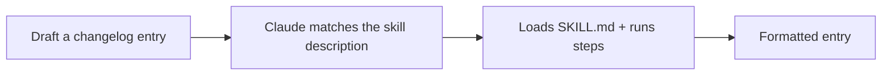

<LevelBadge level="intermediate" />

<Callout type="objectives" items={["Einen funktionierenden Skill von Grund auf bauen und nachweisen, dass er tatsächlich aktiviert wird", "Eine description schreiben, die zum richtigen Zeitpunkt auslöst — das eine Feld, das entscheidet, ob ein Skill überhaupt je läuft", "Entscheiden, wann ein Helfer-Skript für deterministische Datenerhebung sinnvoll ist", "Einen Skill diagnostizieren, der nie auslöst, und die drei Fallstricke kennen, die das verursachen"]} />

<VerifyNote lastVerified="2026-06-20" source="https://code.claude.com/docs/en/skills">
Skill-Aufbau und -Erkennung können sich ändern — gleiche sie mit der offiziellen Skills-Dokumentation ab.
</VerifyNote>

Lass uns einen funktionierenden [Skill](/docs/claude-code/skills) von Grund auf bauen und nachweisen, dass er aktiviert wird. Wir erstellen einen kleinen Skill für "Changelog-Einträge" — generisch und wiederverwendbar.

## Schritt 1 — Den Ordner erstellen

<PromptCard title="Den Skill-Ordner erstellen">{`mkdir -p .claude/skills/changelog-entry`}</PromptCard>

(Verwende `~/.claude/skills/…` für einen persönlichen Skill über alle Projekte hinweg.)

## Schritt 2 — SKILL.md schreiben

`.claude/skills/changelog-entry/SKILL.md`:

```markdown
---
name: changelog-entry
description: Use when the user wants to turn recent git commits into a Keep a Changelog entry.
---

# Changelog Entry

When asked for a changelog entry:
1. Run `git log --oneline -20` to see recent commits.
2. Group them into Added / Changed / Fixed / Removed (Keep a Changelog style).
3. Write concise, user-facing bullets (not raw commit messages).
4. Output only the formatted entry.
```

Die **`description` ist der Auslöser** — formuliere sie als "Use when…", damit Claude den Skill zum richtigen Zeitpunkt lädt.

## Schritt 3 — (Optional) ein Helfer-Skript hinzufügen

Skills können Skripte mitliefern. Füge `scripts/recent.sh` hinzu und verweise aus der SKILL.md darauf, wenn du eine deterministische Datenerhebung möchtest:

```bash
#!/usr/bin/env bash
git log --oneline -20
```

## Schritt 4 — Nachweisen, dass er auslöst

Starte eine Sitzung und probiere den Prompt unten. Claude sollte die Absicht erkennen, den Skill laden und seinen Schritten folgen. Wenn er nicht aktiviert wird, ist deine `description` wahrscheinlich nicht spezifisch genug darin, *wann* er verwendet werden soll — schärfe sie nach.

<PromptCard title="Nachweisen, dass der Skill auslöst">{`Draft a changelog entry for recent work.`}</PromptCard>



## Schritt 5 — Ihn teilen

Bündle ihn (mit anderen) zu einem [Plugin](/docs/claude-code/plugins-marketplaces), damit dein Team ihn in einem Schritt installiert — oder steuere ihn zu den [Skill-Packs](/docs/templates/skills) von AILmanac bei.

## Fallstricke

- **Vage description** → löst nie aus (oder immer). Sei spezifisch.
- **Zu viel in einem Skill** → halte ihn auf eine klare Aufgabe begrenzt.
- **Secrets in einem geteilten Skill** → niemals; siehe [Code von Drittanbietern überprüfen](/docs/security/reviewing-third-party-code).

<Callout type="takeaways" items={["Ein Skill ist ein Ordner plus eine SKILL.md — .claude/skills/<name>/ für das Projekt, ~/.claude/skills/ für jedes Projekt", "Die description ist der Auslöser. Formuliere sie als \"Use when…\", damit Claude den Skill im richtigen Moment lädt", "Skills können Skripte mitliefern — nutze eines, wenn du eine deterministische Datenerhebung willst, statt Claude den Befehl improvisieren zu lassen", "Weise die Funktion nach, indem du die Absicht promptest, nicht indem du den Skill beim Namen nennst. Wenn er nicht auslöst, ist die description nicht spezifisch genug darin, WANN", "Halte einen Skill auf eine klare Aufgabe begrenzt und lege niemals Secrets in einen Skill, den du teilst"]} />

<Quiz title="Teste dich selbst" questions={[{q: "Dein Skill wird nie aktiviert, egal was du fragst. Welches Feld ist mit ziemlicher Sicherheit das Problem?", options: ["name — es muss exakt zum Ordner passen", "description — sie ist nicht spezifisch genug darin, WANN der Skill verwendet werden soll", "Dem Helfer-Skript fehlt das Ausführbar-Bit"], answer: 1, explain: "Die description ist der Auslöser. Als \"Use when…\" formuliert und konkret zur Situation, sagt sie Claude, wann der Skill zu laden ist. Vage descriptions lösen nie aus — oder ständig."}, {q: "Du willst einen Changelog-Skill in jedem Projekt verfügbar haben, nicht nur in diesem. Wohin gehört er?", options: [".claude/skills/changelog-entry/ in jedem Repo", "~/.claude/skills/changelog-entry/", "Er muss zuerst als Plugin veröffentlicht werden"], answer: 1, explain: "Verwende ~/.claude/skills/… für einen persönlichen Skill, der über alle Projekte hinweg gilt. Der Repo-interne Pfad .claude/skills/ begrenzt einen Skill auf dieses Projekt."}, {q: "Warum ein Helfer-Skript wie scripts/recent.sh mit einem Skill mitliefern?", options: ["Skills können ohne eines keine Shell-Befehle ausführen", "Für deterministische Datenerhebung — das Skript läuft jedes Mal gleich, statt dass Claude improvisiert", "Es lässt den Skill schneller laden"], answer: 1, explain: "Skills können Skripte mitliefern, und ein Verweis aus der SKILL.md gibt dir eine deterministische Datenerhebung. Das ist optional — du fügst es hinzu, wenn du bei jedem Lauf exakt denselben Befehl willst, statt es dem Modell zu überlassen."}]} />

## Weiter

- [Skills: Expertise auf Abruf](/docs/claude-code/skills)
- [SKILL.md-Vorlagen](/docs/templates/skills)
- [Baue und verdrahte deinen ersten MCP-Server](/docs/walkthroughs/first-mcp-server)
