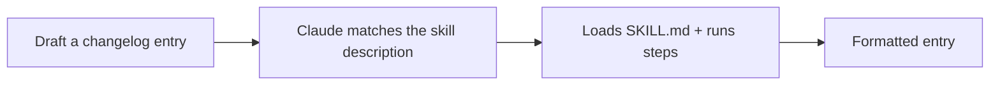

<LevelBadge level="intermediate" />

<VerifyNote lastVerified="2026-06-20" source="https://docs.anthropic.com/en/docs/claude-code/skills">
Skill-Aufbau und -Erkennung können sich ändern — gleiche sie mit der offiziellen Skills-Dokumentation ab.
</VerifyNote>

Lass uns einen funktionierenden [Skill](/docs/claude-code/skills) von Grund auf bauen und nachweisen, dass er aktiviert wird. Wir erstellen einen kleinen Skill für "Changelog-Einträge" — generisch und wiederverwendbar.

## Schritt 1 — Den Ordner erstellen

```bash
mkdir -p .claude/skills/changelog-entry
```

(Verwende `~/.claude/skills/…` für einen persönlichen Skill über alle Projekte hinweg.)

## Schritt 2 — SKILL.md schreiben

`.claude/skills/changelog-entry/SKILL.md`:

```markdown
---
name: changelog-entry
description: Use when the user wants to turn recent git commits into a Keep a Changelog entry.
---

# Changelog Entry

When asked for a changelog entry:
1. Run `git log --oneline -20` to see recent commits.
2. Group them into Added / Changed / Fixed / Removed (Keep a Changelog style).
3. Write concise, user-facing bullets (not raw commit messages).
4. Output only the formatted entry.
```

Die **`description` ist der Auslöser** — formuliere sie als "Use when…", damit Claude den Skill zum richtigen Zeitpunkt lädt.

## Schritt 3 — (Optional) ein Helfer-Skript hinzufügen

Skills können Skripte mitliefern. Füge `scripts/recent.sh` hinzu und verweise aus der SKILL.md darauf, wenn du eine deterministische Datenerhebung möchtest:

```bash
#!/usr/bin/env bash
git log --oneline -20
```

## Schritt 4 — Nachweisen, dass er auslöst

Starte eine Sitzung und sage: *"Entwirf einen Changelog-Eintrag für die jüngste Arbeit."* Claude sollte die Absicht erkennen, den Skill laden und seinen Schritten folgen. Wenn er nicht aktiviert wird, ist deine `description` wahrscheinlich nicht spezifisch genug darin, *wann* er verwendet werden soll — schärfe sie nach.



## Schritt 5 — Ihn teilen

Bündle ihn (mit anderen) zu einem [Plugin](/docs/claude-code/plugins-marketplaces), damit dein Team ihn in einem Schritt installiert — oder steuere ihn zu den [Skill-Packs](/docs/templates/skills) von AILmanac bei.

## Fallstricke

- **Vage description** → löst nie aus (oder immer). Sei spezifisch.
- **Zu viel in einem Skill** → halte ihn auf eine klare Aufgabe begrenzt.
- **Secrets in einem geteilten Skill** → niemals; siehe [Code von Drittanbietern überprüfen](/docs/security/reviewing-third-party-code).

## Weiter

- [Skills: Expertise auf Abruf](/docs/claude-code/skills)
- [SKILL.md-Vorlagen](/docs/templates/skills)
- [Baue und verdrahte deinen ersten MCP-Server](/docs/walkthroughs/first-mcp-server)
