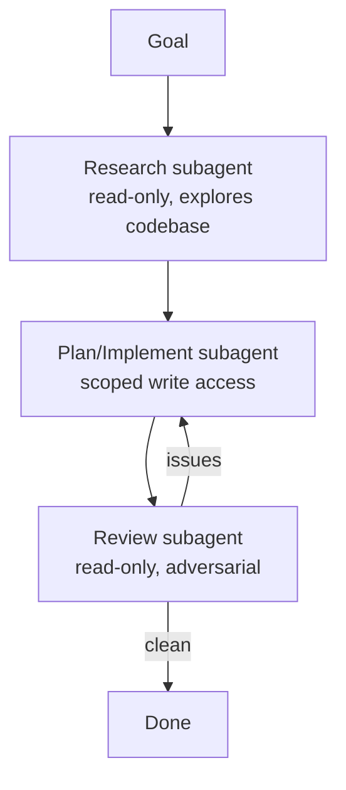

<LevelBadge level="advanced" />

Große Aufgaben gelingen besser, wenn du sie auf fokussierte [Subagenten](/docs/claude-code/subagents) aufteilst, statt alles in einen einzigen Kontext zu pressen. Lass uns eine Pipeline aus Recherche → Implementierung → Review entwerfen.

## Die Form

Jeder Subagent hat seinen **eigenen Kontext** und ein **maßgeschneidertes Toolset** — und nur das *Ergebnis* fließt in die Hauptsitzung zurück, sodass diese sauber bleibt.

## Schritt 1 — Die Agenten definieren

Definiere über die `/agents`-Oberfläche drei davon, jeweils mit einer präzisen `description` (damit der Hauptagent korrekt delegiert) und eingegrenzten Tools:

- **researcher** — nur Lesen/Suchen. Kartiert den relevanten Code und liefert Erkenntnisse zurück.
- **implementer** — kann Dateien bearbeiten und Tests ausführen; erhält die Erkenntnisse des researcher als Eingabe.
- **reviewer** — nur Lesen, adversarial: sucht nach Bugs, fehlenden Fällen und Konventionsverletzungen.

## Schritt 2 — Mit Übergaben orchestrieren

Die Hauptsitzung reicht die Ausgabe jeder Phase an die nächste weiter: Recherche → Implementierung (unter Nutzung der Recherche) → Review (der Implementierung). Füge ein **Review-Gate** hinzu: Wenn der reviewer Probleme findet, kehre vor dem Abschluss zum implementer zurück.

## Schritt 3 — Erkennen, wann man dies NICHT tun sollte

:::warning Parallelität/Multi-Agenten gibt es nicht umsonst
- **Sequenzielle Abhängigkeiten** (Implementierung braucht Recherche) bleiben sequenziell — fächere nicht dort auf, wo die Reihenfolge zählt.
- **Gemeinsame Dateischreibvorgänge** können kollidieren — isoliere sie mit [Git-Worktrees](/docs/claude-code/worktrees) oder serialisiere sie.
- Bei kleinen Aufgaben übersteigt der Koordinationsaufwand den Nutzen. Verwende dies für **umfangreiche, zerlegbare** Arbeit.
:::

## Schritt 4 — Überprüfen

Ein guter Multi-Agenten-Durchlauf zeigt: einen fokussierten Hauptkontext (das umfangreiche Lesen fand im researcher statt), eine Implementierung, die die Recherche widerspiegelt, und ein Review, das tatsächlich etwas gefunden hat (oder glaubwürdig grünes Licht gegeben hat). Wenn der reviewer nur ein Abnickgremium ist, mache seinen Prompt **adversarial** ("versuche herauszufinden, was falsch ist").

## Weiterführend

Dasselbe Muster, programmatisch umgesetzt, findet sich unter [Agenten auf der API bauen](/docs/api/building-agents) und in Produktoberflächen wie [Cowork und Agent-Teams](/docs/api/cowork-and-agent-teams).

## Weiter

- [Subagenten und parallele Agenten](/docs/claude-code/subagents)
- [Git-Worktrees](/docs/claude-code/worktrees)
- [Agenten auf der API bauen](/docs/api/building-agents)
