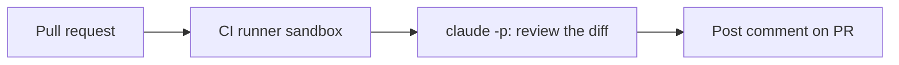

<LevelBadge level="advanced" />

<VerifyNote lastVerified="2026-06-20" source="https://code.claude.com/docs/en/sdk">
Headless-Flags und Details zur CI-Integration entwickeln sich weiter — gleiche sie mit der offiziellen Claude-Code-/Agent-SDK-Dokumentation ab.
</VerifyNote>

Eine klassische Automatisierung mit hohem Nutzen: Lass Claude **jeden Pull Request überprüfen** und seine Erkenntnisse als Kommentar posten — [headless](/docs/claude-code/headless-and-agent-sdk) in der CI ausgeführt. Hier ist die Form, mit den Leitplanken, die sie sicher halten.

## Was es tut

Bei jedem PR: den Diff auschecken, Claude bitten, ihn auf Bugs/Randfälle/Konventionsprobleme zu überprüfen, und einen Kommentar posten. Menschen entscheiden weiterhin; Claude liefert nur einen schnellen ersten Durchgang.



## Der Workflow (Skizze)

```yaml
name: Claude PR review
on: pull_request
permissions:
  contents: read
  pull-requests: write   # to comment — NOT write to code
jobs:
  review:
    runs-on: ubuntu-latest
    steps:
      - uses: actions/checkout@v4
        with: { fetch-depth: 0 }
      - name: Review the diff
        env:
          ANTHROPIC_API_KEY: ${{ secrets.ANTHROPIC_API_KEY }}
        run: |
          git diff origin/${{ github.base_ref }}...HEAD > /tmp/diff.patch
          claude -p "Review this diff for correctness bugs, missing edge cases, and
          security issues. Report ONLY high-confidence findings as a Markdown
          checklist with file:line. Diff:" < /tmp/diff.patch > /tmp/review.md
      # then post /tmp/review.md as a PR comment (e.g. with the gh CLI or an action)
```

(Der genaue Headless-Aufruf kann abweichen — siehe die Dokumentation. Das Prinzip lautet: den Diff einspeisen, Markdown erfassen, ihn posten.)

## Die Leitplanken (lies [Autonome Durchläufe absichern](/docs/security/hardening-autonomous-runs))

:::warning Least Privilege in der CI
- **Nur kommentieren.** Gewähre `pull-requests: write`, **nicht** `contents: write` — der Bot soll keinen Code pushen.
- **Begrenze den Token-Scope**; gib niemals Deploy-/Secret-Zugriff an einen Job weiter, der nicht vertrauenswürdige PR-Inhalte liest.
- **Behandle PR-Inhalte als nicht vertrauenswürdig** — sie können [Prompt-Injection](/docs/security/prompt-injection) enthalten; lass den Job keine folgenschweren Aktionen ausführen.
- **Begrenze die Kosten** — große Diffs kosten [Tokens](/docs/api/tokens-and-pricing); erwäge, nur geänderte Dateien zu überprüfen.
:::

## Mach es nützlich, nicht störend

- Frage **ausschließlich nach Erkenntnissen mit hoher Konfidenz** — eine Wand aus Kleinigkeiten wird ignoriert.
- Behalte es als **ersten Durchgang** bei, wobei Menschen die Merge-Entscheidung treffen.

## Weiter

- [Headless-Modus und das Agent SDK](/docs/claude-code/headless-and-agent-sdk)
- [Autonome Durchläufe absichern](/docs/security/hardening-autonomous-runs)
- [Coding und Softwareentwicklung](/docs/playbooks/coding)
