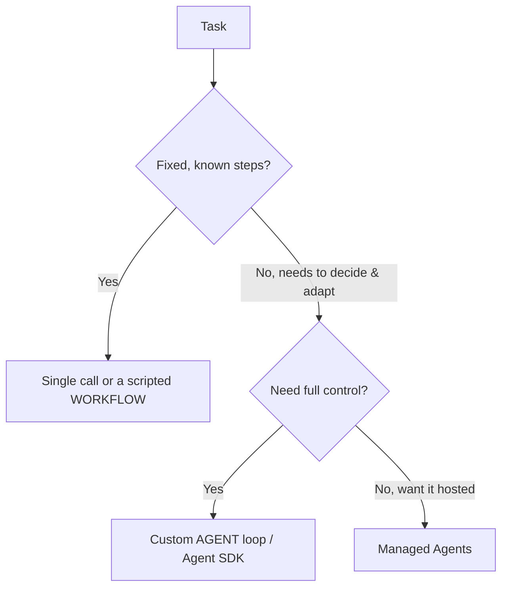

<LevelBadge level="advanced" />

<VerifyNote lastVerified="2026-07-21" source="https://platform.claude.com/docs/en/agents-and-tools/tool-use/overview">
Las herramientas para agentes (el Agent SDK, las opciones gestionadas) evolucionan rápidamente: confirma las opciones actuales en la documentación oficial.
</VerifyNote>

<Callout type="objectives" items={["Definir qué es realmente un agente: un modelo que se ejecuta en un bucle", "Aplicar el test de decisión para elegir entre llamada única, flujo de trabajo o agente", "Diseñar un bucle de agente mínimo con las salvaguardas adecuadas", "Saber cuándo recurrir al Claude Agent SDK en lugar de programarlo a mano", "Hacer que un agente sea robusto: acotarlo, gestionar fallos, restringir privilegios y evaluarlo"]} />

Un **agente** es un modelo que se ejecuta en un bucle: persigue un objetivo llamando a [herramientas](/docs/api/tool-use), observando los resultados y decidiendo el siguiente paso hasta terminar. Antes de crear uno, elige *lo más simple que funcione*.

## El test de decisión (no sobredimensiones)

No toda tarea necesita un agente. Recorre primero este árbol: la mayoría de las tareas se detienen en la parte superior.

Tres opciones, de la más simple a la más compleja:

- **Llamada única** — un solo prompt lo resuelve. La mayoría de las tareas. Lo más barato y fiable.
- **Flujo de trabajo** — orquestas una secuencia fija de llamadas en código (flujo de control determinista). Úsalo cuando los pasos son conocidos.
- **Agente** — el modelo decide los pasos dinámicamente. Úsalo solo cuando el camino realmente no se puede codificar de forma fija.

<Callout type="warning">
Recurre a un agente cuando la adaptabilidad sea la clave, no porque suene impresionante. Un flujo de trabajo que tú controlas es más fácil de probar y depurar.
</Callout>

## Diseñar el bucle

Un agente personalizado mínimo se compone de solo cuatro piezas móviles. Constrúyelas en este orden:

<Steps items={[
  {title: "Prompt de sistema", body: "Indica el objetivo, las restricciones y las herramientas disponibles. Es lo que el modelo razona en cada turno."},
  {title: "El bucle", body: "Envía mensajes → si la respuesta es un tool_use, ejecuta la herramienta, añade un tool_result y repite → hasta una respuesta final o una condición de parada."},
  {title: "Salvaguardas", body: "Añade un límite máximo de iteraciones, un presupuesto de tokens/coste y la validación de las entradas de las herramientas antes de ejecutar nada."},
  {title: "Gestión del contexto", body: "Resume o recorta a medida que crece el historial: la misma idea que se cubre en Gestión del contexto (/docs/claude-code/context-management)."}
]} />

El **[Claude Agent SDK](/docs/claude-code/headless-and-agent-sdk)** te ofrece este bucle —herramientas, permisos, gestión del contexto— todo incluido, para que no tengas que construirlo a mano.

<Callout type="tip">
Antes de escribir tu propio bucle, pregúntate si el Agent SDK ya lo cubre. Incluye el bucle, los permisos y la gestión del contexto, para que puedas centrarte en las herramientas y el objetivo.
</Callout>

## Hazlo robusto

Un bucle que puede llamar a herramientas también puede comportarse mal. Cuatro hábitos mantienen fiable a un agente:

- **Acota todo**: iteraciones, tiempo, coste. Los agentes pueden quedar en bucle.
- **Gestiona los fallos de las herramientas** con elegancia (devuelve el error como resultado).
- **Mínimo privilegio + humano en el bucle** para acciones arriesgadas: consulta [Proteger agentes](/docs/security/securing-agents).
- **Evalúalo** con casos reales antes de confiar en él: consulta [Evaluaciones](/docs/foundations/evals).

<Callout type="takeaways" items={["Un agente es un modelo en un bucle que llama a herramientas hacia un objetivo: úsalo solo cuando el camino no se pueda codificar de forma fija", "Orden de decisión: llamada única → flujo de trabajo → agente → agentes gestionados; prefiere lo más simple que funcione", "Un bucle mínimo = prompt de sistema + bucle tool_use/tool_result + salvaguardas + gestión del contexto", "El Claude Agent SDK incluye el bucle, las herramientas, los permisos y la gestión del contexto por ti", "Robustez = acotar iteraciones/tiempo/coste, gestionar fallos de herramientas, mínimo privilegio + humano en el bucle, y evaluar antes de confiar"]} />

## Compruébalo tú mismo

<Quiz title="Compruébalo tú mismo" questions={[
  {
    q: "¿Qué describe mejor a un agente en este contexto?",
    options: [
      "Un único prompt que devuelve una respuesta completa",
      "Un modelo que se ejecuta en un bucle, llamando a herramientas y decidiendo el siguiente paso hasta terminar",
      "Una secuencia fija de llamadas a la API que orquestas en código",
      "Un servicio alojado que no requiere ninguna configuración"
    ],
    answer: 1,
    explain: "Un agente es un modelo que se ejecuta en un bucle: persigue un objetivo llamando a herramientas, observando los resultados y decidiendo el siguiente paso hasta terminar."
  },
  {
    q: "La tarea tiene pasos fijos y conocidos. ¿A qué deberías recurrir?",
    options: [
      "Un bucle de agente personalizado, para tener el máximo control",
      "Agentes gestionados, para que esté alojado",
      "Una llamada única o un flujo de trabajo programado",
      "Un equipo de varios agentes"
    ],
    answer: 2,
    explain: "Cuando los pasos son fijos y conocidos, una llamada única o un flujo de trabajo programado (flujo de control determinista) es la opción correcta y más simple."
  },
  {
    q: "¿Cuándo está realmente justificado un agente personalizado?",
    options: [
      "Siempre que suene más impresionante que un flujo de trabajo",
      "Cuando la adaptabilidad es la clave y el camino realmente no se puede codificar de forma fija",
      "Para toda tarea que llame a más de una herramienta",
      "Solo cuando no puedas usar el Agent SDK"
    ],
    answer: 1,
    explain: "Recurre a un agente cuando la adaptabilidad sea la clave, no porque suene impresionante. Un flujo de trabajo que tú controlas es más fácil de probar y depurar."
  },
  {
    q: "En el bucle, ¿qué ocurre cuando el modelo responde con un tool_use?",
    options: [
      "Detienes el bucle y devuelves la respuesta parcial",
      "Ejecutas la herramienta, añades un tool_result y repites",
      "Descartas el mensaje y reenvías el prompt de sistema",
      "Resumes el historial de inmediato"
    ],
    answer: 1,
    explain: "El bucle: envía mensajes → si hay un tool_use, ejecuta la herramienta, añade un tool_result, repite → hasta una respuesta final o una condición de parada."
  },
  {
    q: "¿Cuál NO es una de las salvaguardas para hacer robusto a un agente?",
    options: [
      "Un límite máximo de iteraciones y un presupuesto de tokens/coste",
      "Gestionar los fallos de las herramientas devolviendo el error como resultado",
      "Conceder al agente todos los privilegios para que nunca quede bloqueado",
      "Mínimo privilegio más humano en el bucle para acciones arriesgadas"
    ],
    answer: 2,
    explain: "Los agentes robustos usan el mínimo privilegio más un humano en el bucle para las acciones arriesgadas: lo contrario de conceder todos los privilegios. También acotas iteraciones/tiempo/coste, gestionas los fallos de las herramientas con elegancia y evalúas antes de confiar."
  }
]} />

## Siguiente

- [Uso de herramientas](/docs/api/tool-use) · [Modo headless y Agent SDK](/docs/claude-code/headless-and-agent-sdk)
- [Agentes gestionados](/docs/api/managed-agents) · [Cowork y equipos de agentes](/docs/api/cowork-and-agent-teams)
- [Proteger agentes y herramientas](/docs/security/securing-agents)
