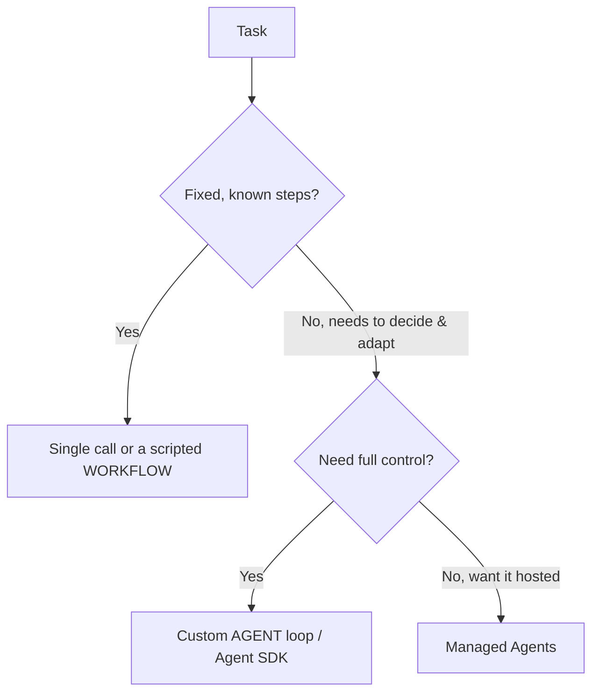

<LevelBadge level="advanced" />

<VerifyNote lastVerified="2026-06-20" source="https://docs.anthropic.com/en/docs/agents-and-tools">
Las herramientas para agentes (el Agent SDK, las opciones gestionadas) evolucionan rápidamente: confirma las opciones actuales en la documentación oficial.
</VerifyNote>

Un **agente** es un modelo que se ejecuta en un bucle: persigue un objetivo llamando a [herramientas](/docs/api/tool-use), observando los resultados y decidiendo el siguiente paso hasta terminar. Antes de crear uno, elige *lo más simple que funcione*.

## El test de decisión (no sobredimensiones)

- **Llamada única** — un solo prompt lo resuelve. La mayoría de las tareas. Lo más barato y fiable.
- **Flujo de trabajo** — orquestas una secuencia fija de llamadas en código (flujo de control determinista). Úsalo cuando los pasos son conocidos.
- **Agente** — el modelo decide los pasos dinámicamente. Úsalo solo cuando el camino realmente no se puede codificar de forma fija.

> Recurre a un agente cuando la adaptabilidad sea la clave, no porque suene impresionante. Un flujo de trabajo que tú controlas es más fácil de probar y depurar.

## Diseñar el bucle

Un agente personalizado mínimo:

1. **Prompt de sistema**: el objetivo, las restricciones y las herramientas disponibles.
2. **Bucle**: envía mensajes → si hay `tool_use`, ejecuta la herramienta, añade el `tool_result`, repite → hasta una respuesta final o una condición de parada.
3. **Salvaguardas**: un límite máximo de iteraciones, un presupuesto de tokens/coste y validación de las entradas de las herramientas.
4. **Gestión del contexto**: resume/recorta a medida que crece el historial (la misma idea que en [Gestión del contexto](/docs/claude-code/context-management)).

El **[Claude Agent SDK](/docs/claude-code/headless-and-agent-sdk)** te ofrece este bucle —herramientas, permisos, gestión del contexto— todo incluido, para que no tengas que construirlo a mano.

## Hazlo robusto

- **Acota todo**: iteraciones, tiempo, coste. Los agentes pueden quedar en bucle.
- **Gestiona los fallos de las herramientas** con elegancia (devuelve el error como resultado).
- **Mínimo privilegio + humano en el bucle** para acciones arriesgadas: consulta [Proteger agentes](/docs/security/securing-agents).
- **Evalúalo** con casos reales antes de confiar en él: consulta [Evaluaciones](/docs/foundations/evals).

## Siguiente

- [Uso de herramientas](/docs/api/tool-use) · [Modo headless y Agent SDK](/docs/claude-code/headless-and-agent-sdk)
- [Agentes gestionados](/docs/api/managed-agents) · [Cowork y equipos de agentes](/docs/api/cowork-and-agent-teams)
- [Proteger agentes y herramientas](/docs/security/securing-agents)
