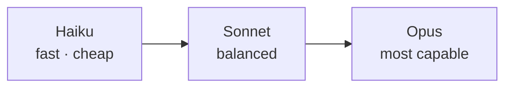

<LevelBadge level="beginner" />

Anthropic ofrece una familia de modelos en distintos puntos de capacidad/coste/velocidad. Elegir bien consiste sobre todo en ajustar el modelo a la tarea, y en no pagar de más por una capacidad que no necesitas.

## Los modelos actuales

<ModelTable />

## Pruébalo: ¿qué modelo encaja?

Responde a tres preguntas y obtén una recomendación de partida:

<ModelPicker />

## El modelo mental: una escalera de capacidades

- **Empieza con Sonnet.** Es el caballo de batalla por defecto: razonamiento y programación sólidos a un coste razonable. La mayoría de las tareas deberían empezar aquí.
- **Sube a Opus** solo cuando Sonnet tenga dificultades y la calidad importe más que el coste (razonamiento difícil, agentes complicados, código enrevesado).
- **Baja a Haiku** para trabajo de alto volumen, sensible a la latencia o simple (clasificación, extracción, enrutamiento, subagentes baratos).

## Cómo elegir de verdad

1. **Usa Sonnet por defecto** y ponlo en producción.
2. **¿Topas con un techo de calidad?** Prueba Opus solo en el subconjunto difícil.
3. **¿El coste o la latencia te están perjudicando?** Comprueba si Haiku es suficientemente bueno para ese paso.
4. **Mezcla modelos.** Usa Haiku para preprocesamiento/posprocesamiento barato y Sonnet/Opus para el núcleo difícil. Esta "estratificación de modelos" es una de las mayores palancas de coste: consulta [Coste y latencia](/docs/foundations/cost-and-latency).

:::tip No elijas solo a partir de los benchmarks
Los benchmarks públicos son una pista de partida, no un veredicto para *tu* tarea. Ejecuta una pequeña [evaluación](/docs/foundations/evals) con un puñado de tus entradas reales en dos modelos: lleva minutos y es mejor que adivinar.
:::

## Consultar el ID exacto del modelo

Pasa siempre el ID de modelo actual de la API (por ejemplo, en tu llamada a `messages.create`). Obtenlo en la [tabla de modelos de arriba](/docs/whats-new/models-and-pricing) o en la página oficial de modelos, y prefiere leerlo desde la configuración en lugar de codificarlo de forma fija en muchos sitios, para que las actualizaciones de modelo sean un cambio de una sola línea.

## Siguiente

- [Tokens, contexto y precios](/docs/api/tokens-and-pricing)
- [Tu primera llamada a la API](/docs/api/first-call)
- [Modelos y precios actuales](/docs/whats-new/models-and-pricing)
