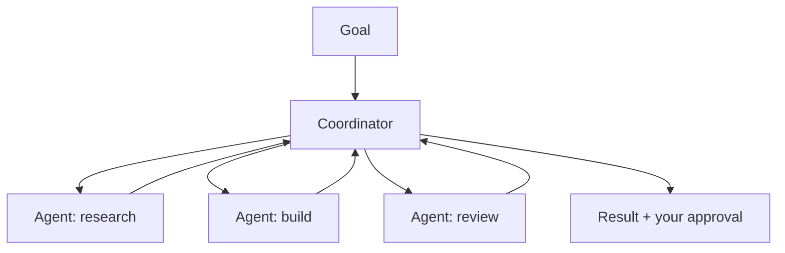

<LevelBadge level="advanced" />

<VerifyNote lastVerified="2026-06-20" source="https://platform.claude.com/docs">
Cowork y los equipos de agentes son superficies de 2026 que evolucionan rápido: los nombres, la disponibilidad y las capacidades cambian a menudo. Confirma los detalles actuales en la documentación o los anuncios oficiales de Anthropic.
</VerifyNote>

Más allá de un único agente, Anthropic ha ido lanzando superficies **a nivel de producto** para que los agentes realicen trabajo sostenido y colaborativo: **Cowork** (un espacio de trabajo agéntico de escritorio) y **equipos de agentes** (varios agentes colaborando). Esta página es un mapa de alto nivel: verifica los detalles concretos en la documentación oficial, ya que estos evolucionan rápidamente.

## Claude Cowork

Piénsalo como un **espacio de trabajo en el que un agente realiza trabajo real de varios pasos** junto a ti, operando sobre archivos y herramientas en un horizonte más largo que un único turno de chat, mientras tú supervisas. Es el primo orientado al consumidor/profesional de crear un agente con la API: el bucle viene dado y tú diriges los objetivos.

## Equipos de agentes

Cuando un solo agente no basta, **varios agentes colaboran**: dividen un objetivo, cada uno con un rol y unas herramientas, coordinándose hacia un resultado. Conceptualmente refleja los [subagentes](/docs/claude-code/subagents) de Claude Code, pero como una superficie de producto para la colaboración sostenida y multiagente en lugar de una única subtarea delegada.

## Cómo se relaciona esto con el resto del sitio

- Construirlo tú mismo, de forma programática → [Crear agentes](/docs/api/building-agents) + el [Agent SDK](/docs/claude-code/headless-and-agent-sdk).
- Delegación dentro de una sesión de programación → [Subagentes](/docs/claude-code/subagents).
- Bucle/estado/programación gestionados → [Agentes gestionados](/docs/api/managed-agents).

## La constante: la supervisión

:::warning Más autonomía, más cuidado
El trabajo multiagente y de horizonte largo amplifica tanto el valor *como* el riesgo. Mantén a las personas en el bucle para las acciones de calado, restringe estrictamente el acceso de las herramientas y verifica las salidas: consulta [Uso responsable](/docs/security/responsible-use) y [Proteger agentes](/docs/security/securing-agents).
:::

## Siguiente

- [Subagentes y agentes en paralelo](/docs/claude-code/subagents)
- [Agentes gestionados](/docs/api/managed-agents)
- [Uso responsable, ética y verificación](/docs/security/responsible-use)
