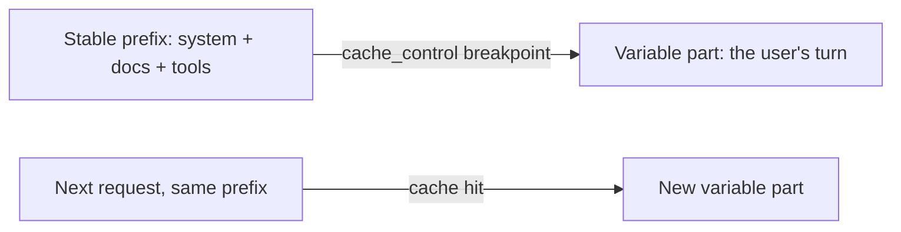

<LevelBadge level="advanced" />

<VerifyNote lastVerified="2026-06-20" source="https://docs.anthropic.com/en/docs/build-with-claude/prompt-caching">
La mecánica de la caché, la elegibilidad y los precios de los tokens en caché frente a los nuevos cambian: confírmalo en la documentación oficial de caché de prompts.
</VerifyNote>

Si muchas de tus solicitudes comparten un fragmento grande e invariable —un prompt de sistema largo, un documento extenso, un catálogo de herramientas—, la **caché de prompts** permite que la API reutilice el prefijo ya procesado en lugar de releerlo en cada llamada. Eso reduce tanto el **coste** como la **latencia** de la parte en caché.

## Cómo funciona (el modelo mental)

Marcas un **punto de corte de caché** después del prefijo estable. En la primera llamada se procesa y se almacena en caché; las llamadas posteriores que comparten el **mismo prefijo exacto** aciertan en la caché y pagan mucho menos por él.

## La invariante que lo hace funcionar o lo rompe

:::warning La caché es exacta en el prefijo
Un acierto de caché requiere que el prefijo en caché sea **idéntico byte a byte**. El error más común: un *invalidador silencioso* cerca del principio del prompt —una marca de tiempo, un nombre de usuario que cambia, una lista de herramientas reordenada— que altera el prefijo y reduce silenciosamente tu tasa de aciertos a cero.
:::

**Pon todo lo estable primero y todo lo variable al final,** y mantén el prefijo verdaderamente constante.

## Dónde rinde más

- **Prompts de sistema** largos reutilizados entre usuarios.
- **RAG / Q&A sobre documentos** donde se consulta repetidamente el mismo texto fuente.
- **Agentes** con un catálogo de herramientas e instrucciones fijos a lo largo de muchos turnos.

Combina la caché con el **procesamiento por lotes** para cargas de trabajo offline, y con el ajuste del tamaño del modelo ([Elegir un modelo](/docs/api/choosing-a-model)) para el mayor ahorro combinado: consulta [Coste y latencia](/docs/foundations/cost-and-latency).

## Siguiente

- [Tokens, contexto y precios](/docs/api/tokens-and-pricing)
- [Streaming y multiturno](/docs/api/streaming)
- [Crear agentes con la API](/docs/api/building-agents)
