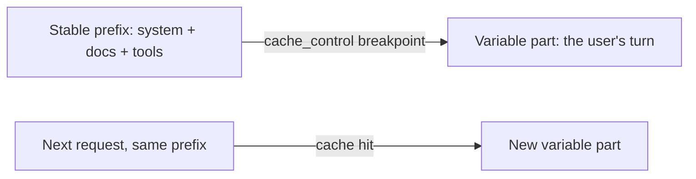

import Tabs from '@theme/Tabs';
import TabItem from '@theme/TabItem';

<LevelBadge level="advanced" />

<VerifyNote lastVerified="2026-06-21" source="https://docs.anthropic.com/en/docs/build-with-claude/prompt-caching">
La mecánica de la caché, los requisitos de elegibilidad y el precio de los tokens en caché frente a los nuevos cambian: confírmalo en la documentación oficial de prompt-caching.
</VerifyNote>

Si muchas de tus solicitudes comparten un bloque grande e inmutable —un system prompt largo, un documento extenso, un catálogo de herramientas—, el **almacenamiento en caché de prompts** permite que la API reutilice el prefijo ya procesado en lugar de releerlo en cada llamada. Eso reduce tanto el **costo** como la **latencia** de la parte en caché.

## Cómo funciona (el modelo mental)

Marcas un **punto de corte de caché** después del prefijo estable. En la primera llamada se procesa y se almacena en caché; las llamadas posteriores que comparten el **mismo prefijo exacto** aciertan en la caché y pagan mucho menos por él.



## Marca el punto de corte (copiar y pegar)

Agrega `cache_control` al **último bloque estable**: aquí, un system prompt extenso. El turno del usuario viene después y varía libremente; todo lo que precede al bloque marcado, incluido este, se almacena en caché.

<Tabs groupId="lang">
<TabItem value="python" label="Python">

```python
import anthropic

client = anthropic.Anthropic()

message = client.messages.create(
    model="claude-sonnet-4-6",
    max_tokens=1024,
    system=[
        {
            "type": "text",
            "text": LARGE_STABLE_PROMPT,  # long, unchanging — the cached prefix
            "cache_control": {"type": "ephemeral"},
        }
    ],
    messages=[{"role": "user", "content": "Summarize the key points."}],  # varies per call
)

print(message.usage.cache_read_input_tokens)  # > 0 means you got a hit
```

</TabItem>
<TabItem value="ts" label="TypeScript">

```ts
import Anthropic from "@anthropic-ai/sdk";

const client = new Anthropic();

const message = await client.messages.create({
  model: "claude-sonnet-4-6",
  max_tokens: 1024,
  system: [
    {
      type: "text",
      text: LARGE_STABLE_PROMPT, // long, unchanging — the cached prefix
      cache_control: { type: "ephemeral" },
    },
  ],
  messages: [{ role: "user", content: "Summarize the key points." }], // varies per call
});

console.log(message.usage.cache_read_input_tokens); // > 0 means you got a hit
```

</TabItem>
</Tabs>

La primera llamada paga un pequeño sobreprecio de **escritura** para poblar la caché; cada llamada posterior con el mismo prefijo lo lee de vuelta a una fracción del precio de entrada. El prefijo debe ser lo bastante largo para ser elegible —unos cuantos miles de tokens, según el modelo— o, de lo contrario, no se almacenará en caché de forma silenciosa.

## El invariante que lo hace funcionar o lo arruina

:::warning La caché es exacta en el prefijo
Un acierto de caché requiere que el prefijo en caché sea **idéntico byte a byte**. El error más común: un *invalidador silencioso* cerca del inicio del prompt —una marca de tiempo, un nombre de usuario que cambia, una lista de herramientas reordenada— que altera el prefijo y reduce silenciosamente tu tasa de aciertos a cero.
:::

**Pon todo lo estable primero y todo lo variable al final,** y mantén el prefijo verdaderamente constante.

## Verifica que realmente funciona

No lo des por hecho: léelo de vuelta desde el campo `usage` de la respuesta:

- **`cache_creation_input_tokens`**: tokens escritos en la caché en esta llamada (la primera solicitud).
- **`cache_read_input_tokens`**: tokens servidos desde la caché (el ahorro).
- **`input_tokens`**: el resto no almacenado en caché, facturado a precio completo.

Si `cache_read_input_tokens` se mantiene en **cero** en solicitudes repetidas que deberían compartir un prefijo, hay un invalidador silencioso en acción: compara los bytes del prompt renderizado entre dos llamadas para encontrarlo.

## Dónde rinde más

- **System prompts** largos reutilizados entre usuarios.
- **RAG / preguntas y respuestas sobre documentos** donde el mismo texto fuente se consulta repetidamente.
- **Agentes** con un catálogo de herramientas e instrucciones fijos a lo largo de muchos turnos.

Combina la caché con el **procesamiento por lotes** para cargas de trabajo offline, y con la elección del tamaño adecuado del modelo ([Elegir un modelo](/docs/api/choosing-a-model)) para el mayor ahorro combinado: consulta [Costo y latencia](/docs/foundations/cost-and-latency).

## Siguiente

- [Tokens, contexto y precios](/docs/api/tokens-and-pricing)
- [Streaming y multi-turno](/docs/api/streaming)
- [Construir agentes sobre la API](/docs/api/building-agents)
