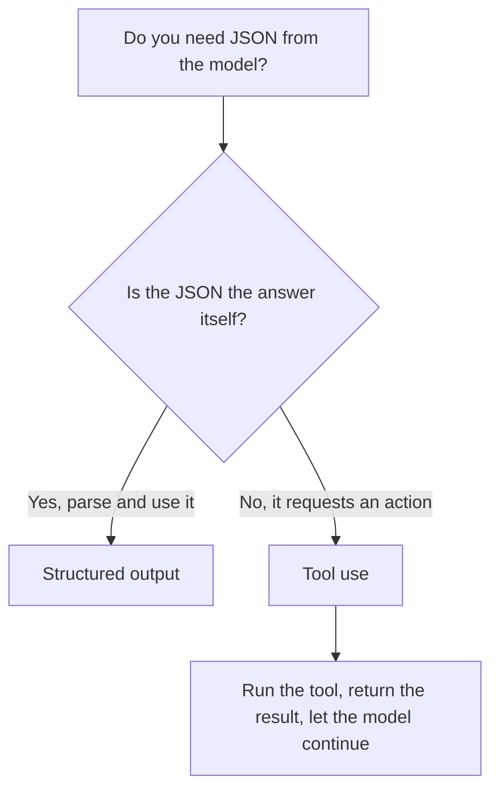

<LevelBadge level="intermediate" />

<VerifyNote lastVerified="2026-06-20" source="https://platform.claude.com/docs/en/docs/build-with-claude/structured-outputs">
El mecanismo exacto para imponer un esquema evoluciona: confirma el enfoque actual (configuración de salida / ayudantes de parseo) en la documentación oficial.
</VerifyNote>

<Callout type="objectives" items={["Explicar por qué la salida impuesta por esquema gana al prompting de JSON con la esperanza de que salga bien", "Proporcionar un JSON Schema y parsear la respuesta en un objeto tipado (Pydantic / Zod)", "Distinguir la salida estructurada del uso de herramientas por su intención, no por su mecanismo", "Aplicar los cuatro consejos para esquemas ajustados y fiables", "Elegir la herramienta correcta con una regla práctica de una sola pregunta"]} />

Cuando la salida de Claude alimenta a otro software, necesitas una **estructura fiable**: JSON válido que coincida con una forma conocida, siempre. No te fíes de "responde en JSON" y esperes lo mejor; usa el soporte de salida estructurada de la plataforma.

Esta lección te lleva desde *por qué falla el "pide y reza"* hasta *cómo imponer un esquema y parsearlo en un objeto tipado*, y cómo distinguir la salida estructurada del uso de herramientas cuando parecen idénticos. Trabájala de arriba abajo y luego ponte a prueba con el cuestionario que hay cerca del final.

## La forma fiable

Proporciona un **JSON Schema** para la salida y deja que la API/SDK lo imponga, luego parséalo en un objeto tipado (p. ej., Pydantic en Python, Zod en TypeScript). Los ayudantes de parseo del SDK te entregan un resultado tipado en lugar de una cadena que tengas que pasar por `JSON.parse` y validar tú mismo.

<Steps items={[
  {title: "Define la forma", body: "Modela la salida que necesitas como un JSON Schema: en Python mediante un BaseModel de Pydantic, en TypeScript mediante un esquema de Zod."},
  {title: "Solicita una salida que cumpla el esquema", body: "Pide al modelo que devuelva datos que se ajusten a ese esquema, para que la API/SDK lo imponga en lugar de dejarlo al azar."},
  {title: "Parsea en un objeto tipado", body: "Usa los ayudantes de parseo del SDK para obtener un resultado tipado directamente: sin JSON.parse manual ni validación hecha a mano."}
]} />

```python
# Conceptual shape — see the official docs for the current API surface.
from pydantic import BaseModel

class Ticket(BaseModel):
    title: str
    priority: str   # "low" | "medium" | "high"
    tags: list[str]

# Request the model to return data conforming to Ticket's JSON schema,
# then parse the response into a Ticket instance.
```

¿Quieres una solicitud concreta para adaptar? Aquí tienes la forma de lo que entregas al modelo: reemplaza el modelo por tu propio esquema.

<PromptCard title="Pide una salida que cumpla el esquema">{`Return the data conforming to this JSON Schema:

{
  "title": "string",
  "priority": "low | medium | high",
  "tags": ["string"]
}

Do not include any prose outside the JSON.`}</PromptCard>

## ¿Por qué no pedir JSON directamente en el prompt?

*Puedes* pedir JSON en el prompt, y para casos simples funciona, pero puede desviarse: prosa extraviada, una coma final, un campo faltante. La salida impuesta por esquema elimina esa clase de error, lo que importa en cuanto un sistema posterior depende de ella.

<Callout type="warning" items={["El JSON pedido por prompt funciona en demos y se rompe en producción: el fallo aparece solo cuando un sistema posterior lo parsea.", "Tres desviaciones clásicas que vigilar: prosa extraviada alrededor del JSON, una coma final y un campo obligatorio faltante."]} />

## Salida estructurada vs. uso de herramientas

Ambas funciones entregan al modelo un **JSON Schema**, así que se parecen — y la gente elige la equivocada. La diferencia es de *intención*, no de mecanismo:

| | **Salida estructurada** | **[Uso de herramientas](/docs/api/tool-use)** |
|---|---|---|
| Qué quieres | La **respuesta final**, en una forma fija | Que el modelo **invoque una capacidad** (llamar a una función, obtener datos, realizar una acción) |
| Quién la consume | Tu código, directamente | Tu código ejecuta la herramienta y luego devuelve el resultado al modelo |
| Forma del turno | Una respuesta, listo | Un bucle: el modelo pide, tú ejecutas, el modelo continúa |
| Uso típico | Extracción, clasificación, parseo | Agentes, búsquedas en vivo, efectos secundarios |

Una regla rápida:



Si el JSON *es* el entregable, usa salida estructurada. Si el JSON es el modelo pidiendo a tu código que *haga* algo, eso es uso de herramientas. Los agentes a menudo usan ambos: herramientas para actuar, salida estructurada para devolver un resultado final limpio.

## Consejos

<Callout type="tip" items={["Mantén los esquemas ajustados: usa enums para opciones fijas; marca los campos obligatorios.", "Describe los campos: las descripciones de campos guían al modelo como minipromts.", "Valida de todos modos en la frontera: el parseo defensivo es un seguro barato.", "Para tareas de extracción, la salida estructurada + un esquema claro gana al formato libre siempre."]} />

<Callout type="takeaways" items={["Entrega a la API/SDK un JSON Schema y parsea en un objeto tipado: no 'pidas y reces'.", "Pedir JSON por prompt puede desviarse (prosa extraviada, coma final, campo faltante); la imposición de esquema elimina esa clase de error.", "La salida estructurada y el uso de herramientas difieren por intención: el JSON ES la respuesta vs. el JSON solicita una acción.", "Esquemas ajustados, campos descritos y validación en la frontera hacen fiables la extracción y la clasificación."]} />

## Fija los términos

<Flashcards cards={[
  {front: "Salida estructurada", back: "Entregas a la API/SDK un JSON Schema para la respuesta final y parseas la respuesta en un objeto tipado (Pydantic / Zod). El JSON ES el entregable."},
  {front: "Uso de herramientas", back: "Entregas al modelo un JSON Schema para que pueda invocar una capacidad. Tu código ejecuta la herramienta y luego devuelve el resultado: un bucle, no una respuesta de un solo paso."},
  {front: "JSON Schema", back: "La forma en la que se basan ambas funciones. En Python la modelas con un BaseModel de Pydantic; en TypeScript con un esquema de Zod."},
  {front: "Ayudantes de parseo", back: "Ayudantes del SDK que devuelven un resultado tipado directamente, para que te saltes el JSON.parse manual y la validación hecha a mano."},
  {front: "Regla práctica de una sola pregunta", back: "¿Es el JSON la respuesta en sí misma? Sí → salida estructurada. No, solicita una acción → uso de herramientas."}
]} />

<Quiz title="Ponte a prueba" questions={[
  {
    q: "¿Cuál es la forma fiable de obtener JSON estructurado de Claude?",
    options: [
      "Pedir 'responde en JSON' en el prompt y reintentar ante los fallos",
      "Proporcionar un JSON Schema, dejar que la API/SDK lo imponga y luego parsear en un objeto tipado",
      "Generar texto libre y escribir una regex para extraer los campos"
    ],
    answer: 1,
    explain: "Proporciona un JSON Schema y deja que la API/SDK lo imponga, luego parsea en un objeto tipado como Pydantic (Python) o Zod (TypeScript)."
  },
  {
    q: "¿Por qué pedir JSON por prompt es arriesgado una vez que un sistema posterior depende de ello?",
    options: [
      "Es más lento que la imposición por esquema",
      "Puede desviarse: prosa extraviada, una coma final o un campo faltante",
      "Cuesta más tokens que el uso de herramientas"
    ],
    answer: 1,
    explain: "El JSON pedido por prompt funciona en casos simples pero puede desviarse; la salida impuesta por esquema elimina esa clase de error."
  },
  {
    q: "¿Qué distingue realmente la salida estructurada del uso de herramientas?",
    options: [
      "La salida estructurada usa JSON Schema; el uso de herramientas no",
      "La intención: la salida estructurada es la respuesta final en una forma fija, el uso de herramientas invoca una capacidad",
      "El uso de herramientas es para Python y la salida estructurada para TypeScript"
    ],
    answer: 1,
    explain: "Ambas entregan al modelo un JSON Schema, así que se parecen. La diferencia es de intención, no de mecanismo: la respuesta final vs. invocar una capacidad."
  },
  {
    q: "¿Cuál es un consejo sensato para diseñar esquemas?",
    options: [
      "Dejar los campos opcionales y omitir los enums para mayor flexibilidad",
      "Usar enums para opciones fijas, marcar los campos obligatorios y validar de todos modos en la frontera",
      "Confiar en el esquema y no validar nunca la salida parseada"
    ],
    answer: 1,
    explain: "Mantén los esquemas ajustados (enums, campos obligatorios), describe los campos como minipromts y aun así valida en la frontera como seguro barato."
  }
]} />

## Siguiente

- [Uso de herramientas / Llamada a funciones](/docs/api/tool-use) — las herramientas también usan esquemas JSON
- [Tu primera llamada a la API](/docs/api/first-call)
- [Plantillas de prompts reutilizables](/docs/templates/prompts)
