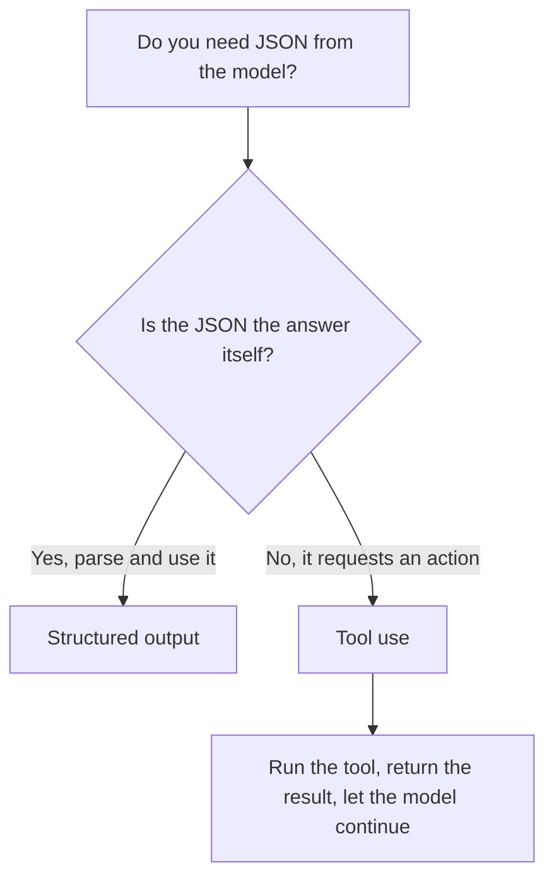

<LevelBadge level="intermediate" />

<VerifyNote lastVerified="2026-06-20" source="https://docs.anthropic.com/en/docs/build-with-claude/structured-outputs">
El mecanismo exacto para imponer un esquema evoluciona: confirma el enfoque actual (configuración de salida / ayudantes de parseo) en la documentación oficial.
</VerifyNote>

Cuando la salida de Claude alimenta a otro software, necesitas una **estructura fiable**: JSON válido que coincida con una forma conocida, siempre. No te fíes de "responde en JSON" y esperes lo mejor; usa el soporte de salida estructurada de la plataforma.

## La forma fiable

Proporciona un **esquema JSON** para la salida y deja que la API/SDK lo imponga, luego parséalo en un objeto tipado (p. ej., Pydantic en Python, Zod en TypeScript). Los ayudantes de parseo del SDK te entregan un resultado tipado en lugar de una cadena que tengas que pasar por `JSON.parse` y validar tú mismo.

```python
# Conceptual shape — see the official docs for the current API surface.
from pydantic import BaseModel

class Ticket(BaseModel):
    title: str
    priority: str   # "low" | "medium" | "high"
    tags: list[str]

# Request the model to return data conforming to Ticket's JSON schema,
# then parse the response into a Ticket instance.
```

## ¿Por qué no pedir JSON directamente en el prompt?

*Puedes* pedir JSON en el prompt, y para casos simples funciona, pero puede desviarse: prosa extraviada, una coma final, un campo faltante. La salida impuesta por esquema elimina esa clase de error, lo que importa en cuanto un sistema posterior depende de ella.

## Salida estructurada vs. uso de herramientas

Ambas funciones entregan al modelo un **JSON Schema**, así que se parecen — y la gente elige la equivocada. La diferencia es de *intención*, no de mecanismo:

| | **Salida estructurada** | **[Uso de herramientas](/docs/api/tool-use)** |
|---|---|---|
| Qué quieres | La **respuesta final**, en una forma fija | Que el modelo **invoque una capacidad** (llamar a una función, obtener datos, realizar una acción) |
| Quién la consume | Tu código, directamente | Tu código ejecuta la herramienta y luego devuelve el resultado al modelo |
| Forma del turno | Una respuesta, listo | Un bucle: el modelo pide, tú ejecutas, el modelo continúa |
| Uso típico | Extracción, clasificación, parseo | Agentes, búsquedas en vivo, efectos secundarios |

Una regla rápida:



Si el JSON *es* el entregable, usa salida estructurada. Si el JSON es el modelo pidiendo a tu código que *haga* algo, eso es uso de herramientas. Los agentes a menudo usan ambos: herramientas para actuar, salida estructurada para devolver un resultado final limpio.

## Consejos

- **Mantén los esquemas ajustados.** Usa enums para opciones fijas; marca los campos obligatorios.
- **Describe los campos.** Las descripciones de campos guían al modelo como minipromts.
- **Valida de todos modos** en la frontera: el parseo defensivo es un seguro barato.
- Para tareas de **extracción**, la salida estructurada + un esquema claro gana al formato libre siempre.

## Siguiente

- [Uso de herramientas / Llamada a funciones](/docs/api/tool-use) — las herramientas también usan esquemas JSON
- [Tu primera llamada a la API](/docs/api/first-call)
- [Plantillas de prompts reutilizables](/docs/templates/prompts)
