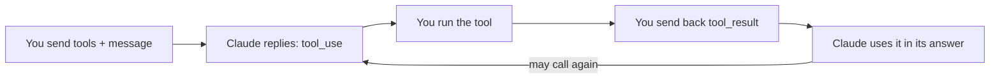

import Tabs from '@theme/Tabs';
import TabItem from '@theme/TabItem';

<LevelBadge level="intermediate" />

<VerifyNote lastVerified="2026-06-20" source="https://docs.anthropic.com/en/docs/build-with-claude/tool-use">
Las formas de solicitud/respuesta del uso de herramientas son estables, pero evolucionan: confirma los campos en la documentación oficial de uso de herramientas.
</VerifyNote>

El **uso de herramientas** permite a Claude llamar a funciones que *tú* defines —búsqueda, una calculadora, tu base de datos, cualquier API— y usar los resultados. Es la base de todo [agente](/docs/api/building-agents).

## El bucle



1. Incluyes una lista de **definiciones de herramientas** (nombre, descripción, entrada en JSON-Schema).
2. Si Claude decide usar una, devuelve un bloque `tool_use` (con argumentos) y se detiene.
3. **Tú ejecutas** la herramienta y envías la salida de vuelta como un `tool_result`.
4. Claude continúa, posiblemente llamando a más herramientas, hasta que responde.

## Definir una herramienta (Python)

```python
tools = [{
    "name": "get_weather",
    "description": "Get current weather for a city.",
    "input_schema": {
        "type": "object",
        "properties": {"city": {"type": "string"}},
        "required": ["city"],
    },
}]

msg = client.messages.create(
    model="claude-sonnet-4-6", max_tokens=1024,
    tools=tools,
    messages=[{"role": "user", "content": "What's the weather in Rome?"}],
)
# If msg.stop_reason == "tool_use": run the tool, then send a tool_result back.
```

## Consejos

- **Las descripciones son prompts.** Una `description` clara de la herramienta y la documentación de los parámetros mejoran enormemente cuándo/cómo la llama Claude.
- **Valida las entradas** que recibes antes de ejecutarlas: nunca confíes en ellas a ciegas.
- **Devuelve los errores como resultados.** Si una herramienta falla, envía un `tool_result` que describa el error para que Claude pueda recuperarse.
- **Herramientas del lado del servidor.** Anthropic también ofrece herramientas integradas (p. ej., búsqueda web, ejecución de código, uso del ordenador): consulta la documentación para ver el menú actual.

:::warning Herramientas = acciones = riesgo
Una herramienta que ejecuta acciones reales hereda un modelo de seguridad. Aplica el mínimo privilegio y mantén a una persona en el bucle para las llamadas arriesgadas: consulta [Proteger agentes y herramientas](/docs/security/securing-agents).
:::

## Siguiente

- [Crear agentes con la API](/docs/api/building-agents)
- [Salida estructurada](/docs/api/structured-output)
- [MCP y conexión a herramientas](/docs/api/mcp)
