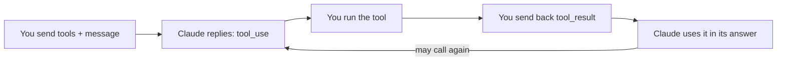

import Tabs from '@theme/Tabs';
import TabItem from '@theme/TabItem';

<LevelBadge level="intermediate" />

<VerifyNote lastVerified="2026-06-20" source="https://platform.claude.com/docs/en/docs/build-with-claude/tool-use">
Las formas de solicitud/respuesta del uso de herramientas son estables, pero evolucionan: confirma los campos en la documentación oficial de uso de herramientas.
</VerifyNote>

El **uso de herramientas** permite a Claude llamar a funciones que *tú* defines —búsqueda, una calculadora, tu base de datos, cualquier API— y usar los resultados. Es la base de todo [agente](/docs/api/building-agents).

<Callout type="objectives" items={["Cómo funciona el bucle agéntico de cuatro pasos, desde las definiciones de herramientas hasta la respuesta final","Cómo definir una herramienta en Python con nombre, descripción y entrada en JSON-Schema","Por qué las descripciones de las herramientas actúan como prompts que determinan cuándo y cómo las llama Claude","Cómo validar las entradas, devolver los errores como resultados y usar herramientas del lado del servidor de forma segura"]} />

## El bucle

El uso de herramientas es una conversación, no una única llamada. Le entregas a Claude un menú de herramientas; Claude elige una y se detiene; tú la ejecutas e informas de vuelta; Claude incorpora el resultado a su respuesta, repitiéndolo según sea necesario.

<Steps items={[{title: "Envía el menú", body: "Incluyes una lista de definiciones de herramientas, cada una con un nombre, una descripción y una entrada en JSON-Schema."}, {title: "Claude elige una herramienta", body: "Si Claude decide usar una, devuelve un bloque tool_use con argumentos y se detiene."}, {title: "Tú la ejecutas", body: "Ejecutas la herramienta tú mismo y envías la salida de vuelta como un tool_result."}, {title: "Claude continúa", body: "Claude continúa, posiblemente llamando a más herramientas, hasta que responde."}]} />

## Definir una herramienta (Python)

Una definición de herramienta no es más que un nombre, una descripción en lenguaje sencillo y un JSON-Schema para la entrada. Pásala en `tools` y luego comprueba `stop_reason` para saber cuándo Claude quiere actuar.

<PromptCard title="Herramienta get_weather + primera llamada">{`tools = [{
    "name": "get_weather",
    "description": "Get current weather for a city.",
    "input_schema": {
        "type": "object",
        "properties": {"city": {"type": "string"}},
        "required": ["city"],
    },
}]

msg = client.messages.create(
    model="claude-sonnet-5", max_tokens=1024,
    tools=tools,
    messages=[{"role": "user", "content": "What's the weather in Rome?"}],
)
# If msg.stop_reason == "tool_use": run the tool, then send a tool_result back.`}</PromptCard>

## Consejos

Las pequeñas decisiones sobre cómo defines y gestionas las herramientas marcan una gran diferencia en la fiabilidad.

- **Las descripciones son prompts.** Una `description` clara de la herramienta y la documentación de los parámetros mejoran enormemente cuándo/cómo la llama Claude.
- **Valida las entradas** que recibes antes de ejecutarlas: nunca confíes en ellas a ciegas.
- **Devuelve los errores como resultados.** Si una herramienta falla, envía un `tool_result` que describa el error para que Claude pueda recuperarse.
- **Herramientas del lado del servidor.** Anthropic también ofrece herramientas integradas (p. ej., búsqueda web, ejecución de código, uso del ordenador): consulta la documentación para ver el menú actual.

:::warning Herramientas = acciones = riesgo
Una herramienta que ejecuta acciones reales hereda un modelo de seguridad. Aplica el mínimo privilegio y mantén a una persona en el bucle para las llamadas arriesgadas: consulta [Proteger agentes y herramientas](/docs/security/securing-agents).
:::

<Flashcards title="Vocabulario del uso de herramientas" cards={[{front: "bloque tool_use", back: "Lo que Claude devuelve cuando decide llamar a una herramienta —incluye los argumentos— tras lo cual se detiene y te espera."}, {front: "tool_result", back: "El mensaje que envías de vuelta con la salida de la herramienta (o una descripción del error para que Claude pueda recuperarse)."}, {front: "input_schema", back: "El JSON-Schema que describe las entradas de una herramienta: tipos, propiedades y qué campos son obligatorios."}, {front: "Herramientas del lado del servidor", back: "Herramientas integradas que ofrece Anthropic, p. ej. búsqueda web, ejecución de código, uso del ordenador: consulta la documentación para ver el menú actual."}]} />

<Quiz title="Comprueba tus conocimientos" questions={[{q: "Después de que Claude devuelva un bloque tool_use, ¿quién ejecuta la herramienta?", options: ["Claude la ejecuta automáticamente en los servidores de Anthropic", "Tú la ejecutas y envías la salida de vuelta como un tool_result", "El JSON-Schema la ejecuta"], answer: 1, explain: "Claude devuelve un bloque tool_use y se detiene; tú ejecutas la herramienta y envías el resultado de vuelta como un tool_result."}, {q: "Una herramienta que definiste falla en tiempo de ejecución. ¿Cuál es la acción recomendada?", options: ["Reintentar en silencio hasta que tenga éxito", "Enviar un tool_result que describa el error para que Claude pueda recuperarse", "Detener la conversación"], answer: 1, explain: "Devuelve los errores como resultados: un tool_result que describa el fallo permite a Claude recuperarse."}, {q: "¿Por qué importa tanto una descripción clara de la herramienta?", options: ["Es solo para documentación y Claude la ignora", "Las descripciones son prompts: determinan cuándo y cómo Claude llama a la herramienta", "Cambia las reglas de validación del JSON-Schema"], answer: 1, explain: "Las descripciones son prompts: una descripción clara y la documentación de los parámetros mejoran enormemente cuándo y cómo Claude llama a una herramienta."}]} />

<Callout type="takeaways" items={["El uso de herramientas es un bucle: envías las definiciones de herramientas, Claude devuelve un bloque tool_use y se detiene, tú la ejecutas y devuelves un tool_result, y Claude continúa hasta que responde.","Una definición de herramienta es un nombre, una descripción y una entrada en JSON-Schema: pásala en tools y comprueba stop_reason == tool_use.","Las descripciones son prompts; valida las entradas antes de ejecutarlas; devuelve los fallos como errores tool_result para que Claude pueda recuperarse.","Anthropic también ofrece herramientas del lado del servidor, y cualquier herramienta que ejecute acciones reales necesita el mínimo privilegio más una persona en el bucle."]} />

## Siguiente

- [Crear agentes con la API](/docs/api/building-agents)
- [Salida estructurada](/docs/api/structured-output)
- [MCP y conexión a herramientas](/docs/api/mcp)
