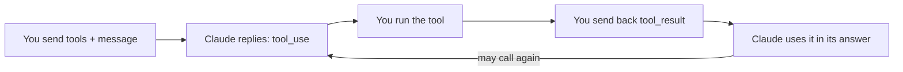

<LevelBadge level="intermediate" />

El **uso de herramientas** permite a Claude llamar a funciones que *tú* defines —búsqueda, una calculadora, tu base de datos, cualquier API— y usar los resultados. Es la base de todo [agente](/docs/api/building-agents).

La mayoría de los tutoriales sobre uso de herramientas se detienen tras el bucle de cuatro pasos. El bucle es la parte fácil. Lo que de verdad rompe las integraciones en producción es algo más estrecho y de lo que se habla menos: las formas de mensaje que devuelven `400`, el campo de error que permite a Claude recuperarse en lugar de disculparse, y el hecho de que **forzar una llamada a herramienta ya no funciona en los modelos Claude más recientes**. Esta página lo cubre todo.

<Callout type="objectives" items={["Cómo funciona el bucle agéntico de cuatro pasos, desde las definiciones de herramientas hasta la respuesta final","Cómo escribir una definición de herramienta — y descripciones que de verdad orienten cuándo la llama Claude","Las tres reglas de forma del mensaje que devuelven un 400, y el texto de error que te dice cuál has incumplido","Por qué tool_choice \"any\" y \"tool\" ahora fallan en los modelos más recientes, y los dos sustitutos","Cómo garantizar entradas de herramienta que cumplen el esquema con strict: true","Por qué los resultados de herramienta son el punto más probable por el que una inyección de prompts llega a tu agente"]} />

<VerifyNote lastVerified="2026-09-29" source="https://platform.claude.com/docs/en/agents-and-tools/tool-use/define-tools">
Los campos de la definición de herramienta, la matriz de soporte de `tool_choice`, las reglas de formato
de `tool_result`, el comportamiento de `is_error` y la semántica de `strict: true` se verificaron el 29 de
septiembre de 2026 contra las páginas "Define tools", "Handle tool calls" y "Strict tool use" de Anthropic.
El soporte de los modelos para el uso forzado de herramientas cambia con cada lanzamiento: vuelve a comprobar
la matriz de soporte en la página Define tools antes de confiar en ella, y consulta
[Modelos y precios actuales](/docs/whats-new/models-and-pricing) para ver la lista actual.
</VerifyNote>

## El bucle

El uso de herramientas es una conversación, no una única llamada. Le entregas a Claude un menú de herramientas; Claude elige una y se detiene; tú la ejecutas e informas de vuelta; Claude incorpora el resultado a su respuesta, repitiéndolo según sea necesario.


```mermaid
flowchart LR
  A[You send tools + message] --> B[Claude replies: tool_use]
  B --> C[You run the tool]
  C --> D[You send back tool_result]
  D --> E[Claude uses it in its answer]
  E -->|may call again| B
```

<Steps items={[{title: "Envía el menú", body: "Incluyes una lista de definiciones de herramientas, cada una con un nombre, una descripción y una entrada en JSON-Schema."}, {title: "Claude elige una herramienta", body: "Si Claude decide usar una, la respuesta vuelve con stop_reason \"tool_use\" y uno o más bloques tool_use, cada uno con un id, un name y un objeto input."}, {title: "Tú la ejecutas", body: "Ejecutas la herramienta tú mismo y envías la salida de vuelta como un tool_result que referencia el id del tool_use."}, {title: "Claude continúa", body: "Claude continúa, posiblemente llamando a más herramientas, hasta que responde con un stop_reason normal."}]} />

Fíjate en el plural del paso 2: Claude puede devolver **varios bloques `tool_use` en una sola respuesta**. Despacha según el campo `type` de cada bloque en lugar de dar por supuesto `content[0]`: una respuesta suele empezar con un bloque `text` y, en los modelos más recientes, puede empezar con bloques `thinking`.

## Definir una herramienta

Una definición de herramienta es un nombre, una descripción en lenguaje sencillo y un JSON Schema para la entrada.

| Campo | Obligatorio | Notas |
| --- | --- | --- |
| `name` | sí | Debe coincidir con la regex `^[a-zA-Z0-9_-]{1,128}$` |
| `description` | sí | Qué hace, cuándo usarla y cuándo *no*. Apunta a un mínimo de 3–4 frases |
| `input_schema` | sí | Un objeto JSON Schema que describe los parámetros |
| `input_examples` | no | Un array de objetos de entrada de ejemplo, cada uno válido según el esquema |
| `strict` | no | Ponlo en `true` para forzar entradas que cumplan el esquema — ver más abajo |
| `cache_control` | no | Cachea la definición entre turnos (ver [Caché de prompts](/docs/api/prompt-caching)) |

<PromptCard title="Herramienta get_weather + primera llamada (Python)">{`tools = [{
    "name": "get_weather",
    "description": (
        "Get the current weather for a city. Use this when the user asks about "
        "present conditions or temperature in a named place. Returns temperature "
        "in the requested unit plus a one-word sky condition. It does NOT return "
        "forecasts — use get_forecast for anything in the future."
    ),
    "input_schema": {
        "type": "object",
        "properties": {
            "city": {"type": "string", "description": "City and region, e.g. 'Rome, IT'"},
            "unit": {"type": "string", "enum": ["celsius", "fahrenheit"]},
        },
        "required": ["city"],
        "additionalProperties": False,
    },
}]

msg = client.messages.create(
    model="claude-opus-5-5", max_tokens=1024,
    tools=tools,
    messages=[{"role": "user", "content": "What's the weather in Rome?"}],
)

if msg.stop_reason == "tool_use":
    for block in msg.content:            # iterate — never index content[0]
        if block.type == "tool_use":
            result = run_tool(block.name, block.input)
            # send back a tool_result carrying block.id`}</PromptCard>

### Las descripciones son prompts

El campo `description` es, con mucha diferencia, la palanca más potente sobre la calidad del uso de herramientas: lo lee el modelo, no tus compañeros de equipo. La propia guía de Anthropic es inequívoca sobre qué distingue a una buena descripción:

- **Di cuándo *no* usarla.** La mayoría de las selecciones erróneas son una herramienta llamada para un trabajo que le corresponde a otra herramienta adyacente.
- **Consolida en lugar de multiplicar.** En lugar de `create_pr`, `review_pr`, `merge_pr`, publica una sola herramienta con un parámetro `action`. Menos herramientas y más amplias reducen la ambigüedad de selección.
- **Usa espacios de nombres entre servicios.** `github_list_prs` y `slack_send_message` ganan a `list_prs` y `send_message` en cuanto tu superficie de herramientas crece.
- **Devuelve resultados con mucha señal.** Identificadores estables y semánticos (slugs, UUID) y solo los campos que Claude necesita para elegir su siguiente paso. Una salida de herramienta inflada consume contexto y entierra la señal.
- **Para entradas delicadas, añade `input_examples`.** Los ejemplos validados contra el esquema cuestan aproximadamente de 20 a 50 tokens cada uno para objetos simples y de 100 a 200 para los anidados complejos, y un ejemplo inválido devuelve un 400.

## Gestionar la respuesta: las tres reglas que devuelven un 400

Aquí es donde suele romperse el código que funciona. Un `tool_result` es un mensaje `user` corriente, pero la API impone tres reglas de colocación.

<Steps items={[{title: "Los resultados deben seguir inmediatamente a su tool_use", body: "Ningún mensaje puede situarse entre el mensaje tool_use del asistente y tu mensaje tool_result. Incumple esto y la API informa: tool_use ids were found without tool_result blocks immediately after."}, {title: "Los bloques tool_result van PRIMERO en el array content", body: "Cualquier texto que añadas debe ir DESPUÉS de todos los tool_result. Un bloque text antes de un tool_result es un 400."}, {title: "Si una llamada a una herramienta del lado del servidor sigue sin resolverse, envía SOLO bloques tool_result", body: "Cuando el mismo turno del asistente también llamó a una herramienta del lado del servidor que todavía no tiene resultado, añadir texto al final termina el turno antes de tiempo y la solicitud falla con un 400 que nombra la herramienta de servidor sin resolver."}]} />

```json
// ❌ 400 — text before tool_result
{"role": "user", "content": [
  {"type": "text", "text": "Here are the results:"},
  {"type": "tool_result", "tool_use_id": "toolu_01", "content": "15 degrees"}
]}

// ✅ correct — results first, text after (client tools only)
{"role": "user", "content": [
  {"type": "tool_result", "tool_use_id": "toolu_01", "content": "15 degrees"},
  {"type": "text", "text": "What should I do next?"}
]}
```

El `content` de un `tool_result` puede ser una cadena simple, o una lista de bloques `text`, `image`, `document` o `search_result`. También puede omitirse por completo para una herramienta que no devuelve nada.

### Devuelve los fallos como resultados, no como excepciones

Cuando una herramienta lanza una excepción, no abortes el bucle: devuélvele el fallo con `is_error`:

```json
{"role": "user", "content": [{
  "type": "tool_result",
  "tool_use_id": "toolu_01A09q90qw90lq917835lq9",
  "content": "Rate limit exceeded. Retry after 60 seconds.",
  "is_error": true
}]}
```

Escribe el mensaje para un lector que tiene que decidir qué hacer a continuación. `"failed"` no le dice nada a Claude; `"Rate limit exceeded. Retry after 60 seconds."` le dice que espere en lugar de reintentar de inmediato. Cuando una llamada a herramienta es inválida o le falta un parámetro, Claude normalmente reintentará dos o tres veces con correcciones antes de rendirse y disculparse con el usuario, así que un error instructivo suele marcar la diferencia entre recuperarse y un callejón sin salida.

## Garantizar entradas que cumplen el esquema: `strict: true`

Poner `strict: true` en una definición de herramienta restringe el muestreo de tokens del modelo a una salida que cumple el esquema (muestreo restringido por gramática). El `input` de cada bloque `tool_use` coincide entonces de forma demostrable con tu `input_schema`, y el `name` es siempre una herramienta real: ningún `"2"` donde necesitabas `2`, ningún campo obligatorio ausente, ninguna capa de validar y reintentar.

<PromptCard title="Definición de herramienta estricta">{`{
  "name": "search_flights",
  "description": "Search bookable flights for a route and date.",
  "strict": true,
  "input_schema": {
    "type": "object",
    "properties": {
      "destination": {"type": "string"},
      "departure_date": {"type": "string", "format": "date"},
      "passengers": {"type": "integer", "enum": [1, 2, 3, 4, 5, 6]}
    },
    "required": ["destination", "departure_date"],
    "additionalProperties": false
  }
}`}</PromptCard>

Tres advertencias que conviene conocer antes de activarlo en todas partes:

- El esquema debe permanecer dentro del subconjunto soportado de JSON Schema — el mismo que usa [Salida estructurada](/docs/api/structured-output).
- Las entradas de **toolset** de uso del ordenador y uso del navegador rechazan `strict: true`; una solicitud que lo establezca en cualquiera de las dos es rechazada.
- Los esquemas compilados se cachean por separado del contenido de los mensajes durante hasta 24 horas. La guía de Anthropic es explícita: **no pongas información sanitaria protegida en los esquemas** — ni en los nombres de propiedades, ni en los valores `enum`, ni en los valores `const`, ni en las regex `pattern`. La PHI pertenece al contenido del mensaje, que lleva las salvaguardas de HIPAA que los esquemas cacheados no tienen.

## `tool_choice` — y por qué forzar una herramienta ahora falla

`tool_choice` controla si Claude *puede*, *debe* o *no puede* llamar a una herramienta. Admite cuatro valores:

| Valor | Significado |
| --- | --- |
| `auto` | Claude decide. El valor por defecto siempre que `tools` está presente |
| `any` | Claude debe llamar a una de tus herramientas, pero elige cuál |
| `tool` | Claude debe llamar a la herramienta indicada |
| `none` | Claude no puede llamar a ninguna herramienta. El valor por defecto cuando no hay `tools` |

Esta es la parte que a todas las demás guías de uso de herramientas se les está escapando ahora mismo. **`any` y `tool` no están soportados universalmente y, en los modelos más recientes, devuelven un 400.**

| Modelo o ajuste | Restricción | Usa en su lugar |
| --- | --- | --- |
| Pensamiento extendido manual (`thinking` de tipo `enabled`) | `any` y `tool` dan error | `auto` o `none`. El pensamiento adaptativo por sí solo *no* bloquea el uso forzado de herramientas |
| Claude Opus 5.5, Sonnet 5.5, Fable 5.1, Mythos 5.1 | `any` y `tool` devuelven un 400, independientemente de los ajustes de pensamiento | `auto` más `strict: true`, o [Salida estructurada](/docs/api/structured-output). `none` sigue funcionando |

El error es explícito:

```text
tool_choice: type "tool" and "any" are not supported for this model.
```

La misma validación se aplica al endpoint de conteo de tokens, así que una solicitud que pasa el conteo de tokens no te dará sorpresas más adelante.

### Qué hacer en su lugar

Separar las dos motivaciones hace que la migración resulte obvia, porque el uso forzado de herramientas estaba haciendo dos trabajos sin relación entre sí:

- **"Necesito JSON que cumpla el esquema."** Eso nunca fue realmente cuestión de forzar una llamada. Mantén `tool_choice` en `auto` y pon `strict: true`, o traslada el esquema a [Salida estructurada](/docs/api/structured-output) si quieres una respuesta en lugar de una llamada.
- **"Necesito que llame a la herramienta, no que me dé conversación."** Dilo en el prompt. Nombrar cuándo aplica la herramienta —"Usa `get_weather` para cualquier pregunta sobre las condiciones actuales"— sigue orientando qué herramienta elige `auto`.

Renunciar al uso forzado de herramientas tiene un extra: `any` y `tool` funcionaban rellenando previamente el mensaje del asistente, lo que suprimía cualquier preámbulo en lenguaje natural antes de los bloques `tool_use`. Con `auto`, Claude puede explicar qué está a punto de hacer, que suele ser lo que quieres en un agente orientado al usuario.

:::tip Trampa del cacheo
Cambiar `tool_choice` a mitad de conversación **invalida los bloques de mensaje cacheados**. Las definiciones de herramientas y los prompts de sistema siguen cacheados, pero el contenido de los mensajes tiene que reprocesarse. Si estabas alternando `tool_choice` en cada turno, eso te estaba costando dinero en silencio — consulta [Caché de prompts](/docs/api/prompt-caching).
:::

## Herramientas de cliente vs. herramientas del lado del servidor

No toda herramienta necesita un handler en tu base de código.

- **Herramientas de cliente** — las tuyas. Tú defines el esquema, tú las ejecutas, tú devuelves un `tool_result`. El bucle de arriba.
- **Herramientas de cliente con esquema de Anthropic** — bash, editor de texto, memoria. El esquema está predefinido, pero *tu* aplicación sigue siendo la que las ejecuta.
- **Herramientas del lado del servidor** — búsqueda web, obtención web, ejecución de código, búsqueda de herramientas. Se ejecutan en la infraestructura de Anthropic sin código de handler por tu parte, y los errores se gestionan de forma transparente: nunca devuelves `is_error` para una herramienta del lado del servidor.
- **Toolsets de cliente** — el uso del ordenador y el uso del navegador son una única entrada sin `name` que declara un conjunto fijo de herramientas miembro. Sus bloques `tool_use` llevan un campo extra `toolset_name` (`"computer"` o `"browser"`), y el `name` es el miembro que se está llamando, como `screenshot` o `navigate`. **Despacha según ambos campos** y devuelve `toolset_name` como eco en el resultado — un resultado de miembro que lo omita es rechazado.

## Errores comunes

- **Indexar `content[0]`** en lugar de iterar y conmutar según `type`. Las respuestas suelen empezar con un bloque `text` y, en los modelos más recientes, con bloques `thinking`.
- **Gestionar solo un `tool_use` por respuesta.** Claude puede llamar a varias herramientas en un turno; un bucle que responde a la primera y descarta el resto deja ids de `tool_use` sin resultados, lo que es un 400 en la siguiente solicitud.
- **Poner tus comentarios antes de los resultados.** Los bloques `tool_result` van primero, siempre.
- **Tragarte las excepciones de las herramientas.** Una excepción en tu handler termina el bucle; un resultado con `is_error` permite a Claude adaptarse.
- **Recurrir a `tool_choice: "any"` por costumbre.** En los modelos estrella actuales es un 400 — y `strict: true` era de todos modos la mejor respuesta.
- **Tratar la salida de las herramientas como de confianza.** Ver más abajo.

:::warning Los resultados de herramienta son la mayor superficie de inyección de tu agente
Los resultados de herramienta llevan habitualmente contenido que no controlas: páginas web, correo entrante, subidas de usuarios, APIs de terceros. Un atacante que pueda influir en cualquiera de ellos puede incrustar instrucciones dirigidas a tu modelo: inyección indirecta de prompts. Mantén el contenido no confiable **dentro de bloques `tool_result`**, nunca injertado en el prompt de `system` ni en un bloque `text` de usuario corriente, y lee [Inyección de prompts](/docs/security/prompt-injection) y [Asegurar agentes y herramientas](/docs/security/securing-agents). Una herramienta que ejecuta acciones reales también hereda un modelo de seguridad: mínimo privilegio y una persona en el bucle para cualquier cosa irreversible.
:::

<Flashcards title="Vocabulario del uso de herramientas" cards={[{front: "bloque tool_use", back: "Lo que Claude devuelve cuando decide llamar a una herramienta —lleva id, name e input— tras lo cual se detiene y te espera. Una respuesta puede contener varios."}, {front: "tool_result", back: "Un bloque de mensaje de usuario que lleva la salida de una herramienta, vinculado al id del tool_use. Debe ir primero en el array content, inmediatamente después del mensaje tool_use del asistente."}, {front: "is_error", back: "Booleano opcional en un tool_result que marca la llamada como fallida. Claude lee el mensaje y se adapta, normalmente reintentando dos o tres veces antes de disculparse."}, {front: "strict: true", back: "Muestreo restringido por gramática en una definición de herramienta: la entrada de la herramienta coincide de forma demostrable con tu input_schema. Requiere additionalProperties false; se rechaza en las entradas de toolset de ordenador/navegador; mantén la PHI fuera del esquema."}, {front: "tool_choice", back: "auto | any | tool | none. auto es el valor por defecto cuando hay tools; none cuando no las hay. any y tool devuelven un 400 en Opus 5.5, Sonnet 5.5, Fable 5.1 y Mythos 5.1."}, {front: "toolset_name", back: "Campo extra en los bloques de miembro de uso del ordenador y uso del navegador (\"computer\" o \"browser\"). Despacha según él junto con name, y devuélvelo como eco en el resultado o el resultado será rechazado."}]} />

<Quiz title="Comprueba tus conocimientos" questions={[{q: "Pones tool_choice en {\"type\": \"tool\", \"name\": \"get_weather\"} en claude-opus-5-5. ¿Qué ocurre?", options: ["Claude se ve forzado a llamar a get_weather", "La solicitud devuelve un 400: el uso forzado de herramientas no está soportado en ese modelo", "Claude ignora tool_choice y responde en texto"], answer: 1, explain: "En Opus 5.5, Sonnet 5.5, Fable 5.1 y Mythos 5.1, los tipos \"any\" y \"tool\" de tool_choice devuelven un 400 independientemente de los ajustes de pensamiento. Usa auto con strict: true, o salida estructurada."}, {q: "Tu mensaje de usuario contiene un bloque text que explica los resultados, seguido de dos bloques tool_result. ¿Qué hace la API?", options: ["Lo acepta: el orden no importa", "Devuelve un 400: los bloques tool_result deben ir primero y el texto después", "Descarta el bloque text en silencio"], answer: 1, explain: "Los bloques tool_result deben ir PRIMERO en el array content; cualquier texto debe ir después de todos ellos."}, {q: "Una herramienta que definiste lanza un error de conexión en tiempo de ejecución. ¿Cuál es la acción recomendada?", options: ["Lanzar la excepción y terminar la conversación", "Reintentar en silencio hasta que tenga éxito", "Enviar un tool_result con is_error true y un mensaje instructivo como 'Rate limit exceeded. Retry after 60 seconds.'"], answer: 2, explain: "Devuelve el fallo como un tool_result con is_error true. Un mensaje instructivo le dice a Claude qué hacer a continuación; un 'failed' genérico no le dice nada."}, {q: "¿Por qué el contenido web no confiable debería quedarse dentro de un bloque tool_result en lugar de pegarse en el prompt de sistema?", options: ["Los bloques tool_result son más baratos en tokens", "Limita la inyección indirecta de prompts: el contenido en un tool_result se enmarca como datos, no como instrucciones", "El prompt de sistema tiene un límite de longitud"], answer: 1, explain: "Los resultados de herramienta llevan contenido que no controlas. Mantenerlo en bloques tool_result en lugar del prompt de sistema o del texto de usuario corriente es la contención recomendada por Anthropic para la inyección indirecta de prompts."}]} />

<Callout type="takeaways" items={["El uso de herramientas es un bucle: envías las definiciones de herramientas, Claude devuelve uno o más bloques tool_use y se detiene, tú las ejecutas y devuelves tool_results, y Claude continúa. Itera sobre los bloques de contenido según su type — nunca indexes content[0].","Tres reglas de colocación causan la mayoría de los 400: los resultados deben seguir inmediatamente a su tool_use, los bloques tool_result van primero en el array content, y una llamada a herramienta del lado del servidor sin resolver significa solo resultados.","El uso forzado de herramientas ha desaparecido en los modelos más recientes: tool_choice \"any\" y \"tool\" devuelven un 400 en Opus 5.5, Sonnet 5.5, Fable 5.1 y Mythos 5.1. Usa auto con strict: true, o salida estructurada, y orienta la selección de herramientas desde el prompt.","strict: true garantiza entradas que cumplen el esquema mediante muestreo restringido por gramática — pero mantén la PHI fuera de los esquemas y no lo pongas en las entradas de toolset de ordenador/navegador.","Devuelve los fallos como tool_results con is_error y un mensaje instructivo para que Claude pueda adaptarse en lugar de disculparse.","Los resultados de herramienta son la vía más probable para que una inyección indirecta de prompts llegue a tu agente — mantén el contenido no confiable dentro de ellos, aplica el mínimo privilegio y somete las acciones irreversibles a la aprobación de una persona."]} />

## Siguiente

- [Llamada programática de herramientas](/docs/api/programmatic-tool-calling) — deja que Claude llame a estas mismas herramientas desde Python dentro de un sandbox, reduciendo las idas y vueltas y manteniendo los resultados intermedios fuera del contexto
- [Salida estructurada](/docs/api/structured-output) — la otra mitad del sustituto del uso forzado de herramientas, cuando quieres una respuesta JSON en lugar de una llamada
- [Crear agentes con la API](/docs/api/building-agents) — envuelve el bucle en un agente real
- [Claude Opus 5.5: la guía de campo](/docs/models/opus-5-5-field-guide) — toda la historia de la migración detrás de la eliminación del uso forzado de herramientas
- [MCP y conexión a herramientas](/docs/api/mcp) — obtén las herramientas de un servidor en lugar de definirlas tú mismo
