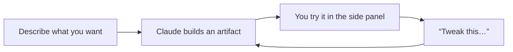

<LevelBadge level="beginner" />

<VerifyNote lastVerified="2026-06-20" source="https://www.anthropic.com">
Las capacidades de los artifacts (interactividad, persistencia, qué pueden invocar) evolucionan rápido — confirma el comportamiento actual en la app o en el centro de ayuda.
</VerifyNote>

Los **Artifacts** son resultados que Claude renderiza en un **panel lateral** junto al chat — un documento, un gráfico, una app funcional, un diagrama — que puedes ver, usar e iterar, de forma separada del texto de la conversación.

## Qué puedes crear

- **Miniapps web y herramientas** — una calculadora, un cuestionario, un formulario, una pequeña demo interactiva.
- **Documentos** — textos estructurados que puedes refinar y exportar.
- **Elementos visuales** — gráficos, diagramas y paneles de datos sencillos.
- **Código** que puedes leer y ejecutar.

## Por qué es potente para quienes no programan

Puedes crear algo *usable* — "hazme una calculadora de propinas para una cena en grupo", "un panel a partir de este CSV" — describiéndolo, y luego refinarlo conversando ("añade un campo de cargo por servicio", "haz los botones más grandes"). Es el ejemplo más claro de **crear con IA sin escribir código tú mismo**.

## Cómo trabajar con Artifacts

1. **Pide la cosa**, con detalles (propósito, entradas, aspecto).
2. **Itera en lenguaje sencillo** — Claude actualiza el mismo artifact.
3. **Úsalo** en el panel; **expórtalo/compártelo** donde sea compatible.

## Consejos

- **Sé concreto** con las entradas/salidas y la audiencia — igual que con un buen [prompting](/docs/prompting/basics).
- **Itera en pequeño.** Un cambio cada vez es más fácil de acertar.
- **Verifica cualquier lógica/número** que calcule un artifact para usos importantes ([Alucinaciones](/docs/foundations/hallucinations)).

## Siguiente

- [Generar archivos reales (docx/pptx/xlsx/pdf)](/docs/claude-app/generating-files)
- [Primeros pasos con Claude.ai](/docs/claude-app/getting-started)
- [Manual de análisis de datos](/docs/playbooks/data-analysis)
