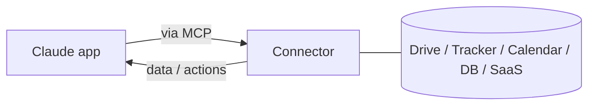

<LevelBadge level="intermediate" />

<VerifyNote lastVerified="2026-06-20" source="https://platform.claude.com/docs">
Qué conectores existen, y su disponibilidad según el plan, cambian con frecuencia — confirma las opciones actuales en la app o en el centro de ayuda.
</VerifyNote>

Los **conectores** permiten que las apps de Claude lleguen **más allá del chat** — a tus herramientas y datos (unidades de almacenamiento, gestores de incidencias, calendarios, bases de datos y más) — para que Claude pueda responder a partir de sistemas reales y actuar sobre ellos. Por debajo funcionan gracias al estándar abierto **[Model Context Protocol (MCP)](/docs/claude-code/mcp)**.

## Qué hacen

Sin conectores, Claude solo conoce lo que hay en la conversación. Con un conector, puede (con tu permiso) extraer información relevante de un servicio conectado — por ejemplo, encontrar un documento, leer incidencias recientes, consultar un calendario — y usarla en su respuesta.

## El mismo estándar, en todas partes

Los conectores son la forma **orientada a las apps** de MCP. El mismo protocolo impulsa [MCP en Claude Code](/docs/claude-code/mcp) y [en la API](/docs/api/mcp). Aprende el concepto una vez; se aplica en todas las superficies.

## Configuración y uso

1. **Conecta** el servicio (autoriza vía OAuth, donde sea compatible).
2. **Concede el mínimo privilegio** — solo el acceso que la tarea necesita.
3. **Pregunta con naturalidad** — "encuentra mi documento de planificación del Q3 y resume los riesgos."

## Seguridad

:::warning Un conector es acceso + (a veces) acciones
- Autoriza solo servicios y permisos en los que confíes.
- El contenido extraído de fuentes externas puede contener [inyección de prompts](/docs/security/prompt-injection) — ten cuidado cuando un conector lee material no confiable.
- Revisa qué puede hacer un conector de terceros antes de habilitarlo ([Revisar código de terceros](/docs/security/reviewing-third-party-code)).
:::

## Siguiente

- [Servidores MCP en Claude Code](/docs/claude-code/mcp)
- [MCP y conexión a herramientas (API)](/docs/api/mcp)
- [IA en tus herramientas existentes](/docs/claude-app/ai-in-your-tools)
