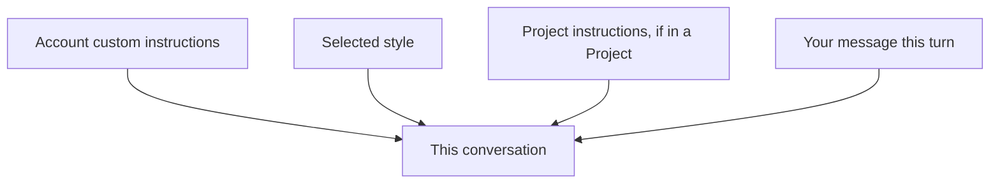

<LevelBadge level="beginner" />

<VerifyNote lastVerified="2026-06-20" source="https://www.anthropic.com">
Los nombres y ubicaciones exactos de las instrucciones personalizadas y los estilos en las apps de Claude cambian — confírmalo en la app o en el centro de ayuda.
</VerifyNote>

¿Cansado de repetir "sé conciso" o "soy enfermera, explícamelo en consecuencia" en cada chat? Las **instrucciones personalizadas** y los **estilos** te permiten establecer tus valores predeterminados una sola vez y aplicarlos en todas partes.

## Instrucciones personalizadas = tu prompt de sistema personal

Establece datos y preferencias permanentes — quién eres, a qué te dedicas, cómo te gustan las respuestas — y Claude los aplica en todas las conversaciones. Es la versión para la app de consumo de un [prompt de sistema](/docs/foundations/roles) (y la prima de [CLAUDE.md](/docs/claude-code/claude-md) para desarrolladores).

Cosas buenas que incluir:
- **Contexto sobre ti** ("dirijo una pequeña panadería"; "programo en Python").
- **Preferencias de salida** ("por defecto, respuestas cortas en viñetas"; "muestra siempre tu razonamiento").
- **Reglas estrictas** ("nunca uses emojis"; "unidades métricas").

## Estilos = ajustes preestablecidos de presentación

Los **estilos** cambian el tono/formato (conciso, formal, explicativo, etc.) y se pueden cambiar por conversación. Usa un estilo cuando quieras una *voz diferente para este chat* sin reescribir tus instrucciones permanentes.

## Cómo se combinan

El contexto más específico o más reciente tiende a prevalecer cuando hay un conflicto — de modo que las instrucciones de un [Proyecto](/docs/claude-app/projects) o una petición explícita en tu mensaje pueden anular tus valores globales predeterminados. Mantenlos coherentes para evitar sorpresas.

## Consejos

- **Mantén las instrucciones cortas y veraces** — como CLAUDE.md, el exceso y las reglas obsoletas perjudican.
- **No pongas secretos** en las instrucciones personalizadas.
- **Revísalas** de vez en cuando a medida que cambian tus necesidades.

## Siguiente

- [Roles de sistema, usuario y asistente](/docs/foundations/roles)
- [Proyectos: espacios de trabajo persistentes](/docs/claude-app/projects)
- [CLAUDE.md y archivos de memoria](/docs/claude-code/claude-md)
