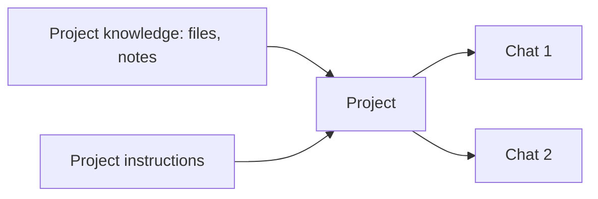

<LevelBadge level="beginner" />

<VerifyNote lastVerified="2026-06-20" source="https://www.anthropic.com">
Las funciones y los límites de los proyectos varían según el plan y cambian — confirma el comportamiento actual en la app o en el centro de ayuda.
</VerifyNote>

Un **Proyecto** es un espacio de trabajo dedicado en Claude.ai que reúne **sus propios archivos, conocimiento e instrucciones**. En lugar de volver a subir los mismos documentos y reexplicar el contexto en cada chat, lo configuras una vez — y cada conversación dentro del Proyecto empieza ya informada.

## Por qué usar un Proyecto

- **Respuestas fundamentadas.** Añade tus documentos (un manual, especificaciones, notas) y Claude responde *a partir de ellos* — una variante integrada y sin código de [RAG](/docs/foundations/rag).
- **Contexto persistente.** Las instrucciones del proyecto actúan como un [prompt de sistema](/docs/foundations/roles) acotado para todo lo que hay dentro.
- **Organizado.** Todos los chats sobre un mismo tema/cliente/iniciativa conviven juntos.

## Configura uno

1. **Crea un Proyecto** y dale un propósito claro.
2. **Añade conocimiento** — los archivos/textos que siempre debe conocer.
3. **Escribe las instrucciones del proyecto** — rol, convenciones, qué hacer/evitar.
4. **Empieza a chatear** — cada conversación hereda el conocimiento + las instrucciones.

## Casos de uso destacados

- Un espacio de trabajo de **cliente/cuenta** (sus documentos + tus notas).
- Una base de conocimiento de un **código o producto** para preguntas y respuestas.
- Un **proyecto de escritura** con tu guía de estilo y piezas anteriores (para que los borradores se ajusten a tu voz).
- **Estudiar** para un curso, con el temario y los materiales cargados.

## Consejos

- **Cura el conocimiento** — los archivos relevantes y actuales superan a volcarlo todo (el ruido perjudica la recuperación).
- **Mantén las instrucciones concisas y veraces** (la misma regla que las [instrucciones personalizadas](/docs/claude-app/custom-instructions)).
- **No añadas datos sensibles** que no te sientas cómodo almacenando — consulta [Privacidad](/docs/foundations/privacy).

## Siguiente

- [Instrucciones personalizadas y estilos](/docs/claude-app/custom-instructions)
- [Memoria entre chats](/docs/claude-app/memory)
- [Generación aumentada por recuperación (RAG)](/docs/foundations/rag)
