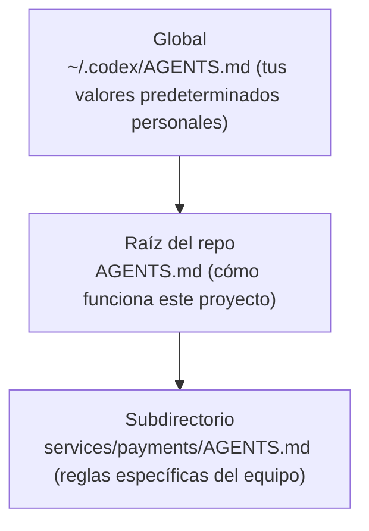

<LevelBadge level="intermediate" />

<VerifyNote lastVerified="2026-06-27" source="https://agents.md/">
La lista de adoptantes de AGENTS.md y el comportamiento de importación/enlace simbólico de Claude Code evolucionan rápido: confirma los detalles en el sitio oficial de AGENTS.md y en la documentación de memoria de Claude Code.
</VerifyNote>

Ya conoces [CLAUDE.md](/docs/claude-code/claude-md), el informe de proyecto de Claude Code. Pero tu repositorio probablemente lo toca *más* de un agente: un compañero usa Codex, CI usa un bot de programación, alguien abre el repo en Cursor. `AGENTS.md` es el estándar abierto que esas herramientas acuerdan leer, así que escribes las instrucciones de tu proyecto **una sola vez** en lugar de mantener un archivo distinto por cada herramienta.

<Callout type="objectives" items={["Qué es AGENTS.md y quién lo administra", "Por qué Claude Code lee CLAUDE.md y no AGENTS.md", "Tres formas fiables de mantener una única fuente de verdad entre herramientas", "Cómo se fusionan los archivos AGENTS.md anidados y globales", "Qué corresponde poner en el archivo y qué dejar fuera"]} />

## Qué es AGENTS.md

`AGENTS.md` es un archivo Markdown sencillo en la raíz de tu repositorio: piénsalo como un **README escrito para agentes en lugar de personas**. Le dice a un agente de programación cómo compilar, probar y contribuir al proyecto. El formato no tiene campos obligatorios: los agentes simplemente leen la prosa.

Es un estándar abierto administrado por la **Agentic AI Foundation (AAIF), bajo la Linux Foundation**, y a mediados de 2026 lo usan más de 60 000 proyectos de código abierto y lo leen más de 30 herramientas, incluyendo OpenAI Codex, Jules y Gemini CLI de Google, Cursor, Windsurf, Devin, Zed, Warp, Aider, goose, Amp y el agente de programación de GitHub Copilot.

<Callout type="info" items={["AGENTS.md es una convención, no un entorno de ejecución: cada herramienta decide cómo descubre, fusiona e inyecta el archivo.", "No se impone ningún esquema: una prosa clara supera a una estructura rígida.", "Complementa tu README; no lo reemplaza."]} />

## El detalle con Claude Code

Aquí está la parte en la que la gente tropieza: **Claude Code lee `CLAUDE.md`, no `AGENTS.md`.** Si tu repositorio solo tiene un `AGENTS.md`, Claude Code lo ignora por defecto. No es un error: es anterior al estándar, pero significa que un repo con varias herramientas necesita una estrategia de sincronización deliberada, o tus instrucciones se desviarán silenciosamente entre sí.

<Callout type="warning" items={["No asumas que Claude Code recurre a AGENTS.md: no lo lee automáticamente.", "Dos archivos mantenidos a mano (CLAUDE.md y AGENTS.md) se desviarán. Elige una única fuente de verdad.", "Verifica el comportamiento actual en la documentación oficial de memoria antes de confiar en cualquier afirmación de respaldo."]} />

## Mantén una única fuente de verdad

Tres patrones mantienen CLAUDE.md y AGENTS.md sincronizados sin duplicar contenido. Elige según la plataforma de tu equipo.

<Steps items={[{title: "Enlace simbólico (lo más simple)", body: "Haz que CLAUDE.md sea un enlace simbólico a AGENTS.md. Claude Code sigue los enlaces simbólicos y lee el destino byte por byte: un único archivo real, cero lógica de fusión. Salvedad: en Windows, crear un enlace simbólico requiere el Modo de desarrollador o permisos de administrador, así que los equipos multiplataforma pueden preferir el método de importación."}, {title: "@import (multiplataforma)", body: "Mantén un CLAUDE.md mínimo cuyo único trabajo sea incorporar el archivo estándar con una importación @AGENTS.md. Claude Code expande el archivo importado en el contexto al iniciar, así que AGENTS.md sigue siendo la única fuente y no hay ningún enlace simbólico que se rompa en Windows."}, {title: "/init (migración)", body: "¿Arrancando Claude Code en un repo que ya tiene un AGENTS.md (o .cursorrules / .windsurfrules)? Ejecuta /init: lee esos archivos e incorpora las partes relevantes en un CLAUDE.md generado."}]} />

<PromptCard title="Enlaza CLAUDE.md al estándar compartido (macOS / Linux)">{`ln -s AGENTS.md CLAUDE.md`}</PromptCard>

<PromptCard title="O mantén un CLAUDE.md de una línea que lo importe">{`@AGENTS.md`}</PromptCard>

<Callout type="tip" items={["Usa el enlace simbólico cuando todo tu equipo esté en macOS/Linux: es lo que menos hay que mantener.", "Usa @import cuando haya colaboradores en Windows.", "Confirma con commit la opción que elijas para que todo el equipo obtenga el mismo comportamiento."]} />

## Cómo se fusionan los archivos anidados y globales

Los agentes más completos tratan AGENTS.md de forma jerárquica, el mismo modelo mental que la [jerarquía de memoria de CLAUDE.md](/docs/claude-code/claude-md). Codex, por ejemplo, recorre desde un archivo global en tu directorio personal hasta la raíz de Git y luego a tu carpeta actual, concatenando a medida que avanza:

Los archivos más cercanos al trabajo ganan, porque se concatenan **al final** y anulan la orientación anterior. Así, un `services/payments/AGENTS.md` hereda las instrucciones de la raíz del repo y añade reglas que solo se aplican dentro de ese servicio: coloca la orientación especializada lo más cerca posible del código especializado.

<Flashcards title="La interoperabilidad de un vistazo" cards={[{front: "¿Quién lee AGENTS.md?", back: "Más de 30 herramientas: Codex, Cursor, Windsurf, Devin, Zed, Gemini CLI, el agente de programación de Copilot y más. Claude Code no, por defecto."}, {front: "¿Quién lee CLAUDE.md?", back: "Claude Code, y solo Claude Code. No lee AGENTS.md automáticamente."}, {front: "Mejor sincronización para un equipo en Mac/Linux", back: "Enlace simbólico CLAUDE.md → AGENTS.md. Un único archivo real, sin desviaciones."}, {front: "Mejor sincronización con colaboradores en Windows", back: "Un CLAUDE.md de una línea que contenga @AGENTS.md: sin necesidad de enlace simbólico."}, {front: "Orden de fusión de archivos anidados", back: "Global → raíz del repo → subdirectorio. Los archivos más cercanos al trabajo anulan, porque se concatenan al final."}]} />

## Qué poner en él

La misma disciplina que en un buen CLAUDE.md: el estándar solo sugiere unas pocas secciones comunes:

- **Resumen del proyecto** — qué es esto, en dos frases.
- **Comandos de compilación y prueba** — cómo ejecutar, probar y aplicar el linter.
- **Estilo de código** — convenciones que un agente no puede inferir.
- **Instrucciones de prueba** — qué significa "terminado".
- **Consideraciones de seguridad** — qué no tocar ni confirmar nunca.
- **Pautas de commit / PR** — formato de los mensajes, reglas de ramas.

<Callout type="warning" items={["Los agentes siguen el archivo al pie de la letra: las instrucciones obsoletas o aspiracionales perjudican activamente, igual que con CLAUDE.md.", "Mantenlo corto y veraz; describe cómo funciona el proyecto hoy.", "Nunca confirmes secretos; haz referencia a documentos extensos en lugar de pegarlos."]} />

## Ponte a prueba

<Quiz title="Ponte a prueba" questions={[{q: "¿Lee Claude Code AGENTS.md automáticamente?", options: ["Sí, recurre a AGENTS.md", "No, lee solo CLAUDE.md", "Solo en Windows"], answer: 1, explain: "Claude Code lee CLAUDE.md e ignora un AGENTS.md independiente por defecto, así que los repos con varias herramientas necesitan una estrategia de sincronización deliberada."}, {q: "Tu equipo está completamente en macOS y Linux. ¿Cuál es la forma de menor mantenimiento para compartir un único archivo de instrucciones entre Claude Code y Codex?", options: ["Mantener CLAUDE.md y AGENTS.md a mano", "Enlazar simbólicamente CLAUDE.md a AGENTS.md", "Pegar AGENTS.md en un comentario"], answer: 1, explain: "Enlazar simbólicamente CLAUDE.md → AGENTS.md te da un único archivo real; Claude Code sigue el enlace simbólico y lee el destino byte por byte."}, {q: "Cuando los agentes fusionan un AGENTS.md global, uno de la raíz del repo y uno de un subdirectorio, ¿cuál gana en los conflictos?", options: ["El archivo global", "El archivo de la raíz del repo", "El archivo del subdirectorio más cercano al trabajo"], answer: 2, explain: "Los archivos se concatenan global → raíz → subdirectorio, así que el archivo más cercano al trabajo aparece al final y anula la orientación anterior."}]} />

<Callout type="takeaways" items={["AGENTS.md es el estándar abierto, administrado por la Linux Foundation, que leen más de 30 agentes de programación: un README para agentes.", "Claude Code lee CLAUDE.md, no AGENTS.md, así que los repos con varias herramientas deben mantenerlos sincronizados.", "Enlaza simbólicamente CLAUDE.md → AGENTS.md en Mac/Linux, o usa una importación @AGENTS.md de una línea para equipos multiplataforma.", "Los archivos anidados se fusionan global → raíz → subdirectorio, ganando el archivo más cercano.", "Rellénalo como un gran CLAUDE.md: resumen, comandos de compilación/prueba, convenciones, seguridad y barreras de protección, corto y veraz."]} />

## Siguiente

- [CLAUDE.md y archivos de memoria](/docs/claude-code/claude-md) — el lado de Claude Code de la misma idea
- [Plantillas de CLAUDE.md](/docs/templates/claude-md) — plantillas listas que puedes reutilizar como AGENTS.md
- [Comandos de barra](/docs/claude-code/slash-commands) — incluido /init para migrar archivos de instrucciones existentes

## Fuentes y lecturas adicionales

- [AGENTS.md — sitio oficial y especificación](https://agents.md/)
- [OpenAI Codex — Instrucciones personalizadas con AGENTS.md](https://developers.openai.com/codex/guides/agents-md)
- [Documentación de memoria de Claude Code](https://code.claude.com/docs/en/memory)
