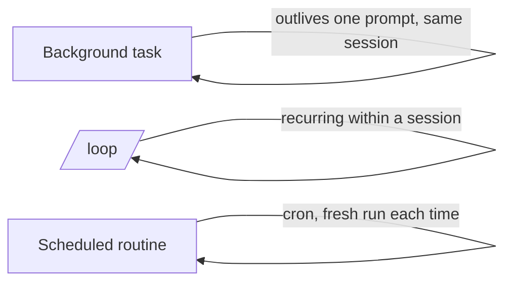

<LevelBadge level="advanced" />

<VerifyNote lastVerified="2026-06-20" source="https://docs.anthropic.com/en/docs/claude-code">
Los comandos exactos y la disponibilidad de las tareas en segundo plano, /loop y la programación cambian entre versiones — confírmalo en la documentación oficial.
</VerifyNote>

No todo es una edición rápida. Claude Code puede ejecutar trabajo que **sobrevive a un único prompt**: comandos largos en segundo plano, bucles recurrentes y ejecuciones programadas.

## Tareas en segundo plano

Lanza un comando de larga duración (un servidor de desarrollo, un watcher de tests, un build) **sin bloquear** la sesión. Claude sigue trabajando y se le notifica cuando la tarea produce salida o termina. Úsalo para cualquier cosa que normalmente ejecutarías en segundo plano con `&` — pero gestionado, para que Claude pueda leer la salida después.

:::tip No hagas busy-wait
Inicia la tarea en segundo plano y continúa; deja que la notificación de finalización te traiga de vuelta, en lugar de hacer polling en un bucle cerrado.
:::

## Bucles recurrentes (`/loop`)

`/loop` ejecuta un prompt o comando en un **intervalo recurrente** dentro de una sesión — p. ej. "cada 5 minutos, comprueba el estado del despliegue". Dale un intervalo, o deja que Claude marque su propio ritmo. Genial para vigilar una ejecución de CI o hacer polling de un trabajo externo del que el harness no puede notificarte de otro modo.

## Agentes en la nube programados

Para trabajo que debe ocurrir **a una hora fija, de forma continua** — "cada mañana resume las incidencias nuevas", "cada hora, comprueba noticias y actualiza la documentación" — usa **tareas programadas / rutinas** (estilo cron). Cada ejecución empieza desde cero, así que sus instrucciones deben ser **autocontenidas**.

## Cómo elegir entre ellas

| Necesidad | Usa |
|---|---|
| Ejecutar un comando largo y seguir trabajando | Tarea en segundo plano |
| Hacer polling de algo cada N minutos en esta sesión | `/loop` |
| Hacer algo según un horario, de forma indefinida | Rutina programada |

:::warning La autonomía necesita salvaguardas
Cualquier cosa que actúe sin supervisión según un horario debe estar estrictamente acotada y ser reversible. Combínala con [permisos](/docs/claude-code/permissions) estrictos y lee [Endurecer ejecuciones autónomas](/docs/security/hardening-autonomous-runs).
:::

## Siguiente

- [Modo Headless y el Agent SDK](/docs/claude-code/headless-and-agent-sdk)
- [Permisos y modos](/docs/claude-code/permissions)
- [Endurecer ejecuciones autónomas](/docs/security/hardening-autonomous-runs)
