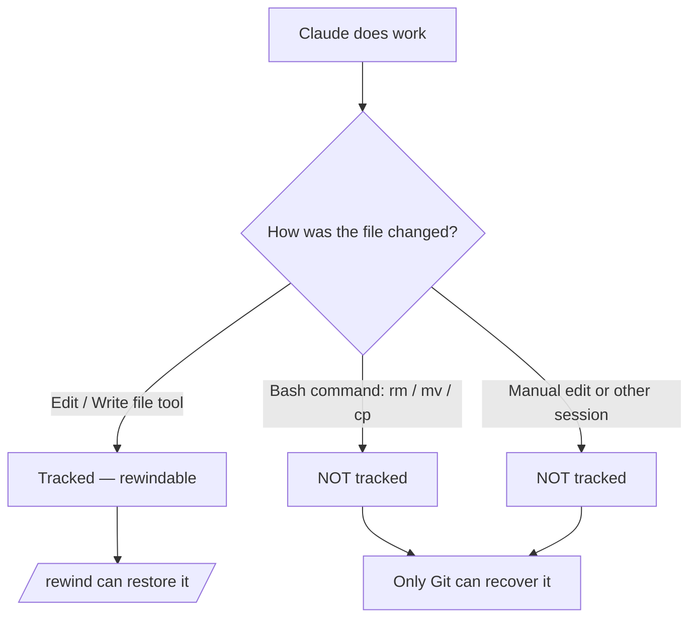

<LevelBadge level="intermediate" />

<Callout type="objectives" items={["Entender qué captura un checkpoint — y qué deja fuera silenciosamente", "Abrir el menú de rewind de dos formas y elegir siempre la acción de restauración correcta", "Distinguir 'restaurar' (deshacer estado) de 'resumir' (comprimir contexto)", "Saber exactamente por qué los checkpoints complementan a Git pero nunca lo reemplazan"]} />

<VerifyNote lastVerified="2026-07-09" source="https://code.claude.com/docs/en/checkpointing">
El comportamiento de los checkpoints, las acciones del menú de rewind, la retención y los requisitos de versión (p. ej. reanudar más allá de un `/clear` necesita Claude Code v2.1.191+) cambian entre versiones — confírmalo en la documentación oficial.
</VerifyNote>

## La idea principal

Cuando dejas a Claude libre en un cambio ambicioso y de amplia escala, la pregunta que más asusta es "¿y si sale mal a tres ediciones de profundidad?" El **checkpointing** es la respuesta: Claude Code toma automáticamente una instantánea de tu código antes de cada edición, de modo que puedes rebobinar a cualquier estado anterior en lugar de desenredar a mano un refactor a medio terminar.

Piénsalo como un **deshacer local para toda la sesión** — una red de seguridad que te permite decir "sí, prueba el enfoque atrevido" sin miedo.

## Cómo se crean los checkpoints

Tú no creas los checkpoints — se producen automáticamente.

<Steps items={[{title: "Cada prompt = un checkpoint", body: "Cada prompt del usuario captura el estado de tu código antes de que se ejecuten las herramientas de edición de archivos de Claude. Ningún comando, ninguna configuración, ninguna ceremonia."}, {title: "Persisten entre sesiones", body: "Los checkpoints sobreviven al salir y reanudar una conversación, así que puedes rebobinar en una sesión reanudada, no solo en la activa."}, {title: "Se limpian solos", body: "Los checkpoints se eliminan junto con su sesión al cabo de 30 días (configurable). Son recuperación a nivel de sesión, no un archivo histórico."}]} />

## Abrir el menú de rewind

Hay dos maneras de entrar:

<Steps items={[{title: "Ejecuta /rewind", body: "Escribe el comando de barra desde el prompt. Siempre funciona."}, {title: "Pulsa Esc dos veces — pero solo con la entrada vacía", body: "El doble Esc abre el menú de rewind cuando la caja del prompt está vacía. Si hay texto en ella, el doble Esc borra ese texto en su lugar (el texto borrado se guarda en el historial de entrada, así que pulsa Arriba para recuperarlo después)."}]} />

<PromptCard title="Open the rewind menu">{`/rewind`}</PromptCard>

El menú lista **todos los prompts que enviaste en esta sesión**. Elige el punto sobre el que quieres actuar y luego escoge una acción.

## Restaurar vs. resumir: la distinción clave

Aquí es donde la gente se confunde. El menú ofrece dos *tipos* de acción:

- Las acciones de **restauración** cambian el estado en disco o en la conversación — deshacen.
- Las acciones de **resumen** nunca tocan tus archivos — comprimen la conversación para liberar espacio en la ventana de contexto.

<Callout type="warning" items={["Restaurar = deshacer (revierte código, conversación, o ambos). Resumir = comprimir contexto (los archivos en disco quedan intactos).", "Recurre a restaurar cuando una edición rompió algo. Recurre a resumir cuando la sesión está sobrecargada pero el código está bien."]} />

### Las acciones de restauración

<Steps items={[{title: "Restaurar código y conversación", body: "Revierte tanto tus archivos como el historial del chat al punto seleccionado — un limpio 'rebobinar el tiempo' hasta ese momento."}, {title: "Restaurar conversación", body: "Rebobina el chat a ese mensaje pero conserva tu código actual. Útil para volver a hacer una pregunta sin perder las ediciones que quieres mantener."}, {title: "Restaurar código", body: "Revierte los cambios de archivos pero conserva la conversación. Deshaz las ediciones, conserva la discusión sobre ellas."}]} />

Tras restaurar la conversación (o elegir "Resumir desde aquí"), el prompt original del mensaje seleccionado se devuelve al campo de entrada para que puedas reenviarlo o editarlo.

### Las acciones de resumen

Ambas comprimen parte de la conversación en un resumen generado por IA — como un **`/compact` dirigido** en el que eliges qué lado del mensaje seleccionado exprimir.

<Steps items={[{title: "Resumir desde aquí", body: "Los mensajes ANTERIORES al mensaje seleccionado quedan intactos. El mensaje seleccionado y todo lo que le sigue se convierten en un resumen. Úsalo para descartar una discusión secundaria manteniendo el contexto inicial con todo detalle."}, {title: "Resumir hasta aquí", body: "Los mensajes ANTERIORES al mensaje seleccionado se convierten en un resumen; el mensaje seleccionado y todo lo que sigue quedan intactos. Permaneces al final de la conversación. Úsalo para comprimir la cháchara de configuración inicial manteniendo el trabajo reciente literal."}]} />

De cualquier modo, los mensajes originales permanecen en la transcripción de la sesión, así que Claude puede seguir consultando los detalles. Puedes escribir instrucciones opcionales para orientar en qué se enfoca el resumen.

Para ver el flujo completo, consulta [Gestión del contexto](/docs/claude-code/context-management) — las acciones de resumen de `/rewind` son un bisturí donde `/compact` es una brocha ancha.

## Rebobinar más allá de un `/clear`

Si ejecutaste `/clear` antes en el mismo proceso de Claude Code, el menú de rewind muestra una entrada extra en la parte superior: `/resume <session-id> (previous session)`. Selecciónala para volver a la conversación que estaba activa antes del `/clear`.

<VerifyNote lastVerified="2026-07-09" source="https://code.claude.com/docs/en/checkpointing">
Reanudar más allá de un `/clear` desde el menú de rewind requiere Claude Code v2.1.191 o posterior. En versiones anteriores, ejecuta `/resume` y elige la sesión anterior de la lista en su lugar.
</VerifyNote>

## Dónde se detienen los checkpoints — los límites que muerden

Los checkpoints parecen mágicos hasta que dejan de serlo. Importan tres huecos:

<Steps items={[{title: "Los cambios de bash son invisibles", body: "Los archivos tocados por comandos de shell que Claude ejecuta — rm, mv, cp, generadores de código, formateadores — NO se rastrean. Solo las ediciones directas a través de las herramientas de edición de archivos de Claude se registran en checkpoints. Un archivo eliminado con rm desaparece en lo que respecta a rewind."}, {title: "Los cambios externos y concurrentes son invisibles", body: "Las ediciones manuales que haces fuera de Claude Code, y las ediciones de otras sesiones concurrentes, normalmente no se capturan — a menos que casualmente toquen los mismos archivos que editó la sesión actual."}, {title: "Es a nivel de sesión, no historial", body: "Los checkpoints son recuperación rápida y local. No son commits, ni ramas, ni compartibles con tu equipo."}]} />

## Checkpoints vs. Git: usa ambos

Resuelven problemas distintos, así que combínalos.

| | Checkpoints (`/rewind`) | Git |
|---|---|---|
| Alcance | Una sesión | Historial completo del proyecto |
| Granularidad | Por prompt, automática | Por commit, deliberada |
| ¿Rastrea cambios hechos por bash? | No | Sí (una vez preparados/confirmados) |
| Vida útil | ~30 días, luego desaparece | Permanente |
| Compartible / colaborativo | No | Sí |
| Modelo mental | "Deshacer local" | "Historial permanente" |

<Callout type="tip" items={["Confirma los estados que funcionan con Git antes de una ejecución arriesgada y de amplia escala — ese es tu suelo duradero.", "Usa /rewind para una recuperación rápida dentro de la sesión entre commits sin ensuciar tu historial de Git.", "Si Claude va a ejecutar bash destructivo (rm/mv) o generadores, apóyate en Git — rewind no salvará esos archivos."]} />

## Cuándo recurrir a ello

<Steps items={[{title: "Explorar alternativas", body: "Prueba una implementación atrevida y, si no te gusta, restaura código y conversación al punto de bifurcación y prueba otra."}, {title: "Recuperarse de una mala edición", body: "¿Una edición introdujo un bug hace tres prompts? Restaura el código a justo antes en lugar de depurar los escombros."}, {title: "Iterar sobre una función", body: "Experimenta con variaciones, sabiendo siempre que un estado bueno conocido está a un /rewind de distancia."}, {title: "Liberar espacio de contexto", body: "¿Un desvío verboso de depuración se comió tu ventana de contexto? Resume desde el punto medio en adelante y conserva tus instrucciones originales con todo detalle."}]} />

<Quiz title="Ponte a prueba" questions={[{q: "Claude ejecutó `rm config.old.json` mediante un comando de bash y lo quieres de vuelta. ¿Puede `/rewind` restaurarlo?", options: ["Sí — cada cambio que hace Claude se registra en un checkpoint", "No — los cambios hechos por bash no se rastrean; solo las ediciones directas con herramientas de archivo", "Solo si ejecutas /rewind dentro de los 30 segundos"], answer: 1, explain: "El checkpointing solo captura ediciones hechas a través de las herramientas de edición de archivos de Claude. Los archivos cambiados por comandos de bash (rm, mv, cp) no se rastrean — para eso está precisamente Git."}, {q: "Tu código está bien, pero una larga digresión de depuración ha llenado la ventana de contexto. ¿Qué acción encaja?", options: ["Restaurar código y conversación a antes de la digresión", "Restaurar código", "Resumir desde aquí al inicio de la digresión"], answer: 2, explain: "Las acciones de resumen comprimen la conversación sin tocar archivos. 'Resumir desde aquí' convierte la digresión en un resumen mientras mantiene intacto tu contexto anterior — liberando espacio de contexto con cero cambios de código."}, {q: "¿Cómo se crea un checkpoint?", options: ["Ejecutas /checkpoint manualmente", "Automáticamente, antes de cada edición — cada prompt crea uno", "Solo cuando haces commit en Git"], answer: 1, explain: "El checkpointing es automático: cada prompt del usuario captura el estado previo a la edición de tu código. No hay ningún paso manual."}]} />

<Flashcards title="Vocabulario de checkpoints y rewind" cards={[{front: "Checkpoint", back: "Una instantánea automática de tu código tomada antes de cada edición, una vez por prompt. Con alcance de sesión, conservada ~30 días."}, {front: "/rewind", back: "Abre el menú de rewind que lista todos los prompts de esta sesión, para que puedas restaurar o resumir desde cualquier punto. También accesible con doble Esc en una entrada vacía."}, {front: "Acción de restauración", back: "Revierte el estado — código, conversación, o ambos — al punto seleccionado. Esto es 'deshacer'."}, {front: "Acción de resumen", back: "Comprime parte de la conversación en un resumen de IA para liberar contexto. Los archivos en disco nunca se tocan."}, {front: "Punto ciego de bash", back: "Los archivos cambiados por comandos de shell (rm/mv/cp) NO se registran en checkpoints — solo las ediciones directas con herramientas de archivo. Usa Git para esos."}]} />

<Callout type="takeaways" items={["Los checkpoints son instantáneas automáticas de tu código, por prompt — un deshacer local para toda la sesión, conservado unos 30 días.", "Abre el menú de rewind con /rewind o con doble Esc en una entrada vacía; lista todos los prompts que enviaste.", "Las acciones de restauración deshacen el estado (código, conversación, o ambos); las acciones de resumen comprimen el contexto y nunca tocan los archivos.", "Los cambios hechos por bash, externos y concurrentes NO se rastrean — solo las ediciones directas con herramientas de archivo.", "Los checkpoints complementan a Git, no lo reemplazan: piensa en 'deshacer local' vs. 'historial permanente y compartible'."]} />

## Siguiente

- [Gestión del contexto](/docs/claude-code/context-management) — `/compact`, `/clear` y cómo encaja el resumen en el panorama general
- [Modo Plan](/docs/claude-code/plan-mode) — investiga y aprueba un plan antes de que se ejecuten las ediciones, para rebobinar con menos frecuencia
- [Permisos](/docs/claude-code/permissions) — la otra mitad de ejecutar tareas ambiciosas de forma segura
