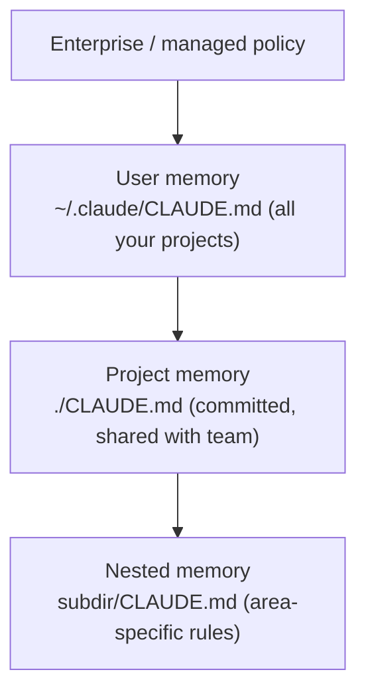

<LevelBadge level="beginner" />

<VerifyNote lastVerified="2026-06-20" source="https://docs.anthropic.com/en/docs/claude-code/memory">
Las ubicaciones de los archivos de memoria y la sintaxis de importación pueden cambiar — confirma los detalles en la documentación oficial de memoria de Claude Code.
</VerifyNote>

Si haces **una** sola cosa para mejorar [Claude Code](/docs/claude-code/what-is-claude-code), que sea esta. `CLAUDE.md` es un archivo de texto plano que Claude lee al inicio de cada sesión — el briefing permanente de tu proyecto.

## Por qué es el ajuste de mayor impacto

Sin él, vuelves a explicar tu proyecto en cada sesión ("usamos pnpm, los tests están en `__tests__`, no toques `/generated`…"). Con él, Claude ya lo sabe. Unas buenas instrucciones aquí mejoran *cada* interacción futura de golpe.

## La jerarquía de memoria

Claude Code lee la memoria de varios sitios y los combina, aproximadamente de lo más global a lo más específico:

- **Memoria de usuario** — tus preferencias personales en todos los proyectos.
- **Memoria de proyecto** (`./CLAUDE.md`, en el control de versiones) — cómo funciona *este* repo. Se comparte con tu equipo.
- **Anidada** — coloca un `CLAUDE.md` en una subcarpeta para reglas que solo apliquen ahí.

## Genera un punto de partida

Ejecuta `/init` en un proyecto y Claude redacta un `CLAUDE.md` inspeccionando el código. Luego **recórtalo** — el borrador es un punto de partida, no la meta final.

## Qué poner en él

- Qué es el proyecto, en dos frases.
- El stack tecnológico y cómo **ejecutar / testear / hacer lint**.
- Convenciones que Claude no puede inferir (nomenclatura, estructura, estilo de commits).
- **Salvaguardas**: "ejecuta los tests antes de declarar que está hecho", "nunca edites `/vendor`", "nunca hagas commit de secretos".

Toma una plantilla lista para usar en [Plantillas de CLAUDE.md](/docs/templates/claude-md).

## Qué NO poner en él

:::warning Breve y veraz gana a largo y aspiracional
Claude sigue `CLAUDE.md` *al pie de la letra*. Las instrucciones obsoletas, vagas o aspiracionales perjudican activamente. Describe cómo funciona el proyecto **realmente** hoy, mantenlo conciso y revísalo periódicamente.
:::

Evita: documentos enormes pegados (usa `@imports` para referenciar archivos en su lugar), secretos y reglas que en realidad no sigues.

## Importaciones

Trae documentos existentes en lugar de duplicarlos — p. ej. referencia tu guía de estilo con una importación `@path/to/file` para que haya una única fuente de verdad. Consulta la [documentación oficial de memoria](https://docs.anthropic.com/en/docs/claude-code/memory) para la sintaxis exacta.

## Siguiente

- [Modo Plan](/docs/claude-code/plan-mode) — primeros cambios seguros
- [Permisos y modos](/docs/claude-code/permissions) — lo que Claude puede hacer sin supervisión
- [Tutorial: Personaliza Claude Code para un repo real](/docs/walkthroughs/customize-claude-code)
