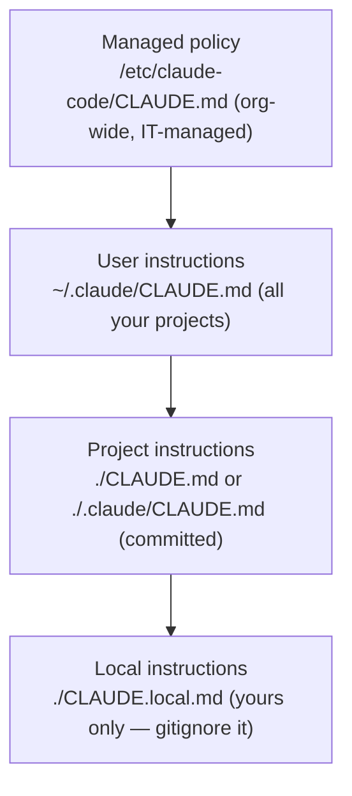

<LevelBadge level="beginner" />

<VerifyNote lastVerified="2026-10-06" source="https://code.claude.com/docs/en/memory">
Las ubicaciones, el orden de carga y la sintaxis de importación provienen de la documentación oficial de memoria («Cómo Claude recuerda tu proyecto»), que ahora describe **dos** mecanismos: los archivos CLAUDE.md que escribes tú y la **memoria automática** que Claude escribe por sí mismo. Las importaciones se resuelven hasta una profundidad máxima de cuatro saltos. Confirma los detalles ahí — estos datos cambian.
</VerifyNote>

Si haces **una** sola cosa para mejorar [Claude Code](/docs/claude-code/what-is-claude-code), que sea esta. `CLAUDE.md` es un archivo de texto plano que Claude lee al inicio de cada sesión — el briefing permanente de tu proyecto.

<Callout type="objectives" items={["Por qué CLAUDE.md es el ajuste de Claude Code de mayor impacto", "Cómo se carga la jerarquía de memoria, desde la política administrada hasta CLAUDE.local.md", "En qué se diferencia la memoria automática del CLAUDE.md que escribes tú", "Cómo generar un archivo inicial con /init y recortarlo", "Qué pertenece a CLAUDE.md — y qué dejar fuera", "Cómo los @imports te permiten referenciar documentos sin duplicarlos"]} />

## Por qué es el ajuste de mayor impacto

Sin él, vuelves a explicar tu proyecto en cada sesión ("usamos pnpm, los tests están en `__tests__`, no toques `/generated`…"). Con él, Claude ya lo sabe. Unas buenas instrucciones aquí mejoran *cada* interacción futura de golpe.

## La jerarquía de memoria

Claude Code carga la memoria desde varias ubicaciones y las combina en el orden de carga, primero el alcance más amplio — así que una instrucción de proyecto aterriza en el contexto *después* de una instrucción de usuario:

```mermaid
flowchart TD
  A["Managed policy<br/>/etc/claude-code/CLAUDE.md (org-wide, IT-managed)"] --> B["User instructions<br/>~/.claude/CLAUDE.md (all your projects)"]
  B --> C["Project instructions<br/>./CLAUDE.md or ./.claude/CLAUDE.md (committed)"]
  C --> D["Local instructions<br/>./CLAUDE.local.md (yours only — gitignore it)"]
```

- **Política administrada** — instrucciones a nivel de organización que despliega tu equipo de IT/DevOps. La ruta depende del sistema operativo: `/Library/Application Support/ClaudeCode/CLAUDE.md` en macOS, `/etc/claude-code/CLAUDE.md` en Linux y WSL, `C:\Program Files\ClaudeCode\CLAUDE.md` en Windows.
- **Instrucciones de usuario** (`~/.claude/CLAUDE.md`) — tus preferencias personales en todos los proyectos.
- **Instrucciones de proyecto** (`./CLAUDE.md` *o* `./.claude/CLAUDE.md`, en el control de versiones) — cómo funciona *este* repo. Se comparten con tu equipo. Si tu repo usa [`AGENTS.md`](/docs/claude-code/agents-md), ese puede cargarse en lugar de estos o junto a ellos.
- **Instrucciones locales** (`./CLAUDE.local.md`) — notas específicas del proyecto solo para ti, como una URL de sandbox. Añádelo a tu `.gitignore`.

Los archivos del árbol de directorios *por encima* de tu directorio de trabajo se cargan al inicio; los archivos de las **subcarpetas se cargan a demanda**, cuando Claude toca algo en esa zona.

<Callout type="tip" items={["¿Se te ha quedado pequeño un solo archivo? Divide las instrucciones en .claude/rules/*.md — un tema por archivo, descubiertos de forma recursiva. Las reglas sin frontmatter paths se cargan al inicio con la misma prioridad que .claude/CLAUDE.md; añade el frontmatter paths para cargar una regla solo cuando Claude trabaje en archivos coincidentes, lo que ahorra contexto."]} />

<Flashcards title="Conoce tus capas de memoria" cards={[{front: "Política administrada", back: "CLAUDE.md a nivel de organización, gestionado por IT — la capa más amplia, cargada antes de las instrucciones de usuario y de proyecto."}, {front: "Instrucciones de usuario", back: "~/.claude/CLAUDE.md — tus preferencias personales que aplican en todos los proyectos."}, {front: "Instrucciones de proyecto", back: "./CLAUDE.md o ./.claude/CLAUDE.md — en el control de versiones y compartidas con el equipo; describen cómo funciona este repo."}, {front: "Instrucciones locales", back: "./CLAUDE.local.md — preferencias personales específicas del proyecto. Añádelo a gitignore."}, {front: ".claude/rules/*.md", back: "Instrucciones con un tema por archivo para proyectos más grandes. Con el frontmatter paths se cargan solo para los archivos coincidentes."}, {front: "CLAUDE.md en una subcarpeta", back: "Se carga a demanda — cuando Claude trabaja en esa parte del árbol — no al inicio."}]} />

## La otra mitad: la memoria automática

CLAUDE.md es la mitad de la memoria que escribes *tú*. Claude Code también mantiene una **memoria automática** — notas que Claude escribe por sí mismo a partir de tus correcciones y preferencias, almacenadas por repositorio y cargadas en cada sesión junto a tus archivos CLAUDE.md.

| | Archivos CLAUDE.md | Memoria automática |
| --- | --- | --- |
| **Quién la escribe** | Tú | Claude |
| **Qué contiene** | Instrucciones y reglas | Aprendizajes y patrones |
| **Alcance** | Proyecto, usuario u organización | Por repositorio, compartida entre worktrees |

Ambas son *contexto*, no imposición: Claude las trata como orientación que puede ponderar, no como configuración que debe obedecer. Para bloquear de forma dura una acción al margen de lo que Claude decida, usa un [hook PreToolUse](/docs/claude-code/hooks) en su lugar.

<Callout type="warning" items={["La memoria automática carga solo sus primeras 200 líneas o 25 KB — un MEMORY.md inflado se trunca en silencio. Consulta Auditoría del presupuesto de contexto para el desglose completo del coste de arranque."]} />

## Genera un punto de partida

<Steps items={[{title: "Ejecuta /init en el proyecto", body: "Claude inspecciona el código y redacta un CLAUDE.md por ti automáticamente."}, {title: "Recórtalo", body: "El borrador es un punto de partida, no la meta final. Recórtalo a lo que es cierto y útil."}, {title: "Toma una plantilla", body: "Toma un punto de partida listo para usar de la página de Plantillas de CLAUDE.md y adáptalo a tu repo."}]} />

<PromptCard title="Genera un borrador de CLAUDE.md">{`/init`}</PromptCard>

Toma una plantilla lista para usar en [Plantillas de CLAUDE.md](/docs/templates/claude-md).

## Qué poner en él

- Qué es el proyecto, en dos frases.
- El stack tecnológico y cómo **ejecutar / testear / hacer lint**.
- Convenciones que Claude no puede inferir (nomenclatura, estructura, estilo de commits).
- **Salvaguardas**: "ejecuta los tests antes de declarar que está hecho", "nunca edites `/vendor`", "nunca hagas commit de secretos".

## Qué NO poner en él

<Callout type="warning" items={["Claude sigue CLAUDE.md al pie de la letra — las instrucciones obsoletas, vagas o aspiracionales perjudican activamente.", "Describe cómo funciona el proyecto realmente hoy; breve y veraz gana a largo y aspiracional.", "Evita documentos enormes pegados (usa @imports en su lugar), secretos y reglas que en realidad no sigues.", "Revísalo periódicamente para que se mantenga preciso a medida que el proyecto evoluciona."]} />

## Importaciones

Trae documentos existentes en lugar de duplicarlos — p. ej. referencia tu guía de estilo con una importación `@path/to/file` para que haya una única fuente de verdad. Funcionan tanto las rutas relativas como las absolutas; las rutas relativas se resuelven respecto al archivo que contiene la importación, **no** respecto a tu directorio de trabajo. Los archivos importados pueden importar otros, hasta una profundidad máxima de **cuatro saltos**.

Dos trampas de sintaxis que conviene conocer antes de que te muerdan:

- **Los espacios necesitan barras invertidas.** `@Design\ Docs/api-conventions.md` funciona; sin la barra invertida la ruta se corta en el primer espacio. Envolverla entre comillas no importa el archivo en absoluto.
- **Las comillas invertidas te dejan fuera.** El análisis de importaciones se salta los fragmentos de código y los bloques delimitados, así que `` `@README` `` se queda como texto literal mientras que `@README` por sí solo importa el archivo. Así es como *mencionas* una ruta sin cargarla.

Consulta la [documentación oficial de memoria](https://code.claude.com/docs/en/memory) para la referencia completa.

<Callout type="tip" items={["Una única fuente de verdad: referencia un archivo con @imports en lugar de pegar su contenido en CLAUDE.md.", "Si un documento ya existe, enlázalo — no lo copies. Las copias se quedan obsoletas."]} />

## Compruébate

<Quiz title="Compruébate" questions={[{q: "¿Qué archivo lee Claude Code al inicio de cada sesión como el briefing permanente de tu proyecto?", options: ["README.md", "CLAUDE.md", "package.json"], answer: 1, explain: "CLAUDE.md es el archivo de memoria en texto plano que Claude lee al inicio de cada sesión."}, {q: "¿Qué hace ejecutar /init en un proyecto?", options: ["Hace commit de CLAUDE.md al repo de tu equipo", "Redacta un CLAUDE.md inspeccionando el código, que luego recortas", "Elimina archivos de memoria obsoletos"], answer: 1, explain: "/init redacta un CLAUDE.md inicial a partir del código — el borrador es un punto de partida, así que lo recortas después."}, {q: "¿Cuál es la forma recomendada de incluir un documento grande existente, como una guía de estilo?", options: ["Pegar el documento entero en CLAUDE.md", "Referenciarlo con una importación @path/to/file", "Guardarlo como un secreto"], answer: 1, explain: "Usa @imports para apuntar al archivo y así tener una única fuente de verdad en lugar de una copia duplicada que se queda obsoleta."}, {q: "¿Dónde van las notas personales específicas de un proyecto, las que no quieres incluir en el control de versiones?", options: ["~/.claude/CLAUDE.md", "./CLAUDE.local.md", "./.claude/CLAUDE.md"], answer: 1, explain: "./CLAUDE.local.md es la capa local: específica del proyecto pero solo tuya. Añádelo a gitignore. ~/.claude/CLAUDE.md aplica a todos tus proyectos, y ./.claude/CLAUDE.md son instrucciones de equipo que van en el control de versiones."}, {q: "¿Quién escribe la memoria automática?", options: ["Tú, a mano", "Claude, a partir de tus correcciones y preferencias", "Tu administrador de IT"], answer: 1, explain: "La memoria automática es la mitad que Claude escribe por sí mismo — aprendizajes y patrones, almacenados por repositorio. CLAUDE.md es la mitad que escribes tú."}, {q: "¿Cuándo se carga un CLAUDE.md que está en una subcarpeta?", options: ["Al inicio, junto con todos los demás archivos de memoria", "A demanda, cuando Claude trabaja en esa parte del árbol", "Solo si lo importas con @import"], answer: 1, explain: "Los archivos por encima de tu directorio de trabajo se cargan al inicio; los archivos de las subcarpetas se cargan a demanda, cuando Claude toca algo en esa zona."}]} />

<Callout type="takeaways" items={["CLAUDE.md es el ajuste de mayor impacto: mejora cada sesión futura de golpe.", "La memoria se carga primero por el alcance más amplio: política administrada, luego usuario (~/.claude/CLAUDE.md), proyecto (./CLAUDE.md o ./.claude/CLAUDE.md) y después local (./CLAUDE.local.md). Los archivos de las subcarpetas se cargan a demanda.", "La memoria automática es la otra mitad — las notas propias de Claude, por repositorio, cargadas en cada sesión. Ambas son contexto, no imposición: usa un hook para bloquear algo de forma dura.", "¿Se te ha quedado pequeño un solo archivo? Divídelo en .claude/rules/*.md y delimita las reglas con el frontmatter paths.", "Empieza con /init, luego recorta el borrador a lo que es realmente cierto.", "Mantenlo breve y veraz — usa @imports (máximo cuatro saltos) para documentos grandes y nunca hagas commit de secretos."]} />

## Siguiente

- [AGENTS.md e interoperabilidad entre herramientas](/docs/claude-code/agents-md) — comparte un único archivo de instrucciones con todos los agentes de programación
- [Modo Plan](/docs/claude-code/plan-mode) — primeros cambios seguros
- [Permisos y modos](/docs/claude-code/permissions) — lo que Claude puede hacer sin supervisión
- [Tutorial: Personaliza Claude Code para un repo real](/docs/walkthroughs/customize-claude-code)
