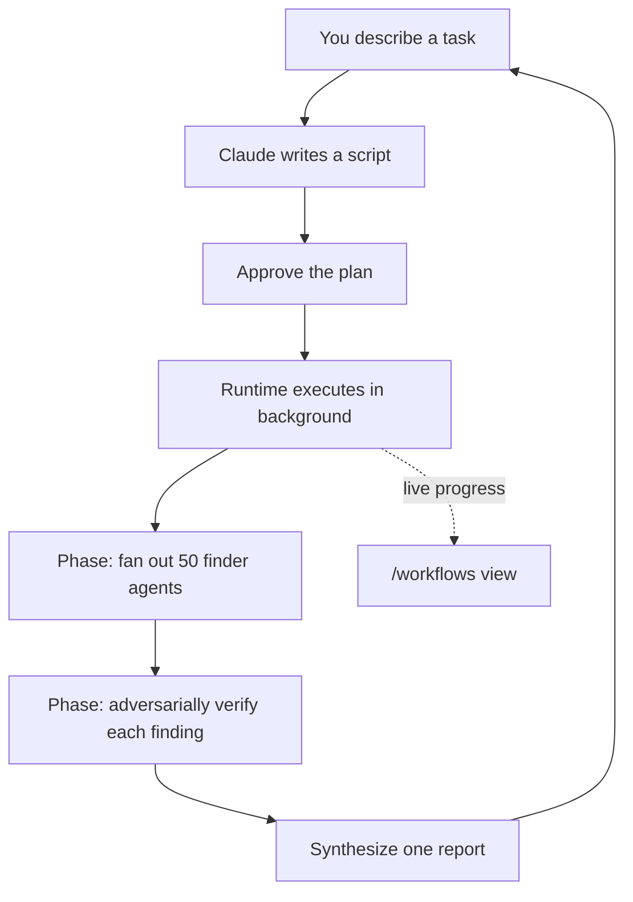

<LevelBadge level="advanced" />

<VerifyNote lastVerified="2026-06-28" source="https://code.claude.com/docs/en/workflows">
Los flujos de trabajo dinámicos son una función que evoluciona rápido: la palabra clave de activación, las opciones de aprobación, los límites de agentes y la disponibilidad cambian entre versiones de Claude Code; confirma los detalles en la documentación oficial. Requieren Claude Code v2.1.154+ y un plan de pago.
</VerifyNote>

<Callout type="objectives" items={["Distinguir un flujo de trabajo de los subagentes, las skills y los equipos de agentes según quién tiene el plan", "Ver uno en 30 segundos con el comando integrado /deep-research", "Iniciar el tuyo de tres formas: la palabra clave ultracode, /effort ultracode o un comando guardado", "Saber de qué te protege el mensaje de aprobación antes de pulsar Sí", "Mantener bajo control el coste y las ejecuciones desatendidas con el troceado y la lista de permitidos"]} />

Un **flujo de trabajo dinámico** es un script de JavaScript que orquesta [subagentes](/docs/claude-code/subagents) a gran escala. Tú describes una tarea; Claude *escribe el script*; un runtime lo ejecuta en segundo plano mientras tu sesión sigue respondiendo. Donde una tarea normal de varios pasos vive turno a turno en la ventana de contexto de Claude, un flujo de trabajo lleva el **plan al código**: el bucle, las ramificaciones y cada resultado intermedio viven en variables del script, así que tu contexto solo guarda la respuesta final.

Ese único cambio es lo que hace que los flujos de trabajo escalen a *decenas o cientos* de agentes en una sola ejecución, donde la delegación corriente se queda en un puñado.

## Cuándo recurrir a un flujo de trabajo

Claude Code te ofrece cuatro maneras de ejecutar trabajo de varios pasos. La verdadera pregunta es **quién tiene el plan**:

| | [Subagentes](/docs/claude-code/subagents) | [Skills](/docs/claude-code/skills) | Equipos de agentes | **Flujos de trabajo** |
| :-- | :-- | :-- | :-- | :-- |
| Qué es | Un trabajador que Claude genera | Instrucciones que Claude sigue | Un líder que supervisa sesiones pares | Un script que el runtime ejecuta |
| Quién decide qué se ejecuta a continuación | Claude, turno a turno | Claude, según el prompt | El líder, turno a turno | **El script** |
| Dónde viven los resultados | Ventana de contexto | Ventana de contexto | Una lista de tareas compartida | **Variables del script** |
| Escala | Unos pocos por turno | Igual que los subagentes | Un puñado de pares | **De decenas a cientos** |
| En caso de interrupción | Reinicia el turno | Reinicia el turno | Los compañeros siguen ejecutándose | **Reanudable dentro de la sesión** |

Usa un flujo de trabajo cuando una tarea necesite **más agentes de los que puede coordinar una sola conversación**, o cuando quieras la orquestación **codificada como un script que puedas leer y volver a ejecutar**. Casos canónicos:

- Un **barrido de errores en toda la base de código**: despliega un buscador por cada módulo y luego haz que agentes independientes verifiquen de forma adversarial cada hallazgo antes de reportarlo.
- Una **migración de 500 archivos**: un agente por archivo, cada uno en su propio worktree, con una etapa de verificación.
- Una **pregunta de investigación** donde las fuentes deben **verificarse cruzadamente entre sí**, no solo resumirse.
- Un **plan difícil** que merece la pena redactar desde varios ángulos independientes para luego sopesarlos entre sí antes de comprometerte.

Ese último punto es el infravalorado: un flujo de trabajo puede aplicar un *patrón de calidad repetible* (revisión adversarial, redacción multiángulo, verificación por mayoría de votos), de modo que obtienes un resultado más fiable que con una sola pasada, no solo más agentes.



## La forma más rápida de ver uno: /deep-research

Claude Code incluye un flujo de trabajo integrado para que no tengas que escribir uno para probar el modelo. Ejecútalo sobre cualquier pregunta:

<PromptCard title="Prueba un flujo de trabajo en un solo comando">{`/deep-research What changed in the Node.js permission model between v20 and v22?`}</PromptCard>

Despliega búsquedas web por varios ángulos, recupera y **verifica cruzadamente** las fuentes, vota sobre cada afirmación y devuelve un **informe con citas, en el que se filtran las afirmaciones que no sobrevivieron a la verificación cruzada**. Aprueba cuando te lo pida y luego observa cómo trabaja con `/workflows`. (Necesita que la herramienta WebSearch esté disponible.)

## Tres formas de iniciar el tuyo

**1. Pídelo en un solo prompt.** Incluye la palabra clave `ultracode`, o simplemente pídelo en lenguaje llano ("usa un flujo de trabajo", "ejecuta un flujo de trabajo"). Claude escribe un script para esa única tarea sin cambiar el nivel de esfuerzo de tu sesión:

<PromptCard title="Ejecuta una tarea como flujo de trabajo">{`ultracode: audit every API endpoint under src/routes/ for missing auth checks`}</PromptCard>

La palabra clave se resalta en tu entrada. ¿No era tu intención? Pulsa `Option+W` (macOS) o `Alt+W` (Windows/Linux) para descartar el resaltado en ese prompt.

:::note Historial de la palabra clave
Antes de la v2.1.160 la palabra de activación literal era `workflow`; se renombró a `ultracode` para que la palabra común "workflow" no disparara una ejecución. Las peticiones en lenguaje natural ("ejecuta un flujo de trabajo") funcionan en **ambas** versiones.
:::

**2. Deja que Claude decida: esfuerzo ultracode.** Pon la sesión en ultracode y Claude planificará un flujo de trabajo para *cada* tarea sustancial, decidiendo por sí mismo cuándo está justificado:

<PromptCard title="Activa la orquestación automática para la sesión">{`/effort ultracode`}</PromptCard>

Ultracode combina el [esfuerzo de razonamiento](/docs/api/thinking-and-effort) `xhigh` con orquestación automática. Una sola petición puede convertirse en varios flujos de trabajo seguidos: uno para entender el código, otro para hacer el cambio, otro para verificarlo. Cada tarea usa entonces más tokens y tarda más, así que vuelve a `/effort high` para el trabajo rutinario. Dura solo la sesión actual.

**3. Ejecuta un comando guardado o integrado.** `/deep-research`, o cualquier flujo de trabajo que hayas guardado (más abajo), aparece en el autocompletado de `/` como cualquier comando de barra.

## Aprueba antes de que se ejecute

Los flujos de trabajo pueden generar muchos agentes, así que la CLI te muestra las fases planeadas y pregunta primero:

- **Sí, ejecútalo**: inicia la ejecución
- **Sí, y no volver a preguntar por `[name]` en `[path]`**: inicia y omite el mensaje para este flujo de trabajo en este proyecto
- **Ver script en bruto** (`Ctrl+G` lo abre en tu editor): léelo antes de decidir
- **No**: cancelar (`Tab` te permite ajustar antes el prompt)

Que se te pregunte o no depende de tu [modo de permisos](/docs/claude-code/permissions): **Default / accept-edits** pregunta en cada ejecución (a menos que te hayas dado de baja para ese flujo de trabajo); **Auto** pregunta solo en el primer lanzamiento; **bypass / `claude -p` / Agent SDK** nunca preguntan: la ejecución empieza de inmediato.

:::warning Los subagentes no heredan el modo de tu sesión
Sea cual sea el modo de permisos de tu sesión, los agentes que genera un flujo de trabajo se ejecutan siempre en **`acceptEdits`** y heredan tu [lista de herramientas permitidas](/docs/claude-code/permissions): las ediciones de archivos se aprueban automáticamente. Los comandos de shell, las descargas web y las herramientas MCP que *no* estén en tu lista de permitidos aún pueden pausar la ejecución para preguntarte. En una ejecución larga y desatendida, **añade los comandos que necesitan los agentes a tu lista de permitidos antes de empezar** para que no se quede atascada esperándote. Consulta [Endurecer las ejecuciones autónomas](/docs/security/hardening-autonomous-runs).
:::

## Cómo se ejecuta una corrida

El runtime ejecuta el script en un **entorno aislado**, separado de tu conversación: los resultados intermedios se quedan en variables del script y nunca tocan el contexto de Claude. El script en sí **no tiene acceso directo al sistema de archivos ni a la shell**: los *agentes* leen, escriben y ejecutan comandos; el script solo los coordina.

Cada ejecución escribe su script en un archivo dentro del directorio de tu sesión en `~/.claude/projects/`, y Claude obtiene la ruta. Así que puedes pedirle a Claude el script, leer la orquestación que escribió, compararla con una ejecución anterior, o editarla y pedirle a Claude que relance desde tu versión editada.

El runtime impone unos cuantos límites para que un script defectuoso no se descontrole:

| Restricción | Por qué |
| :-- | :-- |
| Sin entrada del usuario a mitad de ejecución (solo la pausan los mensajes de permiso de los agentes) | Para una aprobación entre etapas, ejecuta cada etapa como su propio flujo de trabajo |
| El script no tiene acceso directo al sistema de archivos ni a la shell | Los agentes hacen el trabajo; el script coordina |
| Hasta **16 agentes concurrentes** (menos en máquinas con pocos núcleos) | Acota el uso de recursos locales |
| **1.000 agentes en total** por ejecución | Evita bucles desbocados |

## Observa y gestiona las ejecuciones

Ejecuta `/workflows` para listar las ejecuciones en curso y completadas, luego selecciona una para abrir su vista de progreso: cada fase con su número de agentes, el total de tokens y el tiempo transcurrido. Profundiza en una fase, luego en un agente, para leer su prompt, sus llamadas a herramientas recientes y su resultado. Controles clave:

| Tecla | Acción |
| :-- | :-- |
| `↑` / `↓` | Seleccionar una fase o un agente |
| `Enter` / `→` | Profundizar; `Esc` retrocede |
| `f` | Filtrar agentes por estado (v2.1.186+) |
| `p` | Pausar o reanudar la ejecución |
| `x` | Detener el agente seleccionado, o toda la ejecución cuando el foco está en ella |
| `r` | Reiniciar el agente en ejecución seleccionado |
| `s` | **Guardar** el script de esta ejecución como un comando |

También aparece un resumen de progreso de una línea en el panel de tareas debajo de tu caja de entrada; pulsa la flecha hacia abajo para enfocarlo y Enter para expandirlo.

**Reanudar:** detén una ejecución y reanúdala más tarde (`p`); los agentes que ya terminaron devuelven resultados en caché y el resto se ejecuta en vivo. La reanudación funciona **dentro de la misma sesión**; si sales de Claude Code a mitad de una ejecución, la siguiente sesión la inicia de cero.

## Guarda un flujo de trabajo para reutilizarlo

Cuando Claude escribe una buena orquestación para algo que vas a repetir —una revisión que ejecutas en cada rama— pulsa `s` en `/workflows` para guardar el script de esa ejecución. `Tab` alterna dónde:

- `.claude/workflows/` en tu proyecto: compartido con todos los que clonen el repositorio
- `~/.claude/workflows/` en tu directorio personal: disponible en todas partes, solo tú lo ves

Entonces se ejecuta como `/[name]` en sesiones futuras. Un flujo de trabajo guardado puede recibir entrada mediante un global `args`, así lo parametrizas en el momento de la llamada en lugar de editar el script:

```text
> Run /triage-issues on issues 1024, 1025, and 1030
```

Claude pasa la lista como datos estructurados, así que el script llama directamente a métodos de array/objeto sobre `args`.

## Cuida el coste

Un flujo de trabajo genera muchos agentes, así que una sola ejecución puede usar **bastantes más tokens** que hacer la misma tarea en conversación, y cuenta para el uso y los límites de tasa de tu plan. Dos hábitos lo mantienen razonable:

- **Trocea primero.** Ejecuta sobre un directorio (no todo el repositorio) o una pregunta acotada primero para calibrar el gasto; `/workflows` muestra el uso de tokens por agente en vivo, y puedes detenerlo en cualquier momento sin perder el trabajo completado.
- **Dimensiona bien el modelo.** Cada agente usa el modelo de tu sesión salvo que el script enrute una etapa a otro. Comprueba `/model` antes de una ejecución grande y, cuando describas la tarea, pídele a Claude que use un **modelo más pequeño para las etapas que no necesitan el más potente**. Consulta [Coste y latencia](/docs/foundations/cost-and-latency) y [Elegir un modelo](/docs/api/choosing-a-model).

## Errores comunes

- **Esperar intervención humana a mitad de ejecución.** No hay entrada a mitad de ejecución. Si una tarea necesita tu aprobación entre etapas, divídela en flujos de trabajo separados.
- **Olvidar la lista de permitidos en ejecuciones desatendidas.** Un flujo de trabajo largo se atasca en cuanto un agente topa con un comando de shell que no está en la lista de permitidos. Autoriza por adelantado lo que los agentes necesitan.
- **Recurrir a un flujo de trabajo cuando bastaría un subagente.** Unas pocas tareas delegadas por turno es para lo que sirven los [subagentes](/docs/claude-code/subagents). Los flujos de trabajo justifican su sobrecarga a escala de *flota* o cuando quieres la orquestación guardada como un script re-ejecutable.
- **Ejecutar con esfuerzo ultracode toda la sesión para ediciones rutinarias.** Planifica un flujo de trabajo para todo: genial para el trabajo difícil, despilfarrador para un arreglo de una línea. Baja a `/effort high`.

<Quiz title="Ponte a prueba" questions={[{q: "¿Cuál es la diferencia que define a un flujo de trabajo frente a los subagentes, las skills o los equipos de agentes?", options: ["Un flujo de trabajo puede generar agentes; los demás no", "El plan vive en un script que el runtime ejecuta, no turno a turno en el contexto de Claude", "Los flujos de trabajo son los únicos que se ejecutan en segundo plano"], answer: 1, explain: "Los cuatro pueden ejecutar trabajo de varios pasos. En un flujo de trabajo el bucle, las ramificaciones y los resultados intermedios viven en variables del script —el contexto de Claude solo guarda la respuesta final— que es lo que le permite escalar a decenas o cientos de agentes."}, {q: "Ejecutas un flujo de trabajo largo y desatendido y los agentes necesitan un comando de shell que no está en tu lista de permitidos. ¿Qué pasa?", options: ["Los agentes lo aprueban automáticamente porque se ejecutan en acceptEdits", "La ejecución se atasca esperando tu aprobación", "La ejecución omite ese comando y continúa"], answer: 1, explain: "Los agentes de un flujo de trabajo se ejecutan en acceptEdits, así que las ediciones de archivos se aprueban automáticamente, pero los comandos de shell, las descargas web y las herramientas MCP que no están en tu lista de permitidos aún pausan la ejecución para preguntarte. Autoriza por adelantado lo que los agentes necesitan antes de una ejecución desatendida."}, {q: "¿Cuál es la forma más barata de calibrar lo que costará un flujo de trabajo grande antes de comprometerte?", options: ["Leer primero el script guardado", "Ejecutarlo sobre un trozo acotado —un directorio o una pregunta— y observar los tokens por agente en /workflows", "Cambiar toda la sesión a un modelo más pequeño"], answer: 1, explain: "Trocea primero: ejecuta sobre un directorio o una pregunta acotada, observa el uso de tokens por agente en vivo en /workflows y detente en cualquier momento sin perder el trabajo completado."}]} />

<Callout type="takeaways" items={["Un flujo de trabajo lleva el plan al código —el script guarda el bucle y los resultados intermedios—, así que las ejecuciones escalan a decenas o cientos de agentes.", "Prueba uno al instante con /deep-research; inicia el tuyo con la palabra clave ultracode, /effort ultracode o un /comando guardado.", "El mensaje de aprobación existe porque una ejecución puede generar muchos agentes: Default y accept-edits preguntan en cada ejecución; Auto pregunta una vez; bypass y sin interfaz nunca preguntan.", "Los agentes generados se ejecutan en acceptEdits con tu lista de permitidos, así que autoriza por adelantado los comandos que necesitan antes de una ejecución desatendida.", "Los flujos de trabajo cuestan bastantes más tokens: trocea primero, dimensiona bien el modelo por etapa y baja el esfuerzo ultracode a /effort high para las ediciones rutinarias."]} />

## Desactivar los flujos de trabajo

Desactiva **Flujos de trabajo dinámicos** en `/config`, pon `"disableWorkflows": true` en `~/.claude/settings.json`, o establece la variable de entorno `CLAUDE_CODE_DISABLE_WORKFLOWS=1`. Las organizaciones pueden desactivarlos en los [ajustes gestionados](/docs/claude-code/settings). Cuando están desactivados, los comandos de flujo de trabajo integrados desaparecen y `ultracode` ya no dispara una ejecución ni aparece en el menú de `/effort`.

## Siguiente

- [Subagentes y agentes paralelos](/docs/claude-code/subagents): el primitivo trabajador que los flujos de trabajo orquestan
- [Diseña un flujo de trabajo con varios subagentes (recorrido)](/docs/walkthroughs/multi-subagent-workflow)
- [Arneses de agentes de larga duración](/docs/frontiers/long-running-agent-harnesses): los principios de diseño detrás de las ejecuciones multiagente duraderas
- [Endurecer las ejecuciones autónomas](/docs/security/hardening-autonomous-runs)
