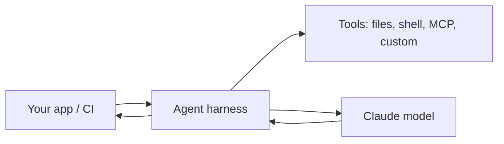

<LevelBadge level="advanced" />

<VerifyNote lastVerified="2026-06-20" source="https://docs.anthropic.com/en/docs/claude-code/sdk">
Los nombres del SDK, de los paquetes y los flags de headless evolucionan — confírmalos en la documentación oficial del Claude Agent SDK / Claude Code.
</VerifyNote>

Claude Code no es solo interactivo. Puedes ejecutarlo en modo **headless** (no interactivo, programable) y puedes crear tus **propios agentes** sobre el mismo harness subyacente con el **Agent SDK**.

## Modo headless

Ejecuta un único prompt de forma no interactiva y captura la salida — perfecto para scripts, hooks de pre-commit y CI:

```bash
claude -p "Review the staged diff and list any bugs as a Markdown checklist"
```

Pasa la entrada por pipe, obtén un resultado. Combínalo con [permisos](/docs/claude-code/permissions) configurados en una postura segura y no interactiva para que nunca se quede colgado esperando una aprobación — y **bloquéalo bien** para que una ejecución automatizada no pueda tocar secretos (consulta [Endurecer ejecuciones autónomas](/docs/security/hardening-autonomous-runs)).

Un uso clásico: un job de CI que hace que Claude revise cada pull request — consulta el [tutorial de revisión de PR](/docs/walkthroughs/pr-review-action).

## El Agent SDK

El **Claude Agent SDK** (Python y TypeScript) te permite crear agentes de producción sobre el mismo bucle que impulsa Claude Code — uso de herramientas, acceso a archivos/shell, permisos, gestión del contexto — pero conectado a *tu* aplicación.



Recurre a él cuando hayas superado una única llamada a la API o un bucle hecho a mano y quieras un runtime de agente completo y listo para usar. Para el abanico de opciones — llamada única → flujo de trabajo → agente personalizado → gestionado — consulta [Crear agentes sobre la API](/docs/api/building-agents).

## Headless/SDK frente a interactivo

| Modo | Para |
|---|---|
| Claude Code interactivo | Desarrollo del día a día con una persona en el bucle |
| Headless (`claude -p`) | Scripts, pre-commit, tareas puntuales de CI |
| Agent SDK | Agentes de producción integrados en tu software |

## Siguiente

- [GitHub Action que revisa cada PR (tutorial)](/docs/walkthroughs/pr-review-action)
- [Crear agentes sobre la API](/docs/api/building-agents)
- [Endurecer ejecuciones autónomas](/docs/security/hardening-autonomous-runs)
