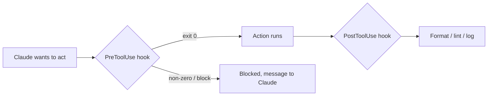

<LevelBadge level="advanced" />

<VerifyNote lastVerified="2026-06-20" source="https://docs.anthropic.com/en/docs/claude-code/hooks">
Los nombres exactos de los eventos de hook y el esquema de configuración evolucionan — confírmalos con la documentación oficial de hooks antes de depender de un evento concreto.
</VerifyNote>

Los hooks son **comandos de shell que Claude Code ejecuta automáticamente** en puntos definidos de su ciclo de vida. Donde los [permisos](/docs/claude-code/permissions) deciden *si* una acción está permitida, los hooks te dejan ejecutar *tu* lógica determinista a su alrededor — formato, validación, registro, controles. Son la forma de hacer que un comportamiento esté garantizado en lugar de un "por favor, recuerda hacerlo".

## Cuándo recurrir a un hook

- **Formatear / hacer lint automáticamente** tras cada edición de archivo (`PostToolUse`).
- **Bloquear** una acción que infringe una regla antes de que se ejecute (`PreToolUse`).
- **Notificar o registrar** cuando termina una sesión o se completa una tarea (`Stop`).
- **Inyectar contexto** al inicio de la sesión.

## Cómo funcionan

Registras los hooks en [`settings.json`](/docs/claude-code/settings), haciéndolos coincidir con un **evento** (y a menudo un matcher de herramienta). Cuando el evento se dispara, Claude ejecuta tu comando y lee su resultado — un código de salida distinto de cero o una salida específica pueden **bloquear** la acción y devolver un mensaje a Claude.

```json
{
  "hooks": {
    "PostToolUse": [
      {
        "matcher": "Edit|Write",
        "hooks": [
          { "type": "command", "command": "npx prettier --write \"$CLAUDE_FILE_PATH\"" }
        ]
      }
    ]
  }
}
```

El hook recibe contexto (p. ej. la ruta del archivo, el nombre de la herramienta) mediante el entorno/stdin — consulta la documentación para el payload exacto, que varía según el evento.

## El modelo mental



## Buenas prácticas

- **Mantén los hooks rápidos e idempotentes** — se ejecutan mucho.
- **Falla de forma ruidosa ante problemas reales**, pero no bloquees por cuestiones cosméticas.
- **Trata la salida del hook como feedback para Claude** — un mensaje claro le ayuda a autocorregirse.
- Los hooks se ejecutan con los privilegios de tu shell — revisa cualquier hook que no hayas escrito tú ([Revisar código de terceros](/docs/security/reviewing-third-party-code)).

Hay plantillas listas para copiar y pegar en [Recetas de Hooks y settings.json](/docs/templates/hooks-settings).

## Siguiente

- [settings.json](/docs/claude-code/settings) · [Permisos](/docs/claude-code/permissions)
- [Skills](/docs/claude-code/skills) — experiencia frente a automatización
- [Endurecer ejecuciones autónomas](/docs/security/hardening-autonomous-runs)
