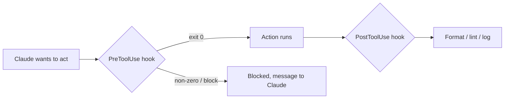

<LevelBadge level="advanced" />

<VerifyNote lastVerified="2026-06-23" source="https://code.claude.com/docs/en/hooks">
Los nombres exactos de los eventos de hook, la carga útil de stdin y el protocolo de bloqueo evolucionan: confírmalos con la documentación oficial de hooks antes de depender de un evento o campo concreto.
</VerifyNote>

Los hooks son **comandos de shell que Claude Code ejecuta automáticamente** en puntos definidos de su ciclo de vida. Donde los [permisos](/docs/claude-code/permissions) deciden *si* una acción está permitida, los hooks te dejan a *ti* ejecutar lógica determinista a su alrededor: formato, validación, registro, controles. Son la manera de hacer que un comportamiento esté garantizado en lugar de quedar en un "por favor, acuérdate de".

## Cuándo recurrir a un hook

- **Formatear / hacer lint automáticamente** tras cada edición de archivo (`PostToolUse`).
- **Bloquear** una acción que infringe una regla antes de que se ejecute (`PreToolUse`).
- **Notificar o registrar** cuando termina una sesión o se completa una tarea (`Stop`).
- **Inyectar contexto** al inicio de la sesión.

## Cómo funcionan

Registras los hooks en [`settings.json`](/docs/claude-code/settings), haciéndolos coincidir con un **evento** (y a menudo un matcher de herramienta). Cuando el evento se dispara, Claude ejecuta tu comando, pasando una **carga útil JSON por stdin** (el nombre de la herramienta, sus entradas, la sesión). El código de salida y la salida de tu comando deciden qué ocurre a continuación.

```json
{
  "hooks": {
    "PostToolUse": [
      {
        "matcher": "Edit|Write",
        "hooks": [
          { "type": "command", "command": "jq -r '.tool_input.file_path' | xargs npx prettier --write" }
        ]
      }
    ]
  }
}
```

El hook anterior lee la ruta del archivo editado del JSON de stdin (`.tool_input.file_path`) y lo formatea. No asumas que una variable de entorno contiene la ruta: **léela desde stdin.** Marcadores de ruta útiles como `${CLAUDE_PROJECT_DIR}` *sí* están disponibles para localizar scripts.

## Cómo bloquea un hook

Dos formas, según el evento:

- **Código de salida 2**: el hook hace fallar la acción y lo que haya escrito en **stderr** se convierte en el mensaje que ve Claude. Sencillo y funciona para los hooks de comando.
- **JSON en stdout (salida 0)**: devuelve una decisión estructurada. Para `PreToolUse`, eso es un `permissionDecision` de `deny`; para `PostToolUse`/`Stop`/etc. es `{"decision": "block", "reason": "…"}`.

```bash
#!/usr/bin/env bash
# PreToolUse hook on the Bash tool: refuse to delete things.
command=$(jq -r '.tool_input.command' < /dev/stdin)
if [[ "$command" == rm\ * || "$command" == *"rm -rf"* ]]; then
  echo "Blocked: destructive 'rm' is not allowed by policy." >&2
  exit 2
fi
exit 0
```

## El modelo mental



## Buenas prácticas

- **Mantén los hooks rápidos e idempotentes**: se ejecutan mucho.
- **Falla de forma ruidosa ante problemas reales**, pero no bloquees por cuestiones cosméticas.
- **Trata la salida del hook como feedback para Claude**: un mensaje claro le ayuda a autocorregirse.
- Los hooks se ejecutan con los privilegios de tu shell: revisa cualquier hook que no hayas escrito tú ([Revisar código de terceros](/docs/security/reviewing-third-party-code)).

## Errores comunes

- **Leer la ruta del archivo desde una variable de entorno.** La ruta vive en el JSON de stdin (`.tool_input.file_path`), no en `$CLAUDE_FILE_PATH`. Pasa stdin a través de `jq`.
- **Bloqueos silenciosos.** Si un hook `PreToolUse` sale con 2 sin nada en stderr, Claude queda bloqueado pero no sabe *por qué* y no puede adaptarse. Escribe siempre una razón clara.
- **Hooks lentos.** Un hook `PostToolUse` se ejecuta tras *cada* edición coincidente. Un linter de 3 segundos hace que toda la sesión se sienta lenta: mantén los hooks rápidos e, idealmente, actúa solo sobre lo que cambió.
- **Matchers demasiado amplios.** `matcher: ".*"` se dispara con cada herramienta. Acótalo con un nombre exacto, una lista `Edit|Write` o el campo `if` por manejador (p. ej. `"if": "Bash(git push *)"`).
- **Confiar en hooks que no escribiste.** Un hook ejecuta shell arbitrario con tus privilegios. Revisa primero cualquier hook de un plugin o plantilla: consulta [Revisar código de terceros](/docs/security/reviewing-third-party-code).

Hay plantillas listas para copiar y pegar en [Recetas de Hooks y settings.json](/docs/templates/hooks-settings).

## Siguiente

- [settings.json](/docs/claude-code/settings) · [Permisos](/docs/claude-code/permissions)
- [Skills](/docs/claude-code/skills) — experiencia frente a automatización
- [Endurecer ejecuciones autónomas](/docs/security/hardening-autonomous-runs)
