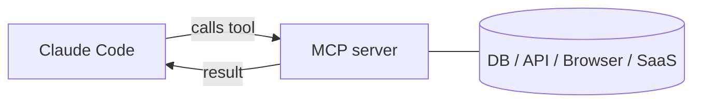

<LevelBadge level="advanced" />

<VerifyNote lastVerified="2026-06-20" source="https://code.claude.com/docs/en/mcp">
La sintaxis de configuración de MCP, los scopes y los transportes evolucionan — confírmalo en la documentación oficial de MCP de Claude Code y en modelcontextprotocol.io.
</VerifyNote>

El **Model Context Protocol (MCP)** es un estándar abierto para conectar la IA con herramientas y datos externos. Un **servidor MCP** expone capacidades (consultar una base de datos, abrir un PR de GitHub, controlar un navegador); Claude Code se conecta a él y puede **llamar a esas herramientas** durante una sesión. Es la forma de extender Claude más allá de tu sistema de archivos y tu shell.

## Cómo es



Declaras los servidores que Claude puede usar; cada servidor publica un conjunto de herramientas con esquemas; Claude las elige y las llama como cualquier otra herramienta.

## Transportes

- **stdio** — un proceso local que Claude lanza (genial para herramientas/CLIs locales).
- **Remoto (HTTP/SSE)** — un servidor alojado, a menudo con OAuth.

## Configurar servidores

Los servidores se configuran (habitualmente en un `.mcp.json` y/o mediante los ajustes) con un comando/URL y la autenticación que haga falta. Los scopes controlan dónde está disponible un servidor (solo tú, o compartido con el proyecto). Consulta [Configuración de MCP y scaffolds de servidor](/docs/templates/mcp-config) para plantillas listas para copiar y pegar.

```json
{
  "mcpServers": {
    "github": { "command": "npx", "args": ["-y", "@modelcontextprotocol/server-github"] }
  }
}
```

## Confianza y seguridad

:::warning Trata los servidores MCP como instalar software
Un servidor MCP ejecuta código y puede leer datos y realizar acciones. Conecta solo servidores en los que confíes, dales el **mínimo privilegio** necesario y recuerda que cualquier contenido externo que devuelvan puede transportar [inyección de prompts](/docs/security/prompt-injection). Revisa primero los servidores de terceros — consulta [Revisar código de terceros](/docs/security/reviewing-third-party-code).
:::

## MCP también en las apps

MCP también impulsa los **Conectores** en las apps de Claude — mismo estándar, distinta superficie. Consulta [Conectores (MCP) en las apps](/docs/claude-app/connectors) y, para la API, [MCP y conexión a herramientas](/docs/api/mcp).

## Siguiente

- [Construye y conecta tu primer servidor MCP (tutorial)](/docs/walkthroughs/first-mcp-server)
- [Configuración de MCP y scaffolds de servidor](/docs/templates/mcp-config)
- [Asegurar agentes y herramientas](/docs/security/securing-agents)
