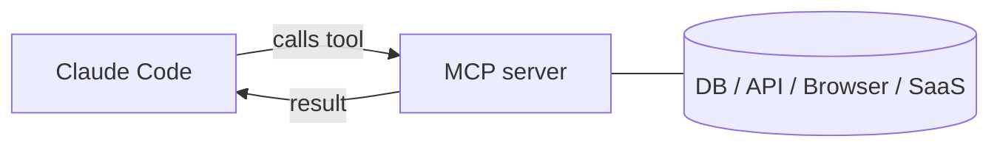

<LevelBadge level="advanced" />

<VerifyNote lastVerified="2026-06-23" source="https://code.claude.com/docs/en/mcp">
Los comandos `claude mcp`, los ámbitos de configuración y los transportes evolucionan: confírmalo en la documentación oficial de MCP de Claude Code y en modelcontextprotocol.io.
</VerifyNote>

El **Model Context Protocol (MCP)** es un estándar abierto para conectar la IA con herramientas y datos externos. Un **servidor MCP** expone capacidades (consultar una base de datos, abrir un PR de GitHub, controlar un navegador); Claude Code se conecta a él y puede **llamar a esas herramientas** durante una sesión. Es la forma de extender Claude más allá de tu sistema de archivos y tu shell.

## Cómo es



Declaras los servidores que Claude puede usar; cada servidor publica un conjunto de herramientas con esquemas; Claude las elige y las llama como cualquier otra herramienta.

## Transportes

- **stdio** — un proceso local que Claude lanza (genial para herramientas/CLIs locales).
- **Remoto (HTTP/SSE)** — un servidor alojado, a menudo con OAuth.

## Configurar servidores

La vía más rápida es el comando `claude mcp add`: escribe la configuración por ti:

```bash
# Un servidor stdio local (todo lo que sigue a -- es el comando de inicio)
claude mcp add github -- npx -y @modelcontextprotocol/server-github

# Un servidor HTTP remoto, compartido con todos los del proyecto
claude mcp add --transport http --scope project linear https://mcp.linear.app/mcp
```

Por debajo, eso no es más que JSON. Un servidor con ámbito **project** acaba en un `.mcp.json` en la raíz del repositorio: súbelo al control de versiones y todo tu equipo obtendrá las mismas herramientas:

```json
{
  "mcpServers": {
    "github": { "command": "npx", "args": ["-y", "@modelcontextprotocol/server-github"] }
  }
}
```

**El ámbito decide quién ve el servidor:**

| Ámbito | Vive en | Úsalo para |
|---|---|---|
| `local` (predeterminado) | tus ajustes de usuario, solo este proyecto | experimentos personales, secretos |
| `project` | `.mcp.json` en el repositorio (subido al control de versiones) | herramientas que todo el equipo debería compartir |
| `user` | tus ajustes de usuario, todos los proyectos | servidores que quieres en todas partes |

Ejecuta `claude mcp list` para ver qué hay conectado y `/mcp` dentro de una sesión para inspeccionar las herramientas y autenticarte en servidores remotos. Consulta [Configuración de MCP y scaffolds de servidor](/docs/templates/mcp-config) para plantillas listas para copiar y pegar.

## Ejemplo práctico: dale a Claude tu base de datos

Supón que quieres que Claude responda preguntas contra un Postgres local en lugar de que tú pegues los resultados de las consultas. Añade el servidor (ámbito project, para que tus compañeros lo hereden):

```bash
claude mcp add --scope project db -- npx -y @modelcontextprotocol/server-postgres "postgresql://localhost/app"
```

Ahora, en una sesión, puedes preguntar: *"¿Cuántos usuarios se registraron la semana pasada? Consulta la BD."* Claude llama a la herramienta `query` del servidor, recibe las filas de vuelta y responde, sin el bucle de copiar y pegar. Como tiene ámbito project, un compañero que clone el repositorio obtiene la misma capacidad en el momento en que abre Claude Code. Mantén la cadena de conexión en solo lectura si únicamente quieres lecturas.

## Confianza y seguridad

:::warning Trata los servidores MCP como instalar software
Un servidor MCP ejecuta código y puede leer datos y realizar acciones. Conecta solo servidores en los que confíes, dales el **mínimo privilegio** necesario y recuerda que cualquier contenido externo que devuelvan puede transportar [inyección de prompts](/docs/security/prompt-injection). Revisa primero los servidores de terceros — consulta [Revisar código de terceros](/docs/security/reviewing-third-party-code).
:::

## MCP también en las apps

MCP también impulsa los **Conectores** en las apps de Claude — mismo estándar, distinta superficie. Consulta [Conectores (MCP) en las apps](/docs/claude-app/connectors) y, para la API, [MCP y conexión a herramientas](/docs/api/mcp).

## Errores comunes

- **Ámbito incorrecto.** Un servidor añadido con ámbito `local` no aparecerá para tus compañeros; uno que solo querías para ti no debería subirse al control de versiones con ámbito `project`. Elige de forma deliberada.
- **Demasiados servidores, demasiadas herramientas.** Cada servidor conectado añade sus esquemas de herramientas al contexto. Conecta lo que la tarea necesita, no todo tu catálogo.
- **Conexiones con privilegios excesivos.** Dale a un servidor de base de datos un rol de solo lectura a menos que Claude realmente necesite escribir. MCP hace que las capacidades sean reales: redúcelas al mínimo.
- **Olvidar el riesgo de inyección.** Cualquier cosa que un servidor devuelva (una página web, el cuerpo de una incidencia, una fila) es texto no confiable que puede transportar [inyección de prompts](/docs/security/prompt-injection). No conectes un servidor potente con capacidad de escritura junto a uno con capacidad de lectura no confiable sin pensarlo bien.

## Siguiente

- [Construye y conecta tu primer servidor MCP (tutorial)](/docs/walkthroughs/first-mcp-server)
- [Configuración de MCP y scaffolds de servidor](/docs/templates/mcp-config)
- [Asegurar agentes y herramientas](/docs/security/securing-agents)
