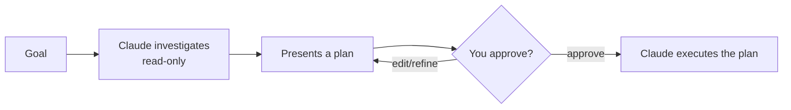

<LevelBadge level="beginner" />

<VerifyNote lastVerified="2026-06-20" source="https://code.claude.com/docs/en">
Cómo entras en el Modo Plan (atajo/flag) puede cambiar entre versiones — consulta la documentación oficial de Claude Code.
</VerifyNote>

El **Modo Plan** pone a Claude Code en **solo lectura**: puede explorar tu código, ejecutar búsquedas y razonar — pero **no editará archivos ni ejecutará comandos que cambien el estado**. En su lugar, produce un plan y espera tu aprobación.

## Por qué es la forma más segura de empezar

Para cualquier cosa grande, arriesgada o desconocida, quieres ver *qué* pretende hacer Claude antes de que toque tu repo. El Modo Plan separa el **pensar** del **hacer**:

Detectas suposiciones equivocadas *antes* de que se conviertan en código equivocado.

## Cuándo usarlo

- **Siempre** para cambios grandes o multiarchivo, migraciones o refactorizaciones.
- Cuando trabajas en un código que aún no conoces del todo.
- Cuando quieres un plan revisable para compartir con un compañero de equipo.

Para ediciones pequeñas y obvias puedes saltártelo — pero en caso de duda, planifica primero.

## Cómo funciona en la práctica

1. Entra en el Modo Plan y expón tu objetivo.
2. Claude lee los archivos relevantes y hace preguntas aclaratorias.
3. Devuelve un plan paso a paso: archivos a cambiar, el enfoque y cómo verificarlo.
4. Lo apruebas (o lo refinas). Solo entonces cambia a hacer modificaciones.

:::tip Combínalo con CLAUDE.md
Un buen [CLAUDE.md](/docs/claude-code/claude-md) hace que los planes sean más precisos — Claude planifica teniendo ya en cuenta tus convenciones y salvaguardas.
:::

## Modo Plan frente a Permisos

Resuelven problemas distintos y funcionan juntos:

- **Modo Plan** = "investiga y propón, no actúes todavía." (Esta página.)
- **[Permisos](/docs/claude-code/permissions)** = una vez actuando, *qué* acciones están permitidas sin preguntar.

## Siguiente

- [Permisos y modos de permiso](/docs/claude-code/permissions)
- [Gestión del contexto](/docs/claude-code/context-management) — mantén efectivas las sesiones largas
- [Tutorial: Personaliza Claude Code para un repo real](/docs/walkthroughs/customize-claude-code)
