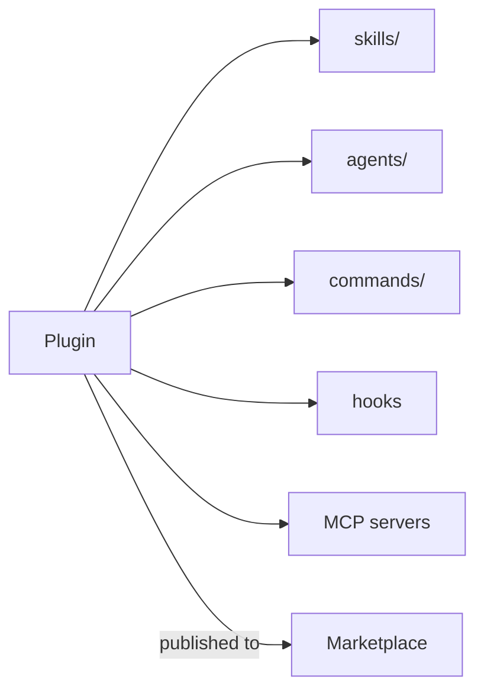

<LevelBadge level="advanced" />

<VerifyNote lastVerified="2026-06-20" source="https://docs.anthropic.com/en/docs/claude-code">
La estructura de los plugins y la mecánica de los marketplaces evolucionan rápido — confirma los detalles en la documentación oficial de Claude Code.
</VerifyNote>

Un **plugin** agrupa varias personalizaciones — [skills](/docs/claude-code/skills), [subagentes](/docs/claude-code/subagents), [comandos slash](/docs/claude-code/slash-commands), [hooks](/docs/claude-code/hooks) y [servidores MCP](/docs/claude-code/mcp) — en una única unidad versionada e instalable. Un **marketplace** es un catálogo de plugins que la gente puede descubrir e instalar.

## Por qué importan los plugins

- **Distribuye un toolkit de equipo en un solo paso.** En lugar de pedir a todos que copien cinco archivos, publica un plugin; tus compañeros lo instalan y obtienen los mismos comandos, hooks, agentes y conexiones MCP.
- **Versionado.** Actualiza el plugin y todos obtienen la nueva versión.
- **Distribución.** Un marketplace hace que tu toolkit (o el de otros) sea descubrible.

## Qué suele contener

Un plugin es una carpeta estructurada (un manifiesto más las piezas que distribuye). Como mínimo puede llevar solo skills; como máximo, el conjunto completo anterior. Mantén cada plugin **coherente** — un plugin de "convenciones de equipo", un plugin de "toolkit de Python" — en lugar de un cajón de sastre.

## Confía antes de instalar

:::warning Los plugins pueden distribuir código ejecutable
Los hooks y los servidores MCP de un plugin se ejecutan con tus privilegios. Instala desde fuentes en las que confíes y revisa primero lo que hace un plugin — consulta [Revisar código de terceros](/docs/security/reviewing-third-party-code).
:::

## Un camino para escalar tu configuración

La progresión natural: un `CLAUDE.md` → unas pocas [skills](/docs/claude-code/skills) y [comandos](/docs/claude-code/slash-commands) → agruparlos en un plugin → publicarlo en un marketplace para tu equipo o la comunidad. Ese último paso es parte de cómo AILmanac quiere ayudar a que crezca el ecosistema.

## Siguiente

- [Skills](/docs/claude-code/skills) · [Subagentes](/docs/claude-code/subagents) · [MCP](/docs/claude-code/mcp)
- [Revisar código de terceros](/docs/security/reviewing-third-party-code)
- Los [packs de skills](/docs/templates/skills) de AILmanac
