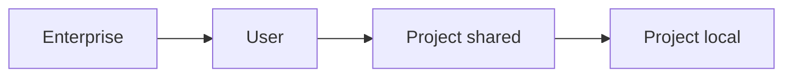

<LevelBadge level="intermediate" />

<VerifyNote lastVerified="2026-06-20" source="https://docs.anthropic.com/en/docs/claude-code/settings">
Las claves exactas y las ubicaciones de los archivos se confirman mejor en la documentación oficial de settings de Claude Code.
</VerifyNote>

`settings.json` es donde vive la configuración de Claude Code — [permisos](/docs/claude-code/permissions), [hooks](/docs/claude-code/hooks), variables de entorno, valores por defecto del modelo y más. Entender los **niveles** es la clave.

## Los niveles (de lo más global a lo más específico)

Los niveles posteriores (más específicos) anulan a los anteriores:

1. **Enterprise / managed** — política establecida por un administrador de la organización. Gana sobre todo.
2. **Usuario** — `~/.claude/settings.json`. Tus valores por defecto en todos los proyectos.
3. **Proyecto (compartido)** — `.claude/settings.json`, en el control de versiones del repo. A nivel de todo el equipo.
4. **Proyecto (personal)** — `.claude/settings.local.json`, ignorado por git. Tus anulaciones para este repo.

:::tip Haz commit del archivo compartido, ignora el local
Pon las convenciones del equipo en `.claude/settings.json` (en el control de versiones). Pon los ajustes personales y las rutas específicas de la máquina en `.claude/settings.local.json` (ignorado por git). Esto mantiene al equipo consistente sin imponer tus preferencias a los demás.
:::

## Lo que configurarás habitualmente

- **`permissions`** — reglas allow/ask/deny. Consulta [Permisos](/docs/claude-code/permissions).
- **`hooks`** — comandos que se ejecutan en eventos del ciclo de vida. Consulta [Hooks](/docs/claude-code/hooks).
- **`env`** — variables de entorno para la sesión.
- **Valores por defecto de modelo / comportamiento** — p. ej. el modelo preferido.

## Editar con seguridad

- Mantén un JSON válido (una coma final lo romperá).
- Prefiere reglas de permiso **estrechas** frente a amplias.
- Nunca pongas secretos en un archivo bajo control de versiones — usa referencias `env` o un gestor de secretos.

Hay archivos iniciales listos para copiar en [Recetas de Hooks y settings.json](/docs/templates/hooks-settings).

## Siguiente

- [Permisos y modos de permiso](/docs/claude-code/permissions)
- [Hooks: Automatización determinista](/docs/claude-code/hooks)
- [Comandos slash personalizados](/docs/claude-code/slash-commands)
