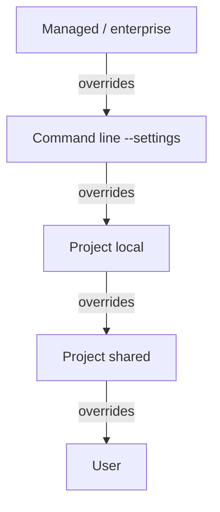

<LevelBadge level="intermediate" />

<VerifyNote lastVerified="2026-09-23" source="https://code.claude.com/docs/en/settings">
Pila de precedencia de cinco niveles (gestionado → línea de comandos → proyecto local → proyecto compartido → usuario) y la regla "las variables de entorno no son un nivel" de la página oficial [Settings files and precedence](https://code.claude.com/docs/en/settings). Las anulaciones por clave se enumeran en la [referencia de ajustes](https://code.claude.com/docs/en/settings-reference).
</VerifyNote>

`settings.json` es donde vive la configuración de Claude Code — [permisos](/docs/claude-code/permissions), [hooks](/docs/claude-code/hooks), variables de entorno, valores por defecto del modelo y más. Entender los **niveles** es la clave.

## Los niveles (de mayor precedencia primero)

Cuando la misma clave está definida en más de un sitio, Claude Code usa el valor del nivel más alto que la define:

1. **Gestionado / enterprise** — `managed-settings.json`, una política MDM o los ajustes gestionados desde el servidor en la consola de claude.ai. Nada de lo que definas los anula (salvo algunas excepciones sensibles para la seguridad).
2. **Línea de comandos** — `claude --settings '<json-or-path>'`, solo para una sesión. Está por encima de cualquier archivo excepto el gestionado y no escribe en ningún archivo.
3. **Proyecto (personal)** — `.claude/settings.local.json`, ignorado por git. Tus anulaciones para este repositorio.
4. **Proyecto (compartido)** — `.claude/settings.json`, versionado en el repositorio. Para todo el equipo.
5. **Usuario** — `~/.claude/settings.json`. Tus valores predeterminados en todos los proyectos.

```mermaid
flowchart TB
  M[Managed / enterprise] -->|overrides| C[Command line --settings]
  C -->|overrides| L[Project local]
  L -->|overrides| P[Project shared]
  P -->|overrides| U[User]
```

:::note Las variables de entorno no son un nivel
Quedan fuera de esta pila y se resuelven clave por clave. Por ejemplo, `ANTHROPIC_MODEL` prevalece sobre la clave `model` de cualquier archivo, mientras que `ANTHROPIC_DEFAULT_MODEL` solo se aplica cuando ningún archivo define `model`.
:::

:::tip Haz commit del archivo compartido, ignora el local
Pon las convenciones del equipo en `.claude/settings.json` (en el control de versiones). Pon los ajustes personales y las rutas específicas de la máquina en `.claude/settings.local.json` (ignorado por git). Esto mantiene al equipo consistente sin imponer tus preferencias a los demás.
:::

## Lo que configurarás habitualmente

- **`permissions`** — reglas allow/ask/deny. Consulta [Permisos](/docs/claude-code/permissions).
- **`hooks`** — comandos que se ejecutan en eventos del ciclo de vida. Consulta [Hooks](/docs/claude-code/hooks).
- **`env`** — variables de entorno para la sesión.
- **Valores por defecto de modelo / comportamiento** — p. ej. el modelo preferido.

## Editar con seguridad

- Mantén un JSON válido (una coma final lo romperá).
- Prefiere reglas de permiso **estrechas** frente a amplias.
- Nunca pongas secretos en un archivo bajo control de versiones — usa referencias `env` o un gestor de secretos.

Hay archivos iniciales listos para copiar en [Recetas de Hooks y settings.json](/docs/templates/hooks-settings).

## Siguiente

- [Permisos y modos de permiso](/docs/claude-code/permissions)
- [Hooks: Automatización determinista](/docs/claude-code/hooks)
- [Comandos slash personalizados](/docs/claude-code/slash-commands)
