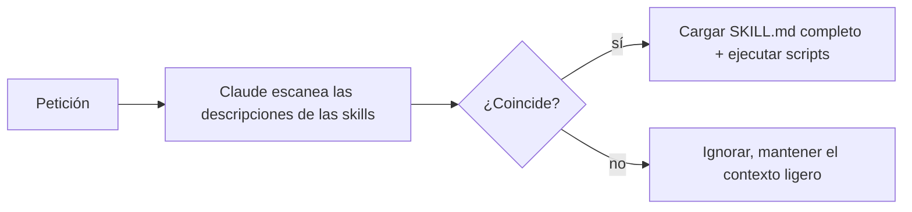

<LevelBadge level="advanced" />

<VerifyNote lastVerified="2026-06-23" source="https://code.claude.com/docs/en/skills">
La estructura de los archivos de Skill, la divulgación progresiva y dónde se ejecutan las skills (Claude Code, Claude.ai, Cowork) están evolucionando — confírmalo en la documentación oficial de Skills.
</VerifyNote>

Una **Skill** empaqueta experiencia — instrucciones más scripts y recursos opcionales — que Claude carga **solo cuando es relevante**. En lugar de meterlo todo en [CLAUDE.md](/docs/claude-code/claude-md), le das a Claude una biblioteca de capacidades que incorpora bajo demanda.

## Anatomía

Una skill es una carpeta con un `SKILL.md`: frontmatter YAML + instrucciones.

```markdown
---
name: pdf-forms
description: Use when the user needs to fill, read, or generate PDF forms.
---

# PDF Forms
Steps and rules for working with PDF forms…
(optionally reference scripts/ or resources/ in this folder)
```

La **`description` es el disparador** — Claude la lee para decidir *cuándo* activar la skill. Escríbela como "Use when…", lo bastante específica para que se cargue en el momento adecuado y no en otros.

## Divulgación progresiva (por qué las skills escalan)

Claude no carga por adelantado el cuerpo completo de cada skill — ve el ligero `name` + `description`, y solo incorpora las instrucciones completas (y ejecuta los scripts) cuando una petición coincide. Eso mantiene el contexto ligero incluso con muchas skills instaladas.



## Dónde viven

- Personal: `~/.claude/skills/<name>/SKILL.md`
- Proyecto (compartible): `.claude/skills/<name>/SKILL.md`
- Incluidas en un [plugin](/docs/claude-code/plugins-marketplaces) para distribución en equipo.

AILmanac incluye [7 packs de skills listos para usar](/docs/templates/skills) — copia uno para probarlo.

## Ejemplo práctico: una skill que se dispara sola

Crea `~/.claude/skills/release-notes/SKILL.md`:

```markdown
---
name: release-notes
description: Use when the user asks to write release notes or a changelog from git history.
---

# Release Notes
1. Run `git log <last-tag>..HEAD --oneline` to get the commits.
2. Group them into Features / Fixes / Breaking changes.
3. Write user-facing notes — what changed for *users*, not commit messages.
4. Output Markdown ready to paste into a GitHub release.
```

Más tarde escribes: *"Redacta las notas de la versión desde v1.4."* Claude nunca tuvo estos pasos en el contexto — pero la petición coincide con la `description`, así que incorpora el `SKILL.md` completo, ejecuta el `git log` y produce notas agrupadas. No invocaste nada por su nombre; la **description hizo el enrutamiento**. Añade un archivo `scripts/` en la misma carpeta y la skill puede ejecutarlo como parte del paso 1.

## Skill frente a comando frente a subagente frente a MCP

| Herramienta | Qué es | Quién la dispara: tú o Claude |
|---|---|---|
| [Comando slash](/docs/claude-code/slash-commands) | Un prompt guardado | **Tú** lo invocas |
| **Skill** | Experiencia bajo demanda + scripts | **Claude** la carga cuando es relevante |
| [Subagente](/docs/claude-code/subagents) | Un agente delegado con su propio contexto | Claude delega |
| [MCP](/docs/claude-code/mcp) | Una conexión a herramientas/datos externos | Proporciona herramientas que llamar |

Regla general: **tú** quieres dispararlo bajo demanda → comando slash. **Claude** debería conocer el procedimiento y aplicarlo cuando sea relevante → skill. El trabajo debería ocurrir en un contexto separado → subagente. Necesitas alcanzar un sistema externo → MCP.

## Errores comunes

- **Una descripción que no se dispara.** "Helps with PDFs" es demasiado vago; "Use when the user needs to fill, read, or generate PDF forms" le dice a Claude exactamente cuándo cargarla. La descripción es todo el mecanismo de activación — escríbela para que coincida, no para humanos.
- **Poner todo en CLAUDE.md en su lugar.** [CLAUDE.md](/docs/claude-code/claude-md) se carga en *cada* sesión y cuesta contexto siempre; una skill se carga *solo cuando es relevante*. Mueve los procedimientos situacionales a skills y deja CLAUDE.md para las reglas de proyecto siempre verdaderas.
- **Una única skill gigante.** Muchas skills pequeñas y descritas con precisión se enrutan mejor que una que lo abarca todo — la divulgación progresiva solo ayuda si cada descripción es específica.
- **Olvidar que es compartible.** Una skill de proyecto en `.claude/skills/` registrada en git le da la capacidad a todo el equipo; una personal en `~/.claude/skills/` se queda contigo.

## Siguiente

- [Escribe tu primera Skill (tutorial)](/docs/walkthroughs/first-skill)
- [Plantillas de SKILL.md](/docs/templates/skills)
- [Plugins y marketplaces](/docs/claude-code/plugins-marketplaces)
