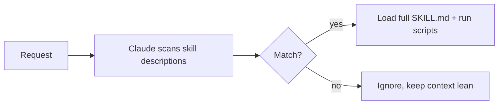

<LevelBadge level="advanced" />

<VerifyNote lastVerified="2026-06-20" source="https://code.claude.com/docs/en/skills">
La estructura de los archivos de skill y dónde se ejecutan las skills (Claude Code, Claude.ai, Cowork) están evolucionando — confírmalo en la documentación oficial de Skills.
</VerifyNote>

Una **Skill** empaqueta experiencia — instrucciones más scripts y recursos opcionales — que Claude carga **solo cuando es relevante**. En lugar de meterlo todo en [CLAUDE.md](/docs/claude-code/claude-md), le das a Claude una biblioteca de capacidades que incorpora bajo demanda.

## Anatomía

Una skill es una carpeta con un `SKILL.md`: frontmatter YAML + instrucciones.

```markdown
---
name: pdf-forms
description: Use when the user needs to fill, read, or generate PDF forms.
---

# PDF Forms
Steps and rules for working with PDF forms…
(optionally reference scripts/ or resources/ in this folder)
```

La **`description` es el disparador** — Claude la lee para decidir *cuándo* activar la skill. Escríbela como "Use when…", lo bastante específica para que se cargue en el momento adecuado y no en otros.

## Divulgación progresiva (por qué las skills escalan)

Claude no carga por adelantado el cuerpo completo de cada skill — ve el ligero `name` + `description`, y solo incorpora las instrucciones completas (y ejecuta los scripts) cuando una petición coincide. Eso mantiene el contexto ligero incluso con muchas skills instaladas.



## Dónde viven

- Personal: `~/.claude/skills/<name>/SKILL.md`
- Proyecto (compartible): `.claude/skills/<name>/SKILL.md`
- Incluidas en un [plugin](/docs/claude-code/plugins-marketplaces) para distribución en equipo.

AILmanac incluye [7 packs de skills listos para usar](/docs/templates/skills) — copia uno para probarlo.

## Skill frente a comando frente a subagente frente a MCP

| Herramienta | Qué es | Quién la dispara: tú o Claude |
|---|---|---|
| [Comando slash](/docs/claude-code/slash-commands) | Un prompt guardado | **Tú** lo invocas |
| **Skill** | Experiencia bajo demanda + scripts | **Claude** la carga cuando es relevante |
| [Subagente](/docs/claude-code/subagents) | Un agente delegado con su propio contexto | Claude delega |
| [MCP](/docs/claude-code/mcp) | Una conexión a herramientas/datos externos | Proporciona herramientas que llamar |

## Siguiente

- [Escribe tu primera Skill (tutorial)](/docs/walkthroughs/first-skill)
- [Plantillas de SKILL.md](/docs/templates/skills)
- [Plugins y marketplaces](/docs/claude-code/plugins-marketplaces)
