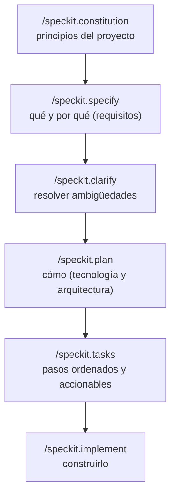

<LevelBadge level="intermediate" />

# Desarrollo guiado por especificaciones con Spec Kit

Programar a ojo — "constrúyeme un panel", acepta lo que sea que devuelva — funciona de maravilla hasta que la función se vuelve grande. Entonces el agente se desvía: olvida una decisión anterior, reinventa una función o entrega algo que técnicamente se ejecuta pero no es lo que querías decir. El **desarrollo guiado por especificaciones (SDD, por sus siglas en inglés)** es la solución que ha calado entre la gente que programa con agentes en 2026: en lugar de tratar el prompt como algo desechable, conviertes una **especificación escrita y revisable en la fuente de verdad** y haces que el agente genere código *a partir* de ella.

El **[Spec Kit](https://github.com/github/spec-kit)** de código abierto de GitHub convierte esa idea en un flujo de trabajo concreto que puedes ejecutar dentro de Claude Code hoy mismo.

<Callout type="objectives" items={["Entender qué es el desarrollo guiado por especificaciones y qué problema resuelve", "Recorrer las fases de Spec Kit: constitution → specify → plan → tasks → implement", "Instalar la CLI de Specify y conectarla con Claude Code", "Conocer las puertas de calidad opcionales (clarify, analyze, checklist)", "Decidir cuándo el SDD merece la sobrecarga y cuándo omitirlo"]} />

<VerifyNote lastVerified="2026-06-28" source="https://github.com/github/spec-kit">
Spec Kit avanza rápido (~116k★, con licencia MIT). Los nombres de los comandos, el flag de selección de agente de `specify init` y las herramientas compatibles cambian entre versiones — confirma la guía de inicio rápido actual en el README del repositorio antes de fiarte de la sintaxis exacta. Los nombres de los comandos de barra que aparecen abajo usan el espacio de nombres `/speckit.*` introducido en versiones recientes.
</VerifyNote>

## Por qué especificaciones, no solo prompts

Un prompt desaparece en el momento en que termina el turno. Una **especificación es un artefacto**: puede leerse, revisarse en un PR, corregirse y volver a ejecutarse. Ese único cambio corrige las tres formas en que se tuercen las construcciones agénticas grandes:

- **Desvío** — el agente contradice una decisión anterior porque nada la dejó por escrito. La especificación es la memoria.
- **Ambigüedad** — "hazlo bonito" significa diez cosas distintas. Forzar los requisitos a prosa saca a la luz las lagunas *antes* de que exista el código, donde son baratas de corregir.
- **Diffs no revisables** — un PR generado de 2.000 líneas es difícil de juzgar. Una especificación y un plan revisados hacen que el diff sea *esperado* en lugar de sorprendente.

El modelo mental: **la intención es lo valioso y duradero; el código es un artefacto derivado y regenerable.** El SDD es el primo disciplinado del propio [Modo Plan](/docs/claude-code/plan-mode) de Claude Code — planificar primero, construir después — llevado a escala de una función completa y persistido en archivos de tu repositorio.

## El flujo de trabajo de Spec Kit

Spec Kit estructura una función como una breve secuencia de comandos de barra. Cada uno escribe artefactos Markdown en tu repositorio (bajo `.specify/`), de modo que cada fase es inspeccionable y está bajo control de versiones.

<Steps items={[{title: "Constitution", body: "Ejecuta /speckit.constitution una vez por proyecto. Escribe principios rectores — estilo de código, listón de pruebas, innegociables de arquitectura — en .specify/memory/constitution.md. Todas las fases posteriores se comprueban contra él, así que esta es tu barrera de protección duradera (piénsalo como un CLAUDE.md centrado en principios)."}, {title: "Specify", body: "Ejecuta /speckit.specify y describe QUÉ estás construyendo y POR QUÉ — historias de usuario, requisitos, criterios de éxito. Deliberadamente NO el stack tecnológico. El agente produce una especificación estructurada que lees y corriges antes de seguir adelante."}, {title: "Plan", body: "Ejecuta /speckit.plan con tus decisiones técnicas — framework, almacén de datos, restricciones. Ahora se escribe el CÓMO: arquitectura, componentes y cómo satisfacen la especificación. Las decisiones técnicas viven aquí, no en la especificación, de modo que la especificación se mantiene agnóstica respecto a la implementación."}, {title: "Tasks", body: "Ejecuta /speckit.tasks para descomponer el plan en una lista numerada y ordenada de pasos pequeños, revisables de forma individual. Esto es lo que hace que la construcción sea auditable — puedes ver la secuencia antes de que se escriba una sola línea de código."}, {title: "Implement", body: "Ejecuta /speckit.implement y el agente ejecuta la lista de tareas, construyendo la función contra el plan y la constitution. Como cada fase previa fue revisada, el diff resultante es esperado, no una sorpresa."}]} />

### Puertas de calidad opcionales

Tres comandos más aprietan el bucle cuando una función es de alto riesgo:

- **`/speckit.clarify`** — interroga la especificación en busca de áreas poco especificadas y te hace preguntas concretas *antes* de planificar. Lo mejor es ejecutarlo justo después de `specify`.
- **`/speckit.analyze`** — coteja la especificación, el plan y las tareas en busca de consistencia y lagunas de cobertura.
- **`/speckit.checklist`** — genera una lista de verificación de validación para que "terminado" quede definido y sea comprobable.

<Callout type="tip" items={["Ejecuta /speckit.clarify antes de /speckit.plan — corregir la ambigüedad es más barato antes de comprometer la arquitectura.", "Trata cada artefacto generado como un PR: léelo, corrígelo y solo entonces avanza a la siguiente fase.", "Haz commit de los artefactos de .specify/ — son el registro revisable de la intención detrás del código."]} />

## Ponlo en marcha con Claude Code

Spec Kit incluye una CLI, **Specify**, que genera el andamiaje de los comandos de barra en tu proyecto. Es compatible con más de 30 agentes de programación, Claude Code entre ellos.

<Steps items={[{title: "Instala la CLI de Specify", body: "Usa uv para instalarla desde el repositorio. (Se requieren Python + uv.)"}, {title: "Inicializa un proyecto", body: "Genera el andamiaje de la estructura .specify/ y los comandos del agente. Ejecuta init en un repositorio nuevo o existente; cuando se te pregunte, elige Claude Code como tu agente (o pasa el flag de integración actual del README)."}, {title: "Abre Claude Code y comprueba los comandos", body: "Lanza claude en la carpeta del proyecto. Sabrás que está conectado cuando /speckit.constitution, /speckit.specify, /speckit.plan, /speckit.tasks y /speckit.implement aparezcan como comandos de barra."}]} />

<PromptCard title="Instala la CLI de Specify (uv)">{`uv tool install specify-cli --from git+https://github.com/github/spec-kit.git`}</PromptCard>

<PromptCard title="Genera el andamiaje del flujo guiado por especificaciones en un proyecto">{`# new project
specify init my-feature

# or in the current repo
specify init --here`}</PromptCard>

<PromptCard title="Luego, dentro de Claude Code, ejecuta la secuencia">{`/speckit.constitution Establish principles: TypeScript strict, tests for every public function, no secrets in code.
/speckit.specify Build a CSV export for the reports page: users pick a date range and download a CSV of matching rows.
/speckit.clarify
/speckit.plan Next.js App Router, server action for the query, stream the CSV; no new dependencies.
/speckit.tasks
/speckit.implement`}</PromptCard>

<Callout type="warning" items={["El flag exacto de selección de agente para specify init cambia entre versiones — consulta la guía de inicio rápido del README en lugar de copiar un flag a ciegas.", "El SDD no elimina la necesidad de verificar: lee el código generado y ejecútalo. La especificación hace que el diff sea revisable, no automáticamente correcto.", "Nunca pongas secretos ni credenciales en la especificación, el plan o la constitution — se versionan como cualquier otro archivo."]} />

## Cuándo usarlo (y cuándo no)

El SDD cambia ceremonia inicial por control. Ese intercambio merece la pena cuando el trabajo es grande, ambiguo o debe ser revisado por otros — y es pura sobrecarga cuando no lo es.

<Callout type="info" items={["Recurre al SDD: funciones desde cero, construcciones multiarchivo, cualquier cosa que un compañero deba revisar, o trabajo que delegarás a una flota de subagentes.", "Omite el SDD: scripts puntuales, arreglos diminutos, código exploratorio desechable — un simple prompt o el Modo Plan es más rápido.", "El trabajo sobre código existente también funciona: apunta /speckit.specify a una mejora de una base de código existente, no solo a proyectos nuevos."]} />

<Flashcards title="SDD at a glance" cards={[{front: "¿Cuál es la fuente de verdad en el SDD?", back: "La especificación escrita. El código es un artefacto regenerable derivado de ella."}, {front: "¿Qué hace /speckit.constitution?", back: "Escribe principios duraderos del proyecto (estilo, listón de pruebas, reglas de arquitectura) contra los que se comprueba cada fase posterior."}, {front: "¿Dónde van las decisiones de stack tecnológico?", back: "En /speckit.plan — no en la especificación. La especificación se mantiene agnóstica respecto a la implementación (qué y por qué); el plan es el cómo."}, {front: "¿Qué hace auditable una construcción con Spec Kit?", back: "/speckit.tasks produce una lista de tareas ordenada y revisable antes de que se escriba código, y cada fase escribe artefactos Markdown inspeccionables."}, {front: "¿Cuándo NO deberías usar el SDD?", back: "Scripts puntuales, arreglos diminutos o exploración desechable — la ceremonia cuesta más de lo que ahorra."}]} />

## Comprueba lo aprendido

<Quiz title="Comprueba lo aprendido" questions={[{q: "¿Cuál es la idea central del desarrollo guiado por especificaciones?", options: ["Escribir prompts puntuales más detallados", "Convertir una especificación revisable en la fuente de verdad y generar código a partir de ella", "Saltarse la planificación y dejar que el agente improvise"], answer: 1, explain: "El SDD trata la intención como el artefacto duradero y valioso y el código como una salida derivada y regenerable — lo opuesto a programar a ojo con prompts desechables."}, {q: "¿Qué fase de Spec Kit debería capturar el stack tecnológico y la arquitectura?", options: ["/speckit.specify", "/speckit.plan", "/speckit.constitution"], answer: 1, explain: "specify describe el QUÉ y el POR QUÉ (agnóstico respecto a la implementación); plan es donde se decide el CÓMO — framework, almacén de datos, arquitectura."}, {q: "¿Cuándo NO merece la pena la sobrecarga del desarrollo guiado por especificaciones?", options: ["Una función multiarchivo desde cero que un compañero debe revisar", "Un script desechable de una línea o un arreglo diminuto", "Cualquier trabajo que delegarás a subagentes"], answer: 1, explain: "La ceremonia inicial del SDD compensa en trabajo grande, ambiguo o revisado. Para un arreglo trivial, un simple prompt o el Modo Plan es más rápido."}]} />

<Callout type="takeaways" items={["El desarrollo guiado por especificaciones convierte una especificación revisable — no el prompt — en la fuente de verdad, eliminando el desvío, la ambigüedad y los diffs no revisables.", "El Spec Kit de GitHub (la CLI de Specify) lleva el SDD a Claude Code como comandos de barra /speckit.*.", "La secuencia es constitution → specify → (clarify) → plan → (analyze) → tasks → (checklist) → implement, y cada paso escribe artefactos inspeccionables.", "Mantén el QUÉ/POR QUÉ en la especificación y el CÓMO en el plan; revisa cada artefacto como un PR antes de avanzar.", "Úsalo para funciones grandes, ambiguas o revisadas; omítelo para trabajo desechable — y siempre verifica el código generado de todos modos."]} />

## Siguiente

- [Modo Plan](/docs/claude-code/plan-mode) — el bucle integrado y más ligero de "planificar antes de construir"
- [Comandos de barra](/docs/claude-code/slash-commands) — cómo encajan los comandos /speckit.* en el sistema de comandos de Claude Code
- [CLAUDE.md y archivos de memoria](/docs/claude-code/claude-md) — la idea de los principios como memoria detrás de la constitution
- [Subagentes](/docs/claude-code/subagents) — entrega una lista de tareas revisada a una flota de agentes
- [Programación y desarrollo de software](/docs/playbooks/coding) — la mentalidad de verificarlo todo de la que depende el SDD

## Fuentes y lecturas adicionales

- [github/spec-kit — Toolkit for Spec-Driven Development](https://github.com/github/spec-kit) (MIT)
- [Spec Kit README & quickstart](https://github.com/github/spec-kit/blob/main/README.md)
- [Anthropic — Plan Mode in Claude Code](https://code.claude.com/docs/en/interactive-mode)
