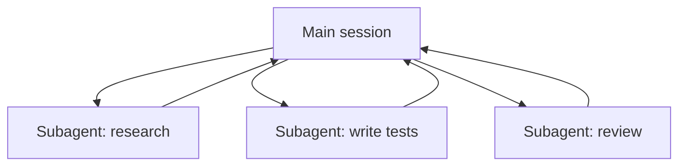

<LevelBadge level="advanced" />

<VerifyNote lastVerified="2026-06-20" source="https://docs.anthropic.com/en/docs/claude-code/sub-agents">
La configuración de los subagentes y la interfaz `/agents` cambian con el tiempo — confírmalo en la documentación oficial.
</VerifyNote>

Un **subagente** es una instancia separada de Claude con su **propia ventana de contexto** y un **conjunto acotado de herramientas**, a la que tu sesión principal delega una parte del trabajo. Reporta un resultado, no toda su transcripción — de modo que la sesión principal se mantiene enfocada y despejada.

## Por qué delegar

- **Protege el contexto principal.** Una inmersión de investigación o un barrido de un archivo grande puede quemar miles de tokens; hazlo en un subagente y solo vuelve la conclusión.
- **Especializa.** Dale a un subagente un system prompt a medida y solo las herramientas que necesita (p. ej. un revisor de solo lectura).
- **Paraleliza.** Ejecuta subtareas independientes a la vez — p. ej. explorar tres módulos simultáneamente.

## Cómo definirlos

Los subagentes se configuran como archivos Markdown con frontmatter (nombre, descripción, herramientas permitidas, a veces un modelo), gestionados mediante la interfaz `/agents`. La `description` le dice al agente principal *cuándo* delegar en él. Acota las herramientas con rigor — un revisor rara vez necesita acceso de escritura.

## Cuándo NO paralelizar

:::warning El paralelismo no es gratis
- Los **pasos dependientes** deben ser secuenciales — no repartas trabajo donde el paso B necesita la salida del paso A.
- Las **escrituras de archivos compartidos** pueden entrar en conflicto; aíslalas (consulta [Git Worktrees](/docs/claude-code/worktrees)) o serialízalas.
- El **coste de coordinación** puede superar el beneficio en tareas pequeñas. Delega cuando la subtarea sea de tamaño considerable e independiente.
:::

## Subagente frente a los "agentes" de la API/SDK

Esta página trata sobre la delegación integrada de Claude Code. Crear tus *propios* agentes de forma programática es [Crear agentes sobre la API](/docs/api/building-agents). El modelo mental — un objetivo, un bucle de herramientas, contexto aislado — es el mismo.

## Siguiente

- [Diseña un flujo de trabajo con varios subagentes (tutorial)](/docs/walkthroughs/multi-subagent-workflow)
- [Gestión del contexto](/docs/claude-code/context-management)
- [Git Worktrees](/docs/claude-code/worktrees)
