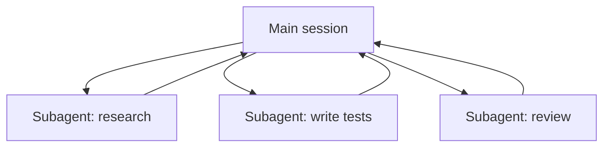

<LevelBadge level="advanced" />

<VerifyNote lastVerified="2026-06-23" source="https://code.claude.com/docs/en/sub-agents">
Los campos del frontmatter de los subagentes, el catálogo de agentes integrados y la interfaz de `/agents` cambian con el tiempo — confírmalo en la documentación oficial.
</VerifyNote>

Un **subagente** es una instancia de Claude independiente con su **propia ventana de contexto** y un **conjunto acotado de herramientas**, a la que tu sesión principal delega una parte del trabajo. Te devuelve un resultado, no toda su transcripción — así la sesión principal se mantiene enfocada y despejada.

## Por qué delegar

- **Protege el contexto principal.** Una inmersión de investigación o un barrido de un archivo grande puede quemar miles de tokens; hazlo en un subagente y solo vuelve la conclusión.
- **Especializa.** Dale a un subagente un system prompt a medida y solo las herramientas que necesita (p. ej. un revisor de solo lectura).
- **Paraleliza.** Ejecuta subtareas independientes a la vez — p. ej. explorar tres módulos simultáneamente.



## Los integrados que ya tienes

Antes de definir los tuyos, ten en cuenta que Claude Code incluye subagentes a los que delega automáticamente:

- **Explore** — un agente rápido de solo lectura (se ejecuta en un modelo más económico) para buscar y entender una base de código sin tocarla.
- **Plan** — reúne contexto durante el modo de planificación para que la investigación no contamine la conversación principal de solo lectura.
- **General-purpose** — un agente con todas las herramientas para trabajo complejo de varios pasos que combina exploración y cambios.

Rara vez los invocas por su nombre; Claude recurre a ellos cuando una tarea encaja. Los subagentes personalizados son para los trabajadores que *tú* sigues recreando con las mismas instrucciones.

## Cómo definir los tuyos

Un subagente es un archivo Markdown con frontmatter YAML (el cuerpo se convierte en su system prompt). Solo `name` y `description` son obligatorios; todo lo demás es opcional. Guárdalo por proyecto en `.claude/agents/` (regístralo en git para que el equipo lo comparta) o por usuario en `~/.claude/agents/`. Crea uno con el comando `/agents` o a mano:

```markdown
---
name: code-reviewer
description: Expert code reviewer. Use proactively after code changes.
tools: Read, Glob, Grep
model: sonnet
---

You are a senior reviewer. Read the changed files, then report only
high-confidence issues: correctness bugs, security risks, and missing
tests. For each, show the file:line, the problem, and a concrete fix.
Do not restate what the code does. Never edit files.
```

Dos cosas hacen bueno a un subagente:

- **La `description` es la señal de enrutamiento.** Claude la lee para decidir *cuándo* delegar, así que escríbela como un disparador — "Use proactively after code changes" lo activa automáticamente; un vago "helps with code" no lo hará. Esta es la línea de mayor impacto del archivo.
- **Acota las herramientas con rigor.** El campo `tools` es una lista de permitidos (o usa `disallowedTools` como lista de denegados). Un revisor que solo puede usar `Read, Glob, Grep` *no puede* editar tu código por accidente — la restricción es una garantía, no una sugerencia. Omite `tools` y el subagente hereda todo lo que tiene la sesión principal.

## Ejemplo práctico: un fan-out de revisión en paralelo

Acabas de terminar una funcionalidad que toca tres módulos y quieres una verificación rápida e independiente de cada uno. En tu sesión principal:

> "Revisa los cambios en `auth/`, `billing/` y `api/` — usa el subagente code-reviewer en cada uno, en paralelo."

Claude genera tres instancias de `code-reviewer` a la vez. Cada una lee solo su módulo, quema su propio contexto en el contenido de los archivos y devuelve una lista breve de hallazgos. Tu sesión principal nunca ve los diffs crudos — solo tres informes ordenados — y todo termina aproximadamente en el tiempo de la instancia de revisión más lenta en lugar de la suma de las tres. Como el revisor es de solo lectura, tres agentes trabajando a la vez no pueden colisionar en una escritura.

## Cuándo NO paralelizar

:::warning El paralelismo no es gratis
- Los **pasos dependientes** deben ser secuenciales — no repartas trabajo donde el paso B necesita la salida del paso A.
- Las **escrituras de archivos compartidos** pueden entrar en conflicto; aíslalas (consulta [Git Worktrees](/docs/claude-code/worktrees)) o serialízalas.
- El **coste de coordinación** puede superar el beneficio en tareas pequeñas. Delega cuando la subtarea sea de tamaño considerable e independiente.
:::

## Subagente frente a los "agentes" de la API/SDK

Esta página trata sobre la delegación integrada de Claude Code. Crear tus *propios* agentes de forma programática es [Crear agentes sobre la API](/docs/api/building-agents). El modelo mental — un objetivo, un bucle de herramientas, contexto aislado — es el mismo.

## Errores comunes

- **Una `description` vaga.** Si no dice *cuándo* usar el subagente, Claude no delegará en el momento adecuado (o no delegará en absoluto). Empieza con "Use when…" / "Use proactively after…".
- **Dejar las herramientas abiertas de par en par.** Un subagente pensado para revisar no debería poder escribir. Una lista de permitidos convierte la intención en una garantía.
- **Esperar memoria compartida.** Un subagente recibe su `description`, su system prompt y la tarea que le entregas — no tu conversación principal. Pásale el contexto que necesita en la delegación.
- **Repartir trabajo dependiente.** El paralelismo solo ayuda con subtareas *independientes*; si B necesita la salida de A, ejecútalos en secuencia.

## Siguiente

- [Diseña un flujo de trabajo con varios subagentes (tutorial)](/docs/walkthroughs/multi-subagent-workflow)
- [Gestión del contexto](/docs/claude-code/context-management)
- [Git Worktrees](/docs/claude-code/worktrees)
