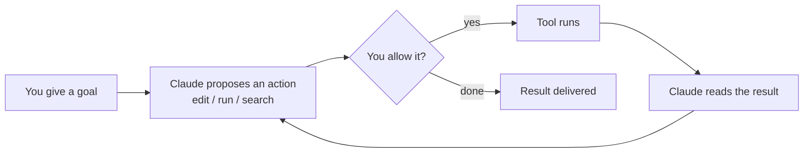

<LevelBadge level="beginner" />

<VerifyNote lastVerified="2026-06-20" source="https://code.claude.com/docs/en/overview">
Los comandos de instalación y el conjunto exacto de funciones cambian a menudo. Considera la documentación oficial de Claude Code como la fuente de verdad para la configuración.
</VerifyNote>

**Claude Code** es la herramienta de programación *agéntica* de Anthropic. A diferencia de una ventana de chat, puede realmente **hacer cosas en tu proyecto**: leer y editar archivos, ejecutar comandos de shell, buscar en el código y llamar a herramientas externas — todo con tu permiso.

## El modelo mental: un bucle agéntico

Esta es la única idea que hace que todo lo demás tenga sentido:

Das un objetivo en lenguaje natural ("añade tests para el módulo de autenticación y arregla lo que falle"). Claude **planifica, actúa, observa el resultado y repite** hasta cumplir el objetivo. Tú mantienes el control mediante [permisos](/docs/claude-code) y el [Modo Plan](/docs/claude-code).

## Dónde puedes ejecutarlo

- **Terminal (CLI)** — la superficie original; funciona en cualquier shell.
- **Extensiones de IDE** — VS Code y JetBrains, con diffs en línea.
- **Escritorio y web** — y comparte tus ajustes, hooks y permisos entre superficies.

## Lo que configurarás (en orden aproximado de impacto)

1. **[CLAUDE.md](/docs/claude-code)** — instrucciones persistentes del proyecto. Máximo impacto, mínimo esfuerzo.
2. **[Modo Plan](/docs/claude-code)** — investiga y propone *antes* de que se ejecute cualquier edición.
3. **[Permisos](/docs/claude-code)** — lo que Claude puede hacer sin preguntar.
4. **[settings.json](/docs/claude-code)** — el sistema de configuración completo.
5. **[Comandos slash](/docs/claude-code)**, **[hooks](/docs/claude-code)**, **[skills](/docs/claude-code)**, **[subagentes](/docs/claude-code)**, **[servidores MCP](/docs/claude-code)** — funciones avanzadas, que añades por capas según las necesites.

## Tu primera sesión (cómo es)

1. Instala y autentícate (consulta la [documentación oficial](https://code.claude.com/docs/en/overview) para los comandos actuales).
2. Haz `cd` a un proyecto e inicia Claude Code.
3. Ejecuta `/init` para generar un **CLAUDE.md** inicial.
4. Pide algo pequeño y concreto: *"Explica cómo funciona el enrutamiento en esta app."*
5. Después prueba un cambio primero en **Modo Plan**, revisa el plan y deja que se ejecute.

:::tip Empieza en solo lectura
Para tu primera tarea real, usa el [Modo Plan](/docs/claude-code) — Claude investiga y te muestra un plan sin tocar archivos. Es la forma más segura de generar confianza.
:::

## Siguiente

- La configuración de mayor impacto → [CLAUDE.md y archivos de memoria](/docs/claude-code)
- Hazlo de principio a fin → [Tutorial: Personaliza Claude Code para un repo real](/docs/walkthroughs)
- Crea tus propias automatizaciones → [Plantillas y recetas](/docs/templates)
