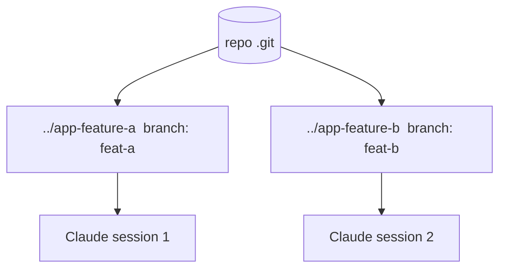

<LevelBadge level="advanced" />

Un **git worktree** permite que un repositorio tenga **varios directorios de trabajo**, cada uno con una rama distinta. Combina eso con Claude Code y podrás ejecutar **varias sesiones en paralelo** sobre el mismo proyecto — cada una editando sus propios archivos, sin colisiones.

## El problema que resuelve

Si dos sesiones de Claude editan el mismo directorio de trabajo a la vez, se pisan los cambios mutuamente. Los worktrees dan a cada sesión su **propio directorio y rama**, de modo que el trabajo paralelo se mantiene aislado hasta que haces el merge.



## Lo básico

```bash
# from your repo
git worktree add ../app-feature-a -b feat-a   # new dir + new branch
git worktree add ../app-fix-123 -b fix-123
git worktree list
# when done with one:
git worktree remove ../app-feature-a
```

Abre una sesión de Claude Code en el directorio de cada worktree y deja que trabajen de forma independiente.

## Cuándo merece la pena

- **Funciones/correcciones paralelas** que quieres avanzar a la vez.
- **Una tarea larga en ejecución** en un worktree mientras sigues trabajando en otro.
- **Experimentos arriesgados** aislados de tu checkout principal.

## Trampas

:::warning Cuidado con el merge de vuelta
- Las ramas acabarán **fusionándose** — los conflictos aparecen entonces, no durante. Mantén los worktrees enfocados y de corta vida.
- No ejecutes **recursos compartidos con estado** (una BD de desarrollo, un puerto) desde dos worktrees sin separarlos.
- Limpia con `git worktree remove` para que no se acumulen directorios obsoletos.
:::

## Worktrees frente a subagentes

- **[Subagentes](/docs/claude-code/subagents)** = paralelismo *dentro* de una sesión (delegación, contexto aislado).
- **Worktrees** = paralelismo *entre* sesiones en disco (ramas/archivos aislados). Se combinan bien: una sesión en un worktree puede a su vez lanzar subagentes.

## Siguiente

- [Subagentes y agentes paralelos](/docs/claude-code/subagents)
- [Modo Headless y el Agent SDK](/docs/claude-code/headless-and-agent-sdk)
- [Gestión del contexto](/docs/claude-code/context-management)
